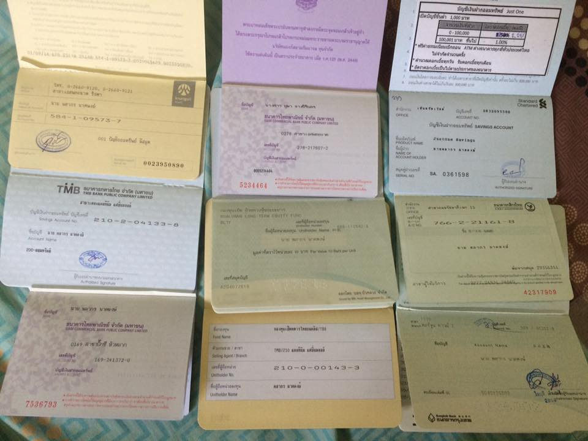

มาจั่วหัวเป็น Clickbait ขำๆรับยามเช้า เป็นบล๊อกแรกที่มาเขียนที่นี่ เพราะปกติจะเขียนลงบล๊อกส่วนตัว เห็นคนย้ายจากโปรแกรมเมอร์ไปทำอย่างอื่นก็เศร้าใจ อยากให้สายอื่นเปลี่ยนมาเป็นโปรแกรมเมอร์บ้าง

**Mode Non Geek**

> Software ก็คือ สิ่งที่โปรแกรมเมอร์สร้างขึ้นเพื่ออำนวยความสะดวกให้กับชีวิตประจำวันของทุกคนโดยใช้พลังสมองเนรมิตรออกมา

Software จะแทรกซึมอยู่ในชีวิตประจำวันของเราทุกคน **แอบช่วยเราอยู่เงียบๆ** ถึงแม้จะไม่นับ Smart Phone กับคอมพิวเตอร์ ก็ยังเยอะอยู่ดี

-   ไปธนาคาร ก็ต้องมีระบบ **Software** เพื่อเก็บข้อมูลเราไว้
-   ไปทำบัตรประชาชน กรมที่ดิน ก็มี **Software** บันทึกข้อมูลเราไว้
-   ไปซื้อชานมไข่มุก ตอนที่คนขายให้เครื่องซีลฝาปิด ก็มี **Software** คอยนับจำนวน
-   ไปจ่ายเงินก็มีเครื่องคิดเงินคอยคิดราคาให้เรา เพียงแตะ Barcode เท่านั้นที่เหลือ **Software** จะช่วยเราเอง
-   มีอีกเยอะ เรียก Messenger ส่งของ เรียกแท๊กซี่ จ้างพนักงานทำความสะอาด หาเพื่อน หาแฟน ก็ต้องใช้ **Software**

> แต่มีอย่างสุดท้ายที่น้อยคนจะรู้คือ “Software มันสร้างเงินให้เราได้นะ \*\*\*ดอกจันร้อยล้านดวง”

มีคนบอกเล่นก็ไม่เห็นได้เงินเลย มีคนชวนแล้ว ที่บอกว่ามีเวลาว่างเล่นอินเตอร์เน็ท 2–3 ชั่วโมงไหม ไปแล้วก็เสียเงินอีกไม่เห็นได้เงินเลย เฮ้ยยยยยยนั่นมัน ไม่ใช่แล้ว!!!

ให้เราเปลี่ยนจาก “ผู้ใช้” มาเป็น “ผู้สร้าง” สิ แล้วจะรู้ว่ายังมีอีกโลกหนึ่งที่เราสามารถเนรมิตรทุกสิ่งที่ต้องการได้ (ไม่ได้พูดเกินจริงเลยนะ)

เอาในชีวิตที่ผมใช้อยู่ปัจจุบันหละกันว่าในฐานะผมเป็นโปรแกรมเมอร์ผมเอามันมาช่วยทำอะไรในชีวิตประจำวันบ้าง ทั้งหาเงินทางตรงและทางอ้อม

**Mode Geek นิดๆ**

-   เมื่อก่อนสมัยเว็ปบอร์ดรุ่งเรื่อง ก็จะมีการโพสขายสินค้าทางอินเตอร์เน็ท ปกติกระทู้เราก็จะตกไปด้านล่างบ่อยๆ เราก็เขียน Software ให้โพสอัตโนมัติเพื่อดันมันขึ้นมา
-   ทำเว็ปบอร์ด ติด โฆษณา ทำมาหมด SEO ทั้งใส่ขาว เทา ไปจนถึงดำ
-   เขียนโปรแกรมวาดกราฟคำนวณจุดคุ้มทุนในการผ่อนบ้าน (จริงๆเพิ่งรู้ว่า Excel ทำได้)
-   ขี้เกียจเฝ้าดูราคาคอนโดในเว็บบอร์ด เขียน Bot ไปคอยดูไว้ ถ้ามีคนประกาศขายขาดทุน ให้แจ้งเลขกระทู้เข้าเมล์
-   สมัยเรียนหุ้นกับเพื่อนทำเน็ทหอพัก
-   ทำ Bot จองตั๋ว, จอง iPhone4 มาขาย (เด็กๆไม่ควรทำตาม)
-   Bot แจ้งเตือนราคาหุ้นที่ตกหนักๆ (ตอนนี้เค้ามีฟังก์ชันนี้แล้ว)
-   โกงเกมให้กับสาวๆ (**นิวตัวจริงชอบโค๊ดดิ้งและหญิงสาว**)

ที่กล่าวมาทั้งหมดทุกท่านที่อ่านมาจนถึงนี่ก็สงสัยใช่มะ ว่ามันหลักล้านยังไงกัน จริงๆแล้วสาระจะอยู่หลังจากนี้นะ 555(อย่าด่าผมในใจนะ)

ผมเคยบอกบ่อยๆว่า

> เป็นโปรแกรมเมอร์มันเลิกไม่ได้ มันเป็นไปตลอดชีวิต ส่วนคนที่เลิกหรอ เค้าไม่ใช่โปรแกรมเมอร์ครับ

**เรามาดูคุณสมบัติคนที่เหมาะจะเป็นโปรแกรมเมอร์ ”หลักล้าน” กันครับ**

สรุปจากหนังสือที่ผมเคยอ่านบวกกับความคิดส่วนตัวนะครับ

-   ช่างสังเกต ชอบวิเคราะห์สิ่งต่างๆรอบตัวให้ออกมาในรูปแบบ Logic ที่ผ่านการคิดอย่างเป็นระบบ เช่น เลขบัตรประชาชน ทำไมกรอกมั่วไม่ได้ เลขบัญชีธนาคาร มีหลักการสร้างมาจากอะไร
-   หลงไหลในตัวเลข ชอบวิชาคณิตศาสตร์ ไม่ได้ว่าไม่เก่งจะเป็นไม่ได้นะครับ แต่ถ้าเก่งจะได้เปรียบโครตๆ ส่วนตัวชอบวิชาคณิตศาตร์อยู่แล้ว เพราะมันตรงไปตรงมาดี
-   สามารถเรียนรู้ได้ด้วยตนเอง เพราะว่าบางทีเทคโนโลยีมันออกใหม่ ใครรู้ก่อนก็ได้เปรียบ บางทีจะถามใครก็ยังไม่มีใครรู้หรอกเพราะมันของใหม่จริงๆต้องเรียนรู้เอง
-   พูดคุยเข้ากับคนอื่นได้ง่าย อ่อนน้อมถ่อมตน ถึงแม้ว่าโปรแกรมเมอร์จะไม่มีสกิลในการขายหรือการทำในเรื่องอื่นๆ แต่เราต้องมีทีมครับ อย่างน้อยก็คนรู้จักแนะนำเราได้
-   สามารถอ่านทำความเข้าใจสิ่งยากๆและแปลสิ่งนั้นให้เป็นภาษาที่เข้าใจง่าย อันนี้สำคัญโคตรๆเหมือนกัน เพราะถ้าเราสื่อสารไม่รู้เรื่องทุกอย่างจบเหมือนกัน
-   ชอบเรียนรู้สิ่งใหม่ตลอดเวลา ถ้าไม่มีข้อนี้ ทุกข้อไม่มีประโยชน์ครับ เทคโนโลยีมันไปเร็ว ถ้าเราหยุดเรียน ไม่ได้หมายความว่าเราหยุด นั่นหมายความว่าเรากำลังถอยหลัง
-   ข้อสุดท้ายหาทีมที่ดีครับ หาได้ที่ [Nextzy Technologies](https://www.facebook.com/nextzy/) โฆษณานิด 555

สุดท้ายขอขอบคุณที่อ่านมาจนจบ ผมก็เป็นคนนึงที่ “รักในงานที่ผมทำมากๆ” ผมก็หวังให้กับเหล่าโปรแกรมเมอร์รุ่นหลัง **รักในงานที่ตัวเองทำ** และช่วยบอกต่ออาชีพเราให้มากที่สุด

เผื่อคำถามที่อยากรู้ ไหนอ่ะ 1 ล้าน ได้ล้านแรกตอนอายุ 26 ก่อนเปิดบริษัทครับ เป็นโปรแกรมเมอร์นี่แหละเจ้าข้าเอ๋ยยยยย และมันหมดไปนานมากแล้ว^^
