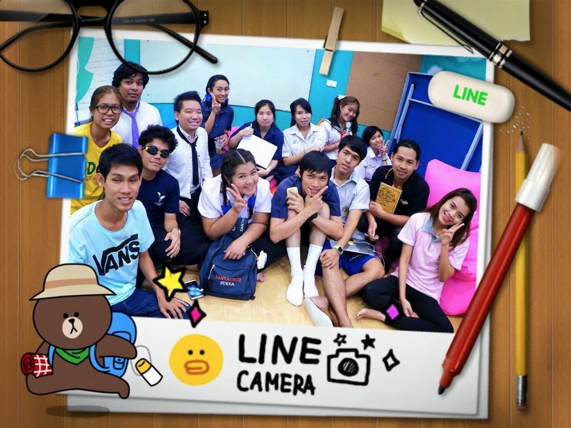
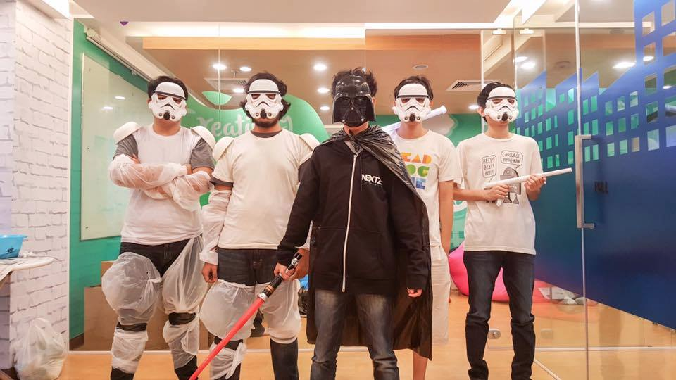

ช่วงนี้ก็เป็นฤดูที่น้องๆหลายๆมหาวิทยาลัยจะหาที่ฝึกงาน กับบริษัทต่างๆ ทางบริษัท Nextzy Technologies ก็รับน้องฝึกงานเช่นกัน และรับตลอดทั้งปีอีกด้วย ทางเราก็คัดเลือกไปพอสมควร เรามั่นใจว่าได้รับ Resume ทุกฉบับและได้อ่าน Resume ทุกฉบับ รวมถึงบางคนที่ไม่ได้ส่ง Resume มาแต่ได้ส่งคำถามมา เราก็พยายามตอบเท่าที่จะตอบได้ จนอย่างที่เห็นในภาพ เราคัดเลือกน้องๆเกือบครบทุกตำแหน่งแล้ว

สิ่งที่ถามเข้ามามากที่ทุดทั้งในเมล์ ถามมาหน้าไมค์ และหลังไมค์ ฝากถามผ่านคนมาบ้าง นั่นคือ “ค่าตอบแทน”

---

อันนี้ไม่รู้ว่าบริษัทอื่นเค้าเตรียมตัวรับมือเรื่องนี้อย่างไร แต่ผมจะตอบในฐานะที่เป็นคนดูแลบริษัท และในฐานะที่เคยฝึกงานมาก่อนด้วย

บริษัทที่เรามาฝึกงานเป็นบริษัทไอที เราใช้แรงงานสมองมากกว่าแรงงานที่เป็นกำลังทางด้านร่างกาย ซึ่งแน่นอนให้เราตระหนักไว้เสมอ ว่าสกิลนี้เราไม่ได้เก่งและสามารถทำงานได้ทันทีเมื่อเริ่มที่จะฝึกงาน เหมือนกับอาชีพอื่นๆทั่วๆไป อย่างเช่น เสริพอาหาร ยกของ ถ่ายเอกสาร

**เอาในฐานะคนดูแลบริษัทก่อน สิ่งที่บริษัทต้องลงทุนในนักศึกษาฝึกงาน(ยกเอาบริษัทเน็กซี่เป็นหลัก บริษัทอื่นๆไม่รู้นะครับ)**

-   ที่นั่งสำหรับน้องๆ อันนี้แน่ๆ เพราะที่นั่งของบริษัท มีจำกัดที่ เน็ทซี่จะไม่มีการแบ่งชนชั้นกัน เพราะเรานั่งเก้าอี้เหมือนกันหมด อย่างค่าใช้จ่ายเรื่องอ๊อฟฟิต ก็ตกเดือนละประมาณ 200,000 บาท ถ้าคนประมาณ 20 คน ถ้าลองตีเป็นตัวเงินคร่าวๆ ของสถานที่จะอยู่คนละ 10,000 บาทต่อเดือนเลยทีเดียว
-   เวลาของพี่ๆที่จะให้กับน้องๆ ในทีม เนื่องจากต้องมีการปรับตัว และสอนงานเพื่อที่จะให้ทำงานได้เองก็ต้องมีการสอน มากหรือน้อย ก็ถือว่าเป็น Manday พี่ๆที่จะลงทุนไปเช่นกัน
-   เวลาในการประชุม น้องฝึกงานก็เปรียบเสมือนทีมงานคนหนึ่งเลยทีเดียว มีการเข้าประชุม มีการถกปัญหา การแก้ปัญหา รับฟังปัญหา เวลาตรงนี้ ทีมก็ต้องรับไป หาประชุมพร้อมกัน 20 คน แล้วมีการพูดคุยกัน 1 ชั่วโมง เท่ากับบริษัทเสีย Manday ไปเกือบๆ 3 วันเลยทีเดียว
-   นี่ยังไม่รวมสวัสดิการในอ๊อฟฟิต มาม่าฟรี ของกินฟรีอีกเพียบ ที่ยังเป็นต้นทุนของบริษัท
-   บางครั้งตรงกับ Event บริษัท เช่นดูหนังประจำเดือน กินเลี้ยงบริษัทประจำเดือน ที่ต้องประเมินค่าใช้จ่ายให้น้องๆด้วย เพราะไม่อย่างให้ถูกมองว่าเป็นน้องฝึกงาน

> **แล้วในฐานะที่ผมเป็นน้องฝึกงานบ้างหละ ผมคิดยังไง**

-   ฝึกงานต้องได้เงินดิ จริงครับได้เงิน และต้องได้สมเหตุสมผลกับที่ผมแสดงฝีมือไปด้วย ถ้าไม่ได้ ผมก็จะหาความรู้ให้มากที่สุดเพื่อที่จะเอาไปทำงานในอนาคต

เงินในการฝึกงาน 2 เดือนตอนนั้นผมคิดไว้เลยครับ ปกติเงินเดือนโปรแกรมเมอร์เชียงใหม่ก็ประมาณ 15,000 บาท ผมเป็นเด็กฝึกงาน คิดว่ายังไงผมก็ไม่ได้เกิน 30,000 บาทแน่ๆ อ่า ลองแบบผมเทพๆ **ผมได้ 30,000 บาท**

จุดเปลี่ยนความคิดของผมมันอยู่ตรงนี้ครับ

**ผมได้ 30,000 บาท แล้วยังไงต่อ ผมก็กลับมาคิด**

> เงิน 30,000 บาท มันทำให้ผมรวยไหม เปล่าเลยยยยย

> 30,000 มันพลิกชีวิตผมหรือป่าว กับการที่ผมไปฝึกบริษัทที่ให้ผมได้แต่เงิน แล้วเอาผมไปทำงานเพื่อที่จะทำกำไรอย่างเดียว คือเอาแรงผมไปเป็น Manday

---

อยากรู้ใช่ม่ะ ว่าสมัยผมฝึกงานได้เงินเท่าไร ตอบให้คือ เดือนละ 1,000 บาทถ้วน และเงินจำนวนนี้มันก็ไม่ได้เปลี่ยนชีวิตผมให้ “จน” หรือ “รวย” ขึ้นแต่อย่างใด

**แล้วสุดท้ายหละ จะเลือกสถานที่ฝึกงานอย่างไร เป็นข้อๆเลยเอาจากที่สำคัญสุด**

-   เลือกบริษัทที่เราอยากจะทำงานด้วยในอนาคต แล้วแสดงฝีมือให้เค้าเห็น
-   ควรเลือกให้ตรงสายงานที่เราอยากจะยึดทำเป็นอาชีพในอนาคต แล้วทำงานแสดงฝีมือเก็บเกี่ยวทำผลงานให้มากที่สุด ถ้าเป็นงานจริงๆจะดีมาก เพราะจะเอาไปใช้สมัครงานได้
-   เลือกบริษัท ที่ให้โอกาสเราที่จะได้แสดงฝีมือ และให้ความสำคัญกับเรา
-   เลือกบรรยากาศที่เราชอบ หากเรารักที่จะทำงานอย่างจริงจังให้เราเลือกฝึกงานที่เป็น Bank ถ้าอยากฝึกกับบริษัทที่สนุกกินบ่อยให้ฝึกบริษัทที่ขายโปรดัก เพราะจะกินเลี้ยงเยอะ ถ้าอยากทำงานทุกอย่างเลยให้ฝึกงานกับบริษัทคนน้อยๆ เราจะได้ทำทุกอย่าง เป็นต้น

สุดท้ายผมขอนิยามคำว่า “ฝึกงาน” ใหม่ว่า

> มันคือการ ฝึก ทำงานจริงๆ

ไม่ใช่ การ “ฝึก” เพื่อที่จะฝึกงาน

> **ควรเตรียมอาวุธมาให้พร้อม ที่จะได้มาลงสนามจริงๆ โดยที่มีพี่เลี้ยงที่จะเค้นศักยภาพคุณออกมาให้มากที่สุดเท่าที่จะทำได้**

> **แต่ไม่ควรที่จะมาหาอาวุธเอาจากที่ฝึกงาน**
