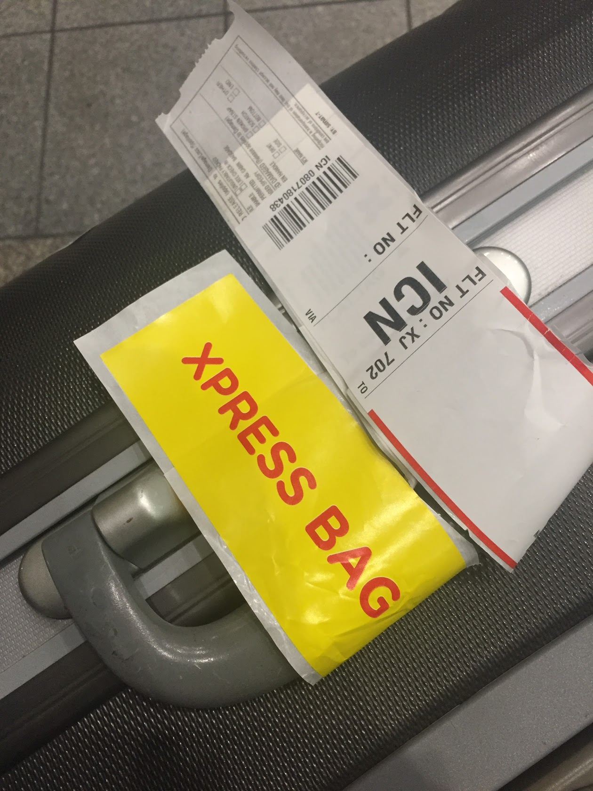
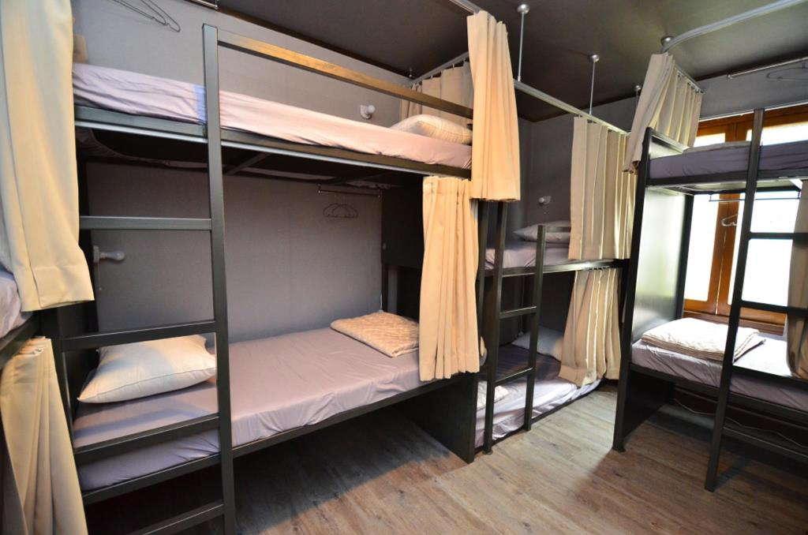

เริ่มจากโปรราคาถูกเข้ามาบัตรเครดิตในมือก็ลั่นจองไปเรียบร้อยจ้า จัดไป 9 วัน ของ AirAsia เจ้าประจำนี่เอง ตามรูปซึ่งออกเดินทางประมาณ 16:10 แน่นอนจ้ามัน Delay

ก็เตรียมขึ้นเครื่อง สิ่งที่ไม่นึกไม่ฝันคือกราวของสายการบินนี้ น่ารักมากๆ น่ารักกว่าแอร์บนเครื่องอีก 555 แนะนำเลย ไม่อยากจากน้องเค้าไปเลยแต่ต้องขึ้นเครื่องแล้ว

ขึ้นไปบนเครื่องก็ฟังเค้าสาธิตการใช้งานอุปกรณ์ ส่วนมากคนเค้าก็จะไม่ค่อยฟังกันอ่ะนะ ผมเลยฟังๆดูมีการดึงดูดผู้ฟังด้วยวิธีใหม่ 555

> เครื่องบินลำนี้ไม่เหมือนเครื่องบินลำอื่น ระบบความปลอดภัยจะไม่เหมือนกันกรุณาตั้งใจฟังประมาณนี้

ฟังๆกันไปเครื่องขึ้นไปก็หลับๆตื่นๆ เลยนั่งอ่านหนังสือไปเรื่อยๆ จนเกือบจบเลย สั่งน้ำดื่มมากิน ราคาก็ไม่แรงมาก แนะนำให้สั่ง มากินได้แก้เหงา

ได้เวลาลงเครื่องก็มาเอากระเป๋า แต่มีบัตรเครดิต Airasia เลยได้กระเป๋าเป็นคิวแรกๆเลย ตอนนั้นมาถึงก็ 23:00 หละ

### **ด้วยความว่ามาถึงเกาหลีดึกมาก รถไฟฟ้าใต้ดินหมดครับพี่น้อง 555**

อ่าว เวนกำหละ ต้องนั่งรถเมย์เข้าไปในเมือง ซึ่งประเด็น คือต้องรอรถเมย์นานมาก ประมาณ 45 นาที แล้วต่อแถวรอกันยาวมาก เลยอยากจะลัดคิว !!เฮ้ยไม่ใช่ อยากจะ ลองหาวิธีใหม่ คือ จุดหมายเราจะไปลง มยองดง(Myeong-dong) เลยถาม ไปว่ามีใครอยากไปลง มยองดง(Myeong-dong) กันไหม ถามไปทั้งภาษาไทยและอังกฤษ ได้เพื่อนคนไทยมาอีก 3 คน แล้วตอนนั้น รวมตัวกันได้ 5 คน เหมารถไปลง มยองดง(Myeong-dong)

> และแล้วก็มาถึง มยองดง(Myeong-dong)

เป็นย่านที่พักของสาวๆเลย ว่าแล้วก็ กดๆหาที่พัก ว่าแถวนี้มีที่พักหรือไม่ จัดไป เปิด App Agoda AirBnB หากันเดี๋ยวนั้น ไม่ได้จองมาล่วงหน้า ก็หากันไป จนไปเจอที่นี่ ที่ยังเปิดอยู่ เดินตาม Google Map ไปเรื่อยๆจนเจอ ที่ยังไม่ปิดเพราะเป็นผับ เราก็จัดแจงเอากระเป๋าไปไว้ แต่เค้าบอกว่า ส่วน Hostel นั้นปิดแล้วนะเข้าไม่ได้ เราก็บอกไม่เป็นไร เดี๋ยวเราไม่ได้พักอยู่แล้วคืนนี้

เพราะคืนนี้ เราจะเข้า NB2 ผับดังย่าน มยองดง(Myeong-dong) คนเกาหลีชอบเรียก ฮงอิก คงเพราะมีมหาวิทยาลัยตั้งอยู่ที่นั่น ซึงตั้งอยู่ใกล้ ที่พักเรามาก เดินไปเลี้ยว สองโค้งถึงเลย เจ้าของที่พัก บอก ยู จะจองที่พักให้ประเป๋าเดินทางหรอ 555 เราบอกใช่ แล้วก็เดินจากไปอย่างหล่อ มุ่งหน้า สู่ NB2

ถึง NB2 จนได้

มาก่อนเที่ยงคืน 12,000won หลังเที่ยงคืน 15,000won สามารถเอาตั๋วไปแลกเครื่องดื่มได้ข้างใน ข้างในส่วนมากเค้าก็กินกันแค่ 1 ขวดหรือ 1 แก้วกันเท่านั้น เค้าก็ไปเต้นกันซ่ะส่วนมาก ไอ้เราก็เต้นกันเต็มที่ เพราะ ไม่มีใครรู้จักเราอยู่แล้ว มีคำถามยอดฮิต ว่าเกาหลี ผู้ชายหล่อไป เอาเป็นว่าถ้าสาวๆมานี่ได้เกาหลีกลับบ้านอย่างแน่นอน ผมเลยเที่ยวอยู่จนร้าน ปิด ประมาณ 8:00 น. ประมาณ 8 โมงเช้า ไม่เหมือนบ้านเรา ที่เปิดเที่ยงคืน ตอนจบผมเซอไพรซ์ มากตรงที่เค้าจะเปิดเพลงๆหนึ่งที่น่าจะฮิตในบ้านเขา แล้วทุกคนในผับต่อแถวจับไหล่กัน แล้วเดินเป็นงูไปรอบผับจนเพลงจบ แล้วร่ำลาและแยกย้ายกันหลับ

ตื่นมาก็เดินเล่นทั่ว ย่านที่พัก วนๆอยู่แถวนี้ประมาณ 3 วัน 555 เพราะไม่รู้จะไปไหน มาช่วงเมษายน หนีร้อนมา ต้นไม้กำลังอยู่ในฤดูผลัดใบเลย ตามรูป

ช่วงนี้ก็ตระเวนหาของกินของฝากไปเรื่อยๆ ตามตรอก ซอย อะไรเยอะแยะไปหมด โดยของยอดนิยมของคนไทย คือ ที่มาร์คหน้า ซึ่งมีลดราคากันแทบทุกร้าน เดินเล่นไปเรื่อยๆ มาเจอ เรือโจรสลัด ต้องถ่ายรูปเก็บซักหน่อย

ชื่อ Cafe de ONE PIECE.

เดินไปเรื่อยๆจนตกเย็น ก็แวะกินข้าว แนะนำอันนี้ เป็นหมูกรอบขั้นเทพราดน้ำซอสเกาหลี แบบเผ็ดพอดีๆ ราคาไม่สูงมาก ตกประมาณ 120 บาทไทย ข้าวเยอะมากๆและหมูกรอบก็ให้มาเต็มจนล้นเลย

ตกเย็นมา ก็เหมือนเดิม คืนนี้ เราจะพาไปที่ใหม่ นั่น คือ ผับเพิ่งเปิดใหม่ในย่านนี้ ชื่อว่า Aura นี่เลย นี่เลย บัตรเข้าสามารถ เอาไปแลกเครื่องดื่มข้างในได้

แต่ที่นี่มีกฏอยู่นิดนึง คือถ้ามาคนเดียวจะไม่สามารถเข้าไปได้ ต้องมากันอย่างน้อย 2 คน ถึงให้เข้าไป ว่าแล้ว ก็คิด เฮ้อ ฝนตก หนาวก็หนาว สงสัยได้กลับไปนอนหละวันนี้ แต่ดัน มีคนเกาหลีมาถาม U มาเป็นบัดดี้ กะ เราไหม ถ่ายรูป กะบัดดี้ ซ่ะหน่อย

ขออภัยที่ไม่ได้ถ่ายภาพข้างในมา ข้างในจะแบ่งเป็นชั้น ๆ มีฟอร์ เอาไว้เต้น ตามจุดต่างๆประจายไปทั่ว อ้อ ลืมบอกไปที่นั่น นิยมกินเป็น แก้วกัน ไม่ได้นิยมมาเปิดโต๊ะ เปิดเหล้าเป็นขวดๆแบบบ้านเรา เพราะที่นั่นเหล้าแพงมาก เปิดโต๊ะนี่อาจจะหมดเป็น หมื่นๆ น่าจะประมาณ 20,000–30,000 บาท มั้งเท่าที่ดูราคา

วันต่อมา ตื่นบ่ายๆ เพราะ เที่ยวถึงเช้าเหมือนเดิม ตอนกลางคืนย่านนี้จะเป็นอีกแบบเลย แสงสวยมาก บรรยากาศคึกคักกว่าตอนกลางวันมากๆ

แวะๆ Line Store

ของไม่ได้แพงมากเท่าไร ก็ซื้อไปเป็นของฝากกันได้ เพราะ ที่ไทยไม่มีขาย ไทยเรา ฮิต Line กันมาก คนรับน่าจะถูกใจ

ตกเย็นก็เดินเล่น หาอะไรกิน ที่ขาดไม่ได้นั่นคือ ….

> หมูกระทะเกาหลี

เครื่องเคียงเติมได้ไม่อั้น จัดไป พร้อมน้ำเขียว 1 ขวด

โดยในนี้ก็จะมีหมูหมัก มีไก่ โดยมีเครื่องเคียงตามรูปเลย ชิวๆ เจ้าของร้านมาเห็นเราเป็นคนต่างชาติ เค้าก็มาสอนย่างให้ด้วย ใจดีมากๆ หมดนี่ ประมาณ 500 บาท มั้ง ถ้าจำไม่ผิด ถูกมากๆ เทียบกับคุณภาพ ร้านแบบนี้อยู่ตามตรอกซอย ชิวๆ อิ่มๆ ก็วันนี้งดเที่ยวซักวัน เลยไม่ได้ไปไหน ตื่นเช้ามากับอากาศหนาวๆ วันนี้จะไปไหนดีว้า เปิดๆพันทิพ โอเคร จัดไป คลองชองเกชอน (Cheonggyecheon Stream) จัดไป

นั่งรถไฟใต้ดินที่มีระบบดีมาก แปบๆเดียว ถึงเลย เป็นคลองที่ใสมากๆ ไหลผ่านกลางเมือง ตอนเย็นๆจะมีร้านอาหารมาขายริมคลองนี้ เพียบเลย หรือ หลังเลิกงาน จะมานั่งโง่ๆ เล่นแถวนี้ก็ได้

แวะมาบ่ายแก่ๆแล้ว ผมเคยลองเดินแม่ม อย่างไกล ไม่สุดคลองซักที พอดีอินดี้อยากรู้ว่ามันจะเดินได้ไกลสุดแค่ไหน วันนี้มาก็ไม่ได้ทำอะไร แวะพบปะผู้คนทั่วไป พูดคุย กันกับคนเกาหลี ส่วนมากในเมืองนี่จะพูดภาษาอังกฤษได้หมดเลย ประทับใจมาก ตกเย็น ก็ไม่รู้จะไปไหน มาเกาหลี 2 ครั้งไม่เคยมา โซลทาวเวอร์ หลังจากลงจากลงรถไฟฟ้าก็จัดไป ลองทดลองนั่งแทกซี่ไปเลย แทกซี่เกือบพาไปไม่ถูก หละก็มีถึงจนได้

นั่งกระเช้าขึ้นไปที่หอคอยต่อเพราะ หอคอยนี้มันอยู่บนภูเขา ถึงแล้วที่ขึ้นกระเช้า

กดตั๋วๆ

ด้านล่างจะเป็นที่แขวนกุญแจตามรูปเลย ยังไม่ได้ขึ้นไปข้างบน เพราะข้างบนเสียค่าขึ้นไปดู

เอาว่ะ มาทั้งที ขึ้นไปก็ได้ จัดไป ค่าบัตรแพงพอสมควร ต่อแถวขึ้นไปได้เลยขึ้นมาบนยอดเรียบร้อย มาดูวิวมุมสูงของเกาหลี

มาแล้วก็ มาเจอร้านขายของ ชอบมามีร้านลูกอมของโปรดด้วย จัดไปซื้อมานิดหน่อย เอาไปกินเล่นระหวางนั่งดูวิว มาซ่ะดึกแล้ว คนไม่ค่อยเยอะ

เสร็จแล้วตอนลงก็ นั่งกระเช้าลง ขึ้นมาข้างบนไม่ค่อยมีอะไรเท่าไร แต่วิวสวยดี เดินกลับระหว่างทางเจอ Casino เลยแวะไปซักหน่อย ข้างในถ่ายไม่ได้ ถ่ายข้างนอกมาหละกัน

ข้างในมีหลากหลายเกม มีทั้งตู้สล๊อด ไฮโล อะไรอีกเยอะ เลยเหมือนเหมาทั้งชั้นของโรงแรมนั้นมาเลย เข้าไปเดินๆดูส่วนมาคนเล่นเสียมากกว่าได้ นะ เหอะๆ เลยลองๆไป นิดหน่อย เสียอย่างรวดเร็ว ข้างในมีน้ำฟรี กาแฟฟรี เพียบเลย อิ่มเชียว หลังจากเดินลงมาจากโซลทาวเวอร์

กลับเข้าที่พัก พรุ่งนี้ลุยต่อ ว่าจะไปเที่ยว เดินผ่านร้านนี้ ผมนี่รีบเลย แต่เค้ารับเฉพาะ คนเกาหลี และคนที่สามารถพูดเกาหลีได้เท่านั้น

จากที่ลองถามคนที่ต่อแถวเข้า เค้าบอกว่าเป็นร้านที่เข้าไป เค้าจะจับนั่งโต๊ะ 4 คน แล้วให้คุยกัน แล้วถ้าเกิดเรา ถูกใจก็คบกัน หรือจะไปเที่ยวกันต่อก็ได้ แล้วแต่เลย หละก็เดินกลับห้องไปนอนกินมาม่า เจอกันพรุ่งนี้

ตื่นแล้ว ซักไปซ่ะเกือบเที่ยง ~~~ ไปเที่ยวไหนดี ค้นๆ พันทิพ เค้าบอกว่าลองไปหมู่บ้านโบราณดู ไม่ไกลมาก อยู่แถวๆ ฮงแดนี่เอง นั่นคือ หมู่บ้านบุกชอนฮันอก (Bukchon Hanok Village) ฮงแด (Hongdae)

นั่งรถไฟฟ้า ต่อแล้วเดินต่อ นิดหน่อยเป็นทางขึ้นมีไกด์ ที่เป็นคนแถวนั้นบอกเลยว่าอยู่ตรงนี้ เดินขึ้นไปตามทางได้เลย

แถวนี้ก็มีทางเดินขึ้นเขา มีร้านน่ารักๆ เต็มไปหมดตลอดเส้นทางแวะชมได้ทั้งวันเลย ไม่เบื่อ มีทางลงหลอกๆ พวก อย่าง ตามในหนังก็มีหวะ สะพานหิน อะไรแบบนี้

เสร็จแล้วก็กลับมาที่ฮงแด ของเรานี่เอง ตอนมืดแล้ว มาดูบรรยากาศ ตอนมืด คนเยอะกว่าตอนกลางวันมาก แวะมาซื้อของฝากให้สาวๆก่อนกลับ

หละตอนนี้ก็ถึงเวลาออกไปพักย่านชาญเมืองดูบ้าง เลยจองที่พักไว้ย่านชาญเมือง ที่พักไม่ไกลจากรถไฟฟ้ามามาก

ห้องนอน คืนละ 1,200 เท่านั้นสำหรับ 1 ห้องนอน นอนคนเดียว สบายๆ ห้องหรูมาก เหมือนโรงแรมเลย แต่ที่พิเศษกว่านั้น คือผู้เข้าพักทุกคนจะรวมตัวกัน ซื้อของมาทำ โดยเจ้าของ Hostel จะเป็นคนทำอาหารให้รับประทาน อิ่มกันหมดเลย อันนี้คือบรรยากาศห้องนอน

เอากระเป๋า แวะเข้าที่พัก ก็ออกมาเดินเล่นกินบรรยากาศชนบท ชิวๆ ลมเย็นๆพัด สบายๆ ตามทางเต็มไปด้วยภาษาเกาหลี

อันนี้เป็นอาการที่เจ้าของ Hostel ทำให้กิน อร่อยมาก เป็นอาหารเกาหลีแท้ๆ โดยคนเกาหลี ตามนี้เลย แถมเจ้าของร้านเอา โซจูฟรี ไม่อั้น แต่ว่าผมกินไปนิดนึง เกือบเมาแล้ว 555

เอาไป ชู สองนิ้วเกาหลีแต่เด็กเลย อ่อ เด็กเกาหลีนี่นา 555

อยู่แถวชนบทเกาหลีก็ชิวดี ไม่เร่งรีบ บรรยากาศ ดีมาก ติดอย่างเดียวคนที่นี่มักพูดได้แต่ภาษาเกาหลี ทำให้การสั่งอาหารนั้น ค่อนข้างยาก แต่ก็ไม่ใช่ปัญหา เพราะ ผมสุ่มเอาตลอด เช่นร้านหมูย่างร้านนี้ ไม่รู้กินเนื้ออเะไรเข้าไป 555

สรุปทริปนี้เป็นทริปที่ได้ของฝากเยอะที่สุด 55 เห็นอะไรก็น่าซื้อไปหมด ตามรูปเลย ส่วนมา คร่าวๆ คือเครื่องสำอางทั้งนั้นเลย เอามาฝากสาวๆ Nextzy และเพื่อนๆทั้งนั้น คนอยู่ Nextzy นี่ได้ของฟรีบ่อยจริงๆ

โอกาสหน้า ถ้าไปเที่ยวไหน จะมาเล่าให้ฟังใหม่เน้อ บาย ~~~~~
