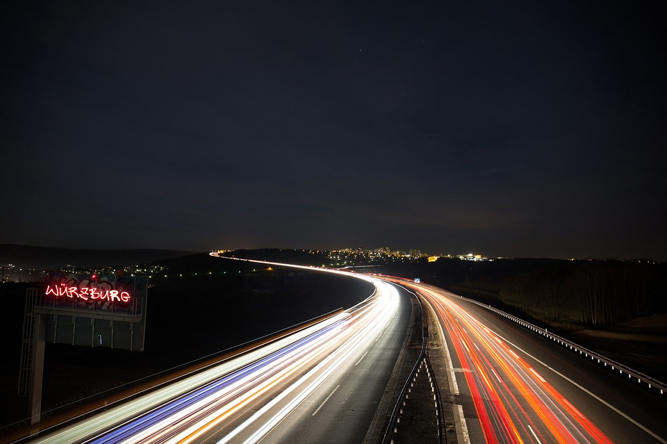

ปีนี้เพิ่งได้มีอารมมานั่งเขียนปกติก็จะเขียนไว้ทุกปี ทั้งเป้าหมายที่จะทำให้ได้และที่สรุปรวบยอดในปีที่แล้ว เอาไว้มานั่งทบทวนตัวเองว่าเราได้ทำอะไรไปบ้างมีข้อผิดพลาดที่เราไม่ควรทำ หรือมีอะไรที่เราสามารถนำกลับมาใช้ เป็นประโยชน์ในปีต่อไปได้

โดยเพื่อให้เป็นเนื้อหาที่ย่อยง่าย จะสรุปให้เป็นบทเรียนเป็นบท เพื่อที่จะเข้าใจง่าย อ่านแล้วเห็นภาพได้เลย

> เปลี่ยนใจเล่าไปเรื่อยๆดีก่า…

---

ช่วงต้นปีเป็นเวลาที่บริษัทอยากที่จะได้งานใหม่ๆท้าทายๆ ผมเลยลองซื้อหนังสือที่เกี่ยวกับเรื่องเซล์มาอ่าน อ่านไปอ่านมาก็ลองทำตัวเองเป็นเซลล์ซ่ะเลย ออกไปหางาน ไปอยู่ 6–7 ที่ก็โอเค สนุกดีน้องๆและผมทำงานหนักๆพอๆกันหมด หละก็ผมก็ตั้งใจไว้ว่าปีนี้ต้องมีลูกค้าใหม่ให้ได้ ใช้เวลานานมาก จนผมเกือบท้อไปแล้วว่าปีนี้ผมคงไม่ได้ลูกค้าใหม่แน่ๆ เวลาล่วงเลยผ่านไป 6 เดือนก็แล้ว 7 เดือนก็แล้ว จนเสียงของหัวใจที่เรียกหาเป้าหมายมันดังขึ้น เข้าเดือนที่ 8 ผมได้ลูกค้ารายใหม่จนได้ ในเดือนที่ 8 เกือบจะเดือนที่ 9 เวลาทั้งหมดใน 9 เดือนที่ผ่านมานั้น ไม่มีวันไหนที่ผมไม่พูดถึงการหาลูกค้าใหม่ ทุกครั้งที่ไปทานเข้า ทุกครั้งที่ไปคุยกับคนที่ไม่รู้จักผมบอกตัวเองเสมอว่าเราต้องมีลูกค้าใหม่ให้ได้ บางทีก็บอกในใจหนะ 555 ไม่กล้าบอกคู่สนทนา อย่างที่บอกครับ ผมยึดเสมอว่า

> หากว่าเราเลิกเล่นเราจะแพ้ทันที แต่ถ้าเรายังเล่นเกมก็ยังดำเนินต่อไป

---

หลังกลางปีมา งานเข้าหนักมากส่วนตัวผมเองทำงานทุกวัน หยุดเดือนละ 2 วัน ทำงานอะไรบ้าง ก็มีตั้งแต่ไปซื้อลูกชิ้นให้น้องในทีม ไปซื้อคอมใหม่ วางบิล Support เกี่ยวกับ Requirement คอยตอบปัญหาลูกค้า เข้าไปช่วยแก้โค๊ด(วางบัค) คอย Standby ช่วงกลางคืนเวลาเกิดปัญหาจะได้แก้ทัน

จริงๆคือทำทุกอยากที่สามารถช่วยทีมได้ ไม่เลือกเลย ทุกคนทำงานผลัดกัน 24 ชั่วโมง ตัวผมเองนั้นก็อยู่ Support 24 ชั่วโมงด้วย วิธีการคือไม่ปิดเสียงโทรศัพท์เลยตลอดทั้งคืน เผื่อมีอะไรฉุกเฉินก็จะได้แก้ให้ทัน

หลายคนก็บอกนะว่าทำไปเสียเวลาหรือป่าวเราควรโพกัสแค่งานของเราหรือเปล่า แต่จริงๆมันไม่ใช่เลยครับ ผมคิดว่าผมควรโฟกัสสิ่งที่ผม “ช่วยได้” และช่วยทำสิ่งนั้นให้กับทีมอย่างเต็มที่มากที่สุดเท่าที่จะทำได้มากกว่า สิ่งที่ผมอยากจะบอกว่าจริงๆแล้วคุณต้องรู้ว่าจะทำงานนั้นไปทำไม

> คุณจะคิดแค่ว่าคุณเป็นโปรแกรมเมอร์ที่ทำงานแลกข้าว หรือจะเป็นโปรแกรมเมอร์ทีช่วยให้ชีวิตคนส่วนมากดีขึ้น ก็อยู่ที่คุณครับว่าคิดแบบไหน

---

Forex มาแรงมาก(ส่วนมากโดน…) บอกเฉยๆ ผมไม่ได้เล่นหรอก มาพูดถึงการลงทุนกันบ้าง ต้นปีมาถึงปลายปี ก็ทรงๆ มีหลายคนรวยขึ้นจากการลงทุน ส่วนน้อยที่จนลง (วัดจากคนรอบตัวนะ) ส่วนตัวผมอ่ะหรอ ก็เทรดเล่นบ้าง นานๆที วิธีการจัดพอร์ตผมง่ายมากคือใช้หนี้ก่อน 555 แล้วค่อยนำมาลงทุน แต่หลายๆคนคงคิดว่า ผมคงลงทุนใน หุ้น อสังหา กองทุนต่างๆแน่ๆ แต่แท้จริงแล้วผิดครับ เงินหลังหักออกจากจ่ายหนี้

ผมเอาไปลงทุนกับตัวเอง 100% ฮ่ะ มาดูว่าลงทุนอะไรไปบ้าง

-   ซื้อหนังสือดีๆมาอ่าน
-   สมัคร Audio Book Online
-   สมัครฟิตเนต ออกกำลังกาย
-   ไปเที่ยว Lowcost ต่างประเทศปีละครั้ง
-   ซื้อ คอร์สออนไลน์

แต่การลงทุนแบบนี้คนส่วนมากไม่ค่อยลงกันเพราะ นอกจากใช้เงินแล้วยังต้องใช้เวลาเพื่อลงทุนด้วย

คนส่วนใหญ่สมัยนี้อยากที่จะรวยเร็วๆอยากที่จะทำงานสบายๆใช้เวลาน้อยๆ แต่ความจริงโลกของเรามันโหดร้ายและเป็นแบบนี้มานานแล้ว จริงๆแล้วการลงทุนก็จำเป็นนะแต่ว่าถ้าอยากที่จะได้ผลตอบแทนเยอะ ในช่วงแรกควรใส่เวลาเข้าไปเยอะๆ แต่ส่วนมากใส่เงินเข้าไปเยอะๆสุดท้ายเจ๊ง เพราะไม่ได้ใส่เวลาเข้าไปด้วย

> ไม่มีอะไรที่เป็นเรื่องบังเอิญ มีแต่ผลของความตั้งใจเท่านั้นแหละ

---

ผมใช้เวลาเกือบทั้งชีวิตไปกับการทำงาน ผมเริ่มทำงานตั้งแต่ตอนอยู่ปี 3 และในปีที่ผ่านมา 2559 ผมแบ่งเวลาทำงานอย่างไร ตอบให้ในนี้เลยคือไม่แบ่ง เพราะ**ในโลกออนไลน์ที่ไม่เคยหลับไหลนี้ เราเลี่ยงไม่ได้กับคำว่าระบบล่ม** หรือติดปัญหา ตอนเด็กๆผมก็เตรียมตัวเตรียมใจมาแล้วคนไอที ทำงาน 24 ชั่วโมงกันจริงๆ แต่ไม่ได้หมายความว่า 24 ชั่วโมงแบบไม่นอนนะ

คติการทำงานของผมคือ หากมีเวลาไหนที่เราต้องทำงานเราต้องพร้อม ไม่มีคำว่าไม่พร้อม เพราะเราทำงานออนไลน์ จำคำนี้เอาไว้ให้ขึ้นหูเลย .

> หลายๆคนบอกว่าเฮ้ยนั่นมันเวลา “ส่วนตัว” นี่หว่า เอามาทำงานทำไม

แต่กลับไม่เคยได้ยินคำว่า

> มาๆรวมพลังกันทำงาน 8 ชั่วโมงนี้ให้เต็มที่ ไม่เล่นไม่เปิดหนัง ไม่แชด ไม่ FB ไม่พันทิพย์กัน ลุยยยยยย

ส่วนตัวผมถ้าทำงานดึกมากๆ ผมก็ตื่นสายนะ ไม่ได้ตื่นเช้าเหมือนกัน และทีมก็เป็นแบบนั้นผมก็ไม่ได้ว่าอะไร เพราะเราทำงานกันจริงๆ ไม่ได้มานั่งแช่ 9–18 โดยที่ไม่ทำอะไร

ซึ่ง Time Management เหมือนก็จะอิงโดยตรงกับ Task Management ซึ่งตัวผมเองจะเขียนเก็บไว้ ว่าแต่ละวันจะทำอะไรบ้าง แบ่งออกเป็นยากและง่าย ถ้า Task ไหนยากจะเอามาทำในตอนที่สมองโล่งๆ จะทำได้เร็วหว่า และค่อยนำ Task อื่นๆมาแทรก เพราะเราต้อง Support คนอื่นๆด้วย

> แต่ก็ดี เพราะถ้าคนธรรมดาทั่วไปทำแค่ Task ของตัวเองเสร็จแต่คนที่พิเศษกว่านั้น ได้เรียนรู้สิ่งใหม่ๆจากการช่วยเหลือคนอื่นด้วย

---

ตามด้านบนอย่างที่บอกว่าผมใช้เวลาเกือบทั้งชีวิตไปกับการทำงาน เรามาพูดถึงเรื่อง Work กันบ้าง Work แบบไหน Work แล้ว Work แล้ว Work แบบไหน Work แล้วไม่ Work เฮ้ย งง มาๆต่อๆ ยาวข้อนี้

โปรแกรมเมอร์ถือเป็นงานที่ใช้ศิลปะเป็นอย่างมาก เพราะอะไรหรอ กว่าจะมีอารมมาเขียนโปรแกรมได้นี่ต้องขจัดความอาร์ตออกไป เพราะอาร์ตเยอะ 555

บางครั้งผมก็มาคิดว่าอารมที่เราเบื่องานหรือเบื่ออะไรซักอย่างหนึ่งเนี่ยมันเป็นเพราะอะไร จริงๆมันก็เพราะตัวเราเองนี่แหละครับ เราไม่ได้เบื่องาน เราเบื่อตัวเราเองนี่แหละ บางครั้งการเบื่อก็อาจจะเป็นเพราะ เราแก้ปัญหางานนั้นไม่ได้ เราไม่ได้โฟกัสมันมากพอ

ผมเคยอ่านเจอในหนังสือเค้าบอกว่า คุณเป็นคนแบบไหน งานก็จะออกมาเป็นแบบนั้น ผมว่าเออจริง เราเป็นคนรีบร้อนไม่รอบคอบ งานก็จะออกมารีบร้อน ไม่รอบคอบ ทำงานไปบ่นไปงานก็จะไม่เรียบร้อย แถมไม่มีความสุขในการทำงานอีกทั้งๆที่จริงๆมันก็ไม่ได้มีอะไรเลย

ดีซ่ะอีกที่เรายังมีงานทำ คนในประเทศตกงานไม่รู้จักเท่าไร งานยากมันจะทำให้เราเติบโตและก้าวหน้า

ผมนึกถึงช่วงอายุที่เรายังเด็กนะ เกิดมาเราก็ยังคลาน ไปคลานมา ถ้าซัก 3 ปี ยังคลานไปคลานมา ป่านนี้เราคงยังเดินไม่ได้ ถ้าเราลองทำสิ่งใหม่ ลองลุกขึ้นและก้าวขา ถึงล้มบ้างมันก็เจ็บ แต่ทำไมผู้ใหญ่เค้าถึงเชียร์ให้เราลุก นั้นเพราะเป้าหมายใหญ่เลยคือเราต้องเดินได้ และเพื่อก้าวไปสู่เป้าหมายใหม่ ที่เราจะต้องเดินได้ด้วยตัวคนเดียว และวิ่งได้

> ผมรู้สึกธรรมดานะที่เห็นคนทำงานได้ดี จากงานที่ง่ายและสภาพแวดล้อมดีอยู่แล้ว แต่ผมจะตื่นเต้นกับคนที่ทำงานได้ดีในงานที่ยากและสภาพแวดล้อมไม่เอื้ออำนวยมากกว่า

นั่นเพราะไม่มีทางใดเลยที่เค้าจะมาว่าเราได้ ว่าเรานั้นเป็นคนไม่เอาไหน ทำงานอะไรก็ไม่ได้ ชีวิตมันไม่ได้ง่ายขนาดนั้น ที่เราจะต้องมาเจองานที่ง่ายสภาพแวดล้อมที่ดีตลอด งานมันไม่ได้เหมือนเกมที่เล่น ที่เราจะจะกดสูตร โหลดเซบใหม่ได้ เลือกด่านได้

---

ด้านตัวเองส่วนตัวนั้นตอนนี้ก็ทำงานมาทั้งหมด 6 ปี อายุ 29 แล้ว 555 ยังไม่ถึง 30 อ่ะนะ ชีวิตมีตกอับ มีเศร้า มีความร้อนแรง มารวมกันในปี 2559 เรียกได้ว่ารวมทุกรสชาติในปีเดียว เลยได้มาหยุดคิดว่าชีวิตนี้ต้องการอะไรกันแน่ ในช่วงต้นปีที่ผ่านมา

> **สิ่งที่เสียงภายในใจที่บอกมาแล้วผมรับรู้ได้นั่น นั่นคือ แรงบันดาลใจที่ให้ผมยังเดินต่อไป**

แล้วผมก็ถามตัวเองต่อว่า แรงบันดาลใจมาจากหนังสือที่อ่านใช่หรือไม่ ซึ่งคำตอบมันคือไม่ใช่

ผมเคยดู Ted Talk อยู่เรื่องนึงซึ่งผมคิดว่ามันจริงมากที่พูดเกี่ยวกับ Inspiration หรือที่เราเรียกกันว่าแรงบันดาลใจ จริงๆมันไม่ได้เกิดขึ้นก่อนที่เราจะลงมือทำอะไร แต่มันจะเกิดขึ้นเมื่อเราทำสิ่งนั้นสำเร็จไปเรียบร้อยแล้ว ยกตัวอย่างเช่น

**สมมติ** ผมเขียนโปรแกรมสุดยอดเครื่องคิดเลข ขายได้ มีคนชอบ จริงๆแล้วผมไม่ได้มีแรงบันดาลใจในการเขียนโปรแกรมนี้มาก่อนเลยนะ แต่เป็นเพราะผมถูกสภาพแวดล้อมหล่อหลอมให้ผมทำ ก่อนที่จะได้เป็นโปรแกรมนั้น ไม่มีใครเคยรู้ว่า ผมเสียใจมาแล้วกี่ครั้งที่โปรแกรมมันไม่เป็นอย่างที่หวัง ผมอยากจะล้มเลิกมาแล้วกี่ครั้งตอนที่โปรแกรมมันขายไม่ได้ ผมหัวเสียแค่ไหน ที่โปรแกรมที่ตัวเองไม่ได้ดังใจ ผมอยากจะเลิกมากๆพอเห็นคนที่ทำอาชีพอื่นแล้วทำได้ดีกว่า รายได้ดีกว่า

> จากเหตุการณ์ข้างบน ถ้าเรายังไม่ล้มเลิกนะ ชีวิตจะเริ่มสะสมความชอบ ความพึงพอใจของเรามากขึ้นเรื่อยๆ จนพอมีจังหวะ ไม่ว่าอะไรก็ตาม ทำให้โปรแกรมเราขายได้เป็นที่นิยม มีรายได้ มีคนชื่นชอบ . ตอนนั้นเอง

> เราจะมีแรงบันดาลใจเกิดขึ้น และ จะผลักกระบวนการคิดของเราใหม่หมด เป็นคนที่ทำงานด้วย แรงบันดาลใจนั้น นั่นแหละ

---

ชีวิตจะเป็นอย่างไรให้ดูที่คนรอบข้างที่เราคุยด้วยมากที่สุดจำนวน 6 คน จริงๆจำนวนไม่สำคัญเท่าไร แต่ที่เคยเจอคนที่มีอิทธิพลมากก็จะมีประมาณ 6 คนนี้แหละ จริงๆผมคุยเยอะกว่านั้น ๆ

หลักคือถ้าเราต้องการคนแบบไหนให้เข้ามาในชีวิต ต้องกระจายความรู้สึกแบบนั้นออกไป ถ้าสังเกตดูผมก็จะแสดงตัวตนอย่างเต็มที่ เพื่อที่จะให้ได้คนแบบนั้นเข้ามาอยู่ในชีวิต อยากได้คนที่คิดบวกเราก็ต้องคิดบวก แต่จริงๆไม่ได้ห้ามห้ามไม่ให้คิดลบนะ เพราะห้ามกันไม่ได้อยู่แล้ว แต่ควรคิดลบแบบเงียบๆ ไม่กระจาย ไม่บ่นบน Social เพราะจริงๆมันเป็นผลร้ายกับตัวเราด้วยซ้ำ เพราะเราก็จะได้คนที่คิดลบติดมือกลับมาด้วย ไม่อยากจะนึกภาพเลยว่า ถ้ารอบๆตัวมีแต่คนที่คิดลบชีวิตมันจะไปทางไหน

ปีนี้โชคดีที่ถึงแม้จะโหดร้ายแค่ไหนก็มีคนดีๆเพื่อนๆพี่ๆดีๆเข้ามาช่วยเหลือตลอด

---

> หลังจากนี้ไปคงเป็นการเริ่มต้นที่ดี

-   ผมไม่ชอบชีวิตที่มีอยู่แล้ว 10 แล้วหาเพิ่มเป็น 11 อยากมีชีวิตที่เริ่มจาก 0 แล้วเพิ่มเป็น 1 ก็พอ
-   ในโลกนี้ทุกคนหนีไม่พ้นการขาย ยังไงก็ต้องค้าขาย แต่สิ่งที่สำคัญต้องขายความรู้ที่ตัวเองมีให้ได้ อย่าเก็บไว้คนเดียวเอามันออกมาซ่ะ
-   ตอนนี้ถึงเวลาที่จะ ใช้กฏของการ Laverage แล้ว เพราะเวลามีน้อยปีนี้
-   เรื่องเวลา ก็ไม่ต้องจัดการอะไรมาก ใช้เวลาในวันนี้เอาไปสร้างเวลาในอนาคตพอ หละก็เวลาในอนาคตเอาไปสร้างเวลาในอนาคต
-   ถามว่าผมยังเป็นโปรแกรมเมอร์อยู่ไหม ตอบเลยว่ายังเป็นอยู่ และก็ไม่มีอาชีพไหนที่จะยึดครองโลกได้เร็วขนาดนี้ 555
-   ปีนี้เริ่มที่การช่วย หากเราทำให้คนรอบช้างนั้นสบายเราก็จะสบายไปด้วย ทำให้คนรอบข้างเก่งเราก็จะเก่งไปด้วย ทำให้ทีมเก่งเราก็จะเก่งไปด้วย

ส่วนชีวิตผมเองก็ยังไม่หยุดอยู่แค่นี้แน่นอน ใครว่าชีวิตมันน่าเบื่อ ไม่มีหรอก เล่นกับมันให้สุดๆ วิ่งไปในสายงานเรื่อยๆ พบป่ะผู้คน แล้วจะรู้ว่าทางสายนี้ มันโครตสนุกมาคุยกันครับ ใน[ — Hipster Coder](https://www.facebook.com/Hipcoder/)

> ชีวิตบนทางด่วนที่วิ่งกันด้วยความเร็วแบบนี้ ซักวันคงมีพลาด แต่ผมก็ชอบนะ เพราะ เราไม่ต้องไปเบียดกับรถข้างนอก และถ้าหากทำความเร็วไปเรื่อยๆสุดท้ายถนนก็จะโล่งและปลอดภัย **เพราะเหลือแต่คุณและนักแข่งด้วยกันเท่านั้นแหละ**
