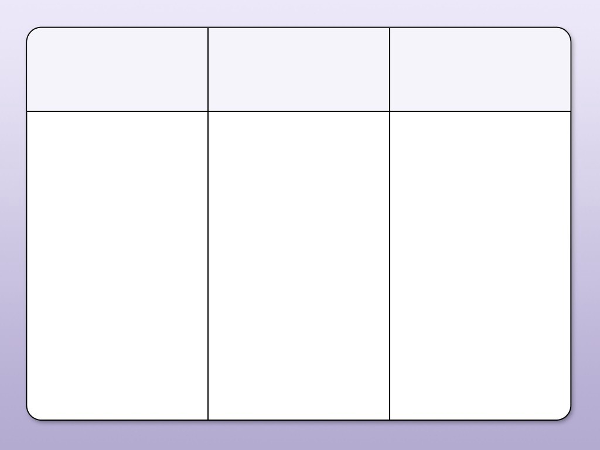
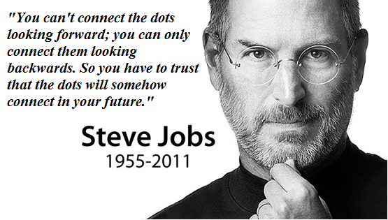

สวัสดีท่านผู้อ่านทุกท่าน จริงๆบทความนี้กะจะเขียนสรุปไว้ในทุกๆปี แต่ละปีปกติก็จะเล่าใน Facebook แต่ปีนี้พิเศษหน่อย เพราะมันเยอะมาก เลยมาเขียนเป็นบล๊อก แต่ถ้าหากเก็บเอาไว้คนเดียวมันก็คงไม่มีประโยชน์ ฉนั้นแบ่งปันมันเลยดีกว่า…

ปีนี้เป็นปีที่เอาทุกอย่างจากที่อ่านมาในปีก่อนๆปฏิบัติจริง จะแบ่งเป็น 3 เรื่องใหญ่ๆคือ

1.  เรื่องการทำงาน
2.  เรื่องการดำเนินชีวิต
3.  เรื่องการลงทุน

มหาเศรษฐี แต่ละคนทำงานกันแทบไม่มีวันหยุด และทำงานกันจนแทบจะวันสุดท้ายของชีวิตกันเลย…ไม่คิดจะสนใจให้เงินทำงานบ้างหรือ แต่นั่นเพราะเค้ามีความสุขกับงานที่ทำนั่นเอง ไม่รู้เหมือนกัน ตอนนี้ก็ยังไม่มีเงินมากพอ แต่ก็คิดว่า เป้าหมายแรกมันไม่ใช่เงินอีกต่อไปแต่เป็นการเสพติดความสำเร็จ บางทีการนั่งทำในสิ่งที่เราสร้างมามันก็เหนื่อย แต่มันมีความสนุก ความมัน ทั้งหมดมันเอาชนะความเหนื่อยไปได้

วิถีแห่งการโฟกัส อ่านหนังสือในหลายๆเล่มก็บอกให้โฟกัสเป็นเรื่องๆ บางเล่มก็ให้ทำอะไรพร้อมๆกัน ในเวลาเดียวกัน บางเล่มก็บอกทำๆแล้วพัก 15 นาที แล้วมาทำต่อ ผลคือได้คิดวิธีขึ้นมาเอง อาจจะคล้ายหนังสือบางเล่ม นั่นคือ

“ทำในสิ่งที่เราอยากทำในตอนนั้น แต่อยู่ในขอบข่ายความรับผิดชอบ” จะได้ Productivity สูงสุด

> อาจจะงงเช่น ตอนนั้นเราอยากจะ เขียนโปรแกรม Function A ก็ให้เราเขียนโปรแกรม Function A เลย แล้วค่อยเอางานอื่นมาต่อคิว

> มีงาน 2 ชิ้น งาน A เป็นงานที่ชอบและ งาน B เป็นงานเร่งกว่า ถ้าตามกฏก็ต้องทำงาน A ก่อน

แต่ส่วนมากที่เจอหรือคนส่วนใหญ่เจอคือ งาน A จริงๆไม่ใช่ “งาน” แต่เป็น “สิ่งรบกวน”(Noise) ซึ่งทำให้งาน B นั้นไม่สำเร็จ เราต้องกำจัดมันออกให้ได้ แม้มันจะยากแค่ไหนก็ตาม

จากที่ทำงานมาประมาณ 9 ปี ประสบการณ์มันบอกว่า งานที่ยากที่สุดคืองานที่เกี่ยวกับคน ถ้าเราทำงานและเราพัฒนาทางด้านตรงนี้ได้ เราจะเลเวลอับไปได้อีกเยอะเลยทีเดียว ปกติอ่านหนังสือจิตวิทยามาตลอด แต่มันใช้แทบไม่ได้ในชีวิตจริง

“เสียงที่ได้ยินด้วยหูอาจจะไม่ใช่การบอก แต่เสียงที่ได้ยินด้วยหัวใจต่างหาก” บางทีการได้ยินคำชวนว่าไปเดินเล่นตลาดกันไหม ? ถ้าเรามองปกติก็คือเค้าแค่หาคนไปเดินเล่นด้วย แต่เราใช้หัวใจมอง บางครั้ง เค้าอาจจะอยากระบายอะไรบางอย่างให้เราฟัง เค้าถึงชวนเราคนเดียว, ชวนกันไปหารค่าอาหาร, เค้ากลัวที่จะเดินคนเดียว, หรือสุดท้ายเค้าเห็นเรานั่งเศร้าอยู่แล้วอยากพาเราไปเดินก็เป็นได้ เราต้องวิเคราะห์ตรงนี้ให้ได้

ในปีที่ผ่านมานั้นได้ใช้ในเรื่องนี้เยอะมาก อย่างว่าแหละ เราทำงานกับคน จะไม่รู้เรื่องนี้ไม่ได้

> งานที่ทำยังยึดหลักแบบเดิม ในนิยามของผมคือ เป็นสิ่งที่เราชอบ เลี้ยงดูเราได้ และไม่เบียดเบียนผู้อื่น

ในปีที่ผ่านมานี้ก็ได้ทำสิ่งต่างๆเยอะมาก ได้ลอง Framework ใหม่ ศึกษานิยามทฤษฎีใหม่ๆ ไม่คิดว่า จะมีอะไรมาเทียบเคียง OOP ได้ แต่ก็มี มันยอดมาก

สุดท้ายก็บรรลุเป้าหมายคือมอบหน้าที่สำคัญ ส่งต่องานที่ท้ายทายให้กับน้องๆในทีม ได้มีโอกาสเข้ามาเป็นส่วนหนึ่งของครอบครัว นั่นคือการให้หุ้นของบริษัท มาลุยด้วยกัน

---

ในเรื่องการดำเนินชีวิต คือใช้ชีวิตให้สุด ไม่ครึ่งๆกลางๆ เล่นให้สุด เที่ยวให้สุด ดูแลคนรอบข้างให้สุด เกือบๆ 90% ในชีวิตวัยรุ่นทั้งหมดน่าจะไปอยู่ที่งาน

จะเรียกได้ว่าหากไม่มี Work ก็ไม่มี Life ที่อยากจะมี ความจนมันน่ากลัว(อ่านจากหนังสือซักเล่ม) ซึ่งถ้า Work เราไม่ดีแล้วมันจะส่งผลกระทบไปยัง Life แน่ๆ มันไปด้วยกัน ทีนี้เรามาดูวิธีการที่ผมใช้ในการทำให้มันอยู่ด้วยกัน

ผมว่าสุดท้ายแล้วในชีวิต คือ คนอยากได้**ความสุข** รองลงมาคือ**เวลา** สุดท้ายคือ**เงิน**

อ้างอิง งานวิจัยพบใช้เงินซื้อเวลาช่วยเพิ่มความสุข มากกว่าซื้อของปรนเปรอตัวเอง [https://www.pptvhd36.com/news/%E0%B8%9B%E0%B8%A3%E0%B8%B0%E0%B9%80%E0%B8%94%E0%B9%87%E0%B8%99%E0%B8%A3%E0%B9%89%E0%B8%AD%E0%B8%99/60820](https://www.pptvhd36.com/news/%E0%B8%9B%E0%B8%A3%E0%B8%B0%E0%B9%80%E0%B8%94%E0%B9%87%E0%B8%99%E0%B8%A3%E0%B9%89%E0%B8%AD%E0%B8%99/60820)

ส่วนเรื่องงาน อันดับแรกคือ คนอยากได้**เงิน** รองลงมาคือ **ความภูมิใจและความสุข**ที่ได้ทำงานนั้น สุดท้ายคือ **ความก้าวหน้าในหน้าที่การงาน**

> ชีวิตมันคือการหาทางลัดอยู่ตลอดเวลา

จาก Work และ Life ผมหาทางลัดมันออกมาได้คือ ผมสามารถทำมันได้ทั้ง work และ Life จากข้อด้านบน นั่นคือ **ความสุขและเรื่องเงิน (อันนี้คือเป้าหมายของแต่ละคนนะผมแค่ยกตัวอย่าง)**

ทีนี้เราได้มาหละ 2 ข้อ ที่สามารถทำพร้อมกันได้ แล้วเราได้ทั้ง Work และ Life ไปพร้อมๆกัน

### **How To…**

เริ่มต้นด้วยกระประการบวนการของสมองก่อนที่ Mindset มีบทความที่พี่เนยได้เขียนไว้ดีอยู่แล้ว สามารถเข้าไปอ่านได้ที่นี่ [https://nuuneoi.com/blog/blog.php?read\_id=905](https://nuuneoi.com/blog/blog.php?read_id=905)

เมื่ออ่านจบแล้วววว ลงมือ

ส่วนตัวผมไม่ค่อยได้ไปลงสัมมนาเท่าไรนะ แต่ผมอ่านเอาจาก บล๊อกคนที่เคยไปมา ส่วนมากเค้าจะทำกันประมาณนี้ ซึ่ง ผมลองทำแล้วมันได้ผล และผมก็ลองกับคนใกล้ตัว เฮ้ยมันได้ผล

1.  เขียนเป้าหมายของเราลงไปครับ ขอซัก 10 ข้อ ข้างบนผมบอกว่ามีความสุขและเงินนะ ก็ขยายมันออกมาครับ มีเงินเท่าไร อยากได้เดือนละเท่าไร ก็เขียนไป มีความสุขหละ เป็นแบบไหน อยากทำงานที่รัก อยากไปเที่ยวที่ไหน อยากดูแลใคร เขียนลงไปให้หมด

2\. เขียนสิ่งที่เราชอบทำลงไปครับ(ไม่จำเป็นต้องทำได้) ขอซัก 15 ข้อ เช่นปีนหน้าผา ร้องเพลง เล่นดนตรี หลับตาแลบลิ้น อะไรก็ใส่ไป

3\. สิ่งที่ตัวเองทำได้ ใส่ไปครับ อันนี้จะชอบหรือไม่ชอบก็ได้ ใส่ไปครับ เช่น อ่านหนังสือเร็ว ว่ายน้ำ เล่นกีต้า ข้อนี้ไม่จำกัดนะครับ อยู่ที่ความสามารถของตัวเองเลย แต่ควรมีอย่างน้อย 5 ข้อ

สามข้อนี้เขียนเรียงลงมาเลย ประมาณนี้ เป้าหมายเขียนตรงกลาง

> ลากเส้นต่อจุด

> — Steve Jobs.

ห้ามโกงนะครับ ไปเขียนข้างบนมากก่อน…. ถ้าเขียนเสร็จแล้วอ่านต่อโล๊ดๆๆๆๆๆ

ต่อมาให้เราลากเส้น พอมาถึงตอนนี้ เราจะเริ่มเห็นหละ ให้โยงสิ่งที่เราชอบและสิ่งที่เราทำได้เข้าหากับเป้าหมาย โดยเงื่อนไขคือ สิ่งที่เราชอบและสิ่งที่เราทำได้ต้องสนับสนุนให้เป้าหมายเป็นจริง โยงมันครับ ไม่จำกัดเส้นนะจะโยงสิ่งที่ชอบหรือสิ่งที่ทำได้ไปหาสองเป้าหมายก็ได้

ช้าก่อนๆๆๆๆๆๆ มาตรวจกัน

**หากมันโยงไม่ได้เลยหละ** ผมจะบอกว่า “คุณจะติดกงล้อนั้นไปอีกซักพัก คุณต้องทำทุกอย่าง ที่คุณเลือกไม่ได้และเก็บประสบการณ์อีกพอสมควร”

**โยงได้บ้างบางข้อ** ยินดีด้วยคุณได้ไปต่อ อ่านข้อต่อไป

**โยงได้ทุกข้อ** ยินดีด้วยครับ ตอนนี้ชีวิตคุณช่างเป็นที่น่าอิจฉาของคนอื่นๆเลยหละผมจะบอกให้

สำหรับคนที่โยงได้เรียบร้อยแล้ว

มาดูที่เป้าหมายของเราครับ ว่ามีสิ่งที่เราชอบและสิ่งที่เราทำได้โยงเข้าไปหามันกี่ข้อ ทีนี้ให้เราเริ่มจัดอันดับความสำคัญของเราครับ การจัดลำดับความสำคัญมีหลายวิธีแต่เรื่องนี้ผมแนะนำให้เอาเรื่องที่เราสามารถทำได้สำเร็จได้อย่างง่ายๆมาทำก่อน

หากสิ่งไหนที่เรายังทำไม่ได้ให้เราพัฒนาตรงจุดนั้นให้เราสามารถทำเป้าหมายนั้นได้สำเร็จ

สุดท้ายเรามีสูตรแอบโกงได้ บางทีสิ่งที่เราชอบและสิ่งที่เราทำได้นั้น ไม่อาจจะทำให้ เราสำเร็จเป้าหมายได้ คุณสามารถใช้กฏ 80:20 โดยคุณสามารถเพิ่มสิ่งที่คุณ “ไม่เคยทำ” อีก 20% แล้วโยงกลับเข้าไปหาเป้าหมายครับ

Workshop นี้สามารถเอาไปประยุกต์ใช้ในงานในแต่ละวันก็ได้นะครับ ไม่จำเป็นต้องเป็นเป้าหมายใหญ่ๆอย่างเดียว

บล๊อกนี้มันเริ่มยาวเกิน เดี่ยวเรื่องการลงทุนจะมาต่ออีกบล๊อกนะครับ

ลากันด้วยคำนี้ของพี่แก ผมชอบมาก

> **ชีวิตมันก็ง่ายๆแค่หาทางลัดให้เราได้โตขึ้นในทุกๆวันก็พอ**
