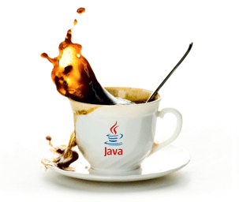
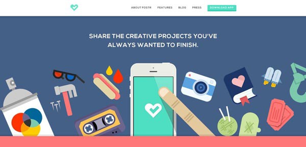
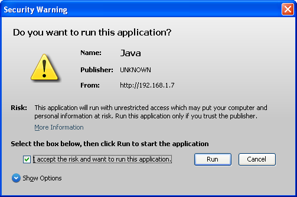

ตอนนี้ปัญหาที่ยิ่งใหญ่ที่บริษัทต่างๆกำลังประสบอยู่ก็คือ โปรแกรมเมอร์นั้นขาดหนัก และ Java Programmer ก็ขาดเยอะมากว่าตำแหน่งอื่นๆ จริงๆบัณฑิตใหม่ๆก็จบมาทุกปีแหละครับ แต่บ้างทีก็ไปหัด สกิลบางอย่างที่ไม่ได้ก่อให้เกิดประโยชน์ในสายงาน หรือบางคนยังไม่รู้ว่าควรที่จะศึกษาอะไร ทางเราเลย จัดเต็มความเกรียน…. ความกาม… เฮ้ยความรู้!! เฮ้ย!! ถูกแล้ว มาดูกันเลยครับ

### 1\. ต้องรู้จัก ภาษา Java

เออนั่นดิครับ จะให้ไปรู้จัก .NET ก็ใช่เรื่อง ก็เขียนกันอยู่ทุกวันทำไมจะไม่รู้ แต่จริงๆน้อยคนที่จะรู้ Core Java Concept ซึ่งที่ควรศึกษามีดังนี้

-   Class declaration rules
-   Access Modifiers (ใช้ให้ถูก)
-   final static abstract synchronize (อย่าไปประกาศมั่วจน Memory Leak)
-   Interface and abstract classes (ใครไม่เคยเขียนตัวนี้ก็ไปศึกษามา)
-   HashCode and Equals methods Contract
-   Immutable Classes String, Wrapper classes (ประโยชน์เยอะมาก และยังทำให้โค๊ดอ่านง่ายด้วย)
-   Collection API java.util package (รู้จักให้ครบแล้วจะรู้ว่ามันดีจริง อย่าไปรู้แค่ List กับ Map)
-   Supportive interface Comparable Comparator Runnable Callable
-   Serializable (นี่ก็ของดีที่ Java เค้าสร้างไว้ให้)
-   Naming Conventions (บางคนตั้งชื่อตัวแปรขึ้นต้นเป็นตัวใหญ่เล้กมั่วไปหมด, ค่าคงที่ตัวเล็กซึ่งมันจะทำให้เราดูไม่โปรเอาเสียเลย)
-   Java is call by Value not call by reference (บัคส่วนใหญ่ที่หาไม่เจอก็เพราะ ไม่เข้าใจไอ้นี่)
-   JVM, JRE, JDK(รู้ให้ลึก มันคืออะไร เพราะเวลา Server มีปัญหามันก็วนๆอยู่กะตัวนี้ด้วย) Class Loader, Java Memory Model, Concurrent Package, ExecutorFramework.(ต่อจากตัวบนนี่แหละ)
-   java.io package (ผมนี่โครตเกลียด JavaIO เลย แต่จะบอกไว้อย่างว่าใช้ตัวนี้คล่องๆไปอวดชาวบ้านได้สบาย เพราะงาน Enterprise ใช้พวกนี้เยอะ ไม่รู้มันจะ Read/Write อะไรนักหนา)

### 2\. OO:P

เอาจริงๆสมัยผมทำงานแรกๆผมก็ไม่รู้ครับ มันจะ New Object ทำไม ทำไมต้องสร้าง Method มันขึ้นมาเรียก ทำไมไม่เรียกตรงๆ

ผมแนะนำให้อ่านแค่ Concept หลักๆก่อน ไปรู้ให้ได้ว่ามันเอาไว้ใช้ทำอะไรและมีประโยชน์อย่างไร ตามนี้

-   Objects and Classes
-   Dynamic dispatch/message passing
-   Encapsulation
-   Composition, inheritance, and delegation
-   Polymorphism
-   Open recursion

### 3\. ต้องรู้จักเขียนแบบ Distributed Application

แปลเป็นไทย คือ การเขียนโค็ดแบบ(บัค)กระจาย 555 มันคือการเขียนแบบหลายๆโหนดๆ ให้เราลองจินตนาการว่ามันมีหลายๆเครื่องถึงแม้ส่วนใหญ่ เค้าก็เขียนกันอยู่เครื่องเดียวทั้งก็เถอะทั้ง Database Server, Service Server หละ Web Server

ทาง Java ก็เตรียมตัว Package ไว้ใช้เป็นมาตรฐาน ตามนี้ มี third party ที่นิยมใช้ด้วย

-   Sockets (ชื่อเท่ ในเน็ทคนอธิบายเยอะมาก)
-   RMI (ถ้ามันอยู่คนละ JVM ต้องใช้หละตัวนี้ ไปศึกษามาครับ)
-   Interface APIs — JMS, JDBC(JDBC น่าจะรู้กันอยู่หละ แต่ JMS ก็ควรรู้นะว่าเวลามันส่งข้ามเครื่องกันเค้าทำกันอย่างไร)
-   ORMs — EJB ( Session Beans , Entity beans, MDB’s) เก่าแก่อ้วนๆ Bank ชอบใช้, Hibernate(จริงๆตัวนี้ก็ควรรู้)

### 4\. เอา Java นั้นมาเขียนเว็บได้

ถ้าเขียน Java แล้วไม่เขียนเว็บเขียนแต่ App อย่างเดียว แนะนำไปเขียน .NET ดีกว่าครับ หน้าตาสวยกว่าง่ายกว่า Java เยอะ จริงๆ เหตุผลเดี๋ยวผมจะบอกตอนท้ายว่าเพราะอะไรที่ต้องมาเขียนเว็บ

สกิลเว็บที่ควรรู้ จริงๆถ้ารู้ครบจะดีมาก

-   JSP (เป็น Java ที่เป็น Scriptes )
-   Servlets / filters / Interceptors (ใช้ให้ถูกมันจะช่วยลดโค๊ดเราเป็นอย่างมาก)
-   JNDI (ส่วนมากตัวนี้จะเอาไว้ไปดึง Datasource ใน Web Server มาใช้)
-   Architectures — n Tier, MVC (จริงๆรู้แค่ MVC ก็รอดแล้ว)
-   Web Frameworks like Struts / Spring (เขียน Java Web ไม่เคยใช้ 2 ตัวนี้อาจจะเป็นบาปได้)
-   Service Oriented Architecture / Web Services ( ถ้าเป็น SOA developers ก็ควรรู้, Web Service ต้องรู้ให้ครบทั้ง REST, SOAP)
-   Web Technologies like HTML, CSS, Javascript and JQuery (ขอแค่ jQuery ตัวเดียวพอ เดี๋ยวถ้าในบริษัทเป็นตัวอื่นค่อยไปมั่วเอา เอา jQuery เป็นพื้นฐานไว้)
-   Markup Languages like XML and JSON. (ถ้าจะเอาให้ถึงขั้นบรรลุโสดาบัน ต้องเขียน Schema XML ขึ้นมาเองได้)

### 5\. รู้จัก Database

เคยบ้าอยู่พักนึงไปนั่งท่องพวกคำสั่งพิเศษใน Oracle, SQL Server พวก Check If อะไรของพวกมัน จริงๆมันไม่จำเป็นเลยเดียวมาเปิด Doc เอาก็ได้

เรารู้แค่ พื้นฐานที่ผมจะบอกนี้ก็พอแล้ว ตามข้างล่าง

-   Database Drivers
-   Normalization / Denormalization
-   SQL Queries — Inner Outer Joins, Group By , Having
-   Stored Procedures
-   Triggers
-   Cursors
-   #จบข่าว

### 6\. ไม่จำเป็นต้องไปศึกษา Java App ถ้าไม่ได้ใช้

มันล้าหลังไปไกลแล้ว เหอะๆ ไม่ว่าจะเป็น Applet, Swing, SWT, AWT โถบางคนยังกล้าใส่มาใน Resume นะ เขียนแล้วมันเท่หรือไงไม่รู้ สำหรับผมนั้น ไม่ได้นำมาพิจารณาเลย บางครั้ง ติดลบด้วยซ้ำถ้าไม่มีสกิลด้านอื่นๆมาเสริม~

### 7\. คุยและสื่อสารกับทีมได้

วิธีการที่ผมใช้ในการฝึกทางด้านนี้ก็คือ พูดคุยเยอะๆในสิ่งที่เราชอบ **คุยเรื่อยๆยิ่งที่เป็นเพศตรงข้ามด้วยยิ่งดีเพราะเราจะได้ประโยชน์ถึง 2 ต่อ 555** ผมจะตั้งเป้าเอาไว้ว่าใน 1 เดือนต้องรู้จักคนเดือนละ 2 คน ฝึกนำเสนอเยอะๆ ถ้าบริษัทให้โอกาสเราก็ควรคว้าโอกาสไว้ ฝึกไปเรื่อยๆแล้วเราจะคุยกับคนอื่นรู้เรื่องเอง

### 8\. เป็นคนตลก

บางทีการเป็น Java Programmer มันเป็นอะไรที่ยากที่คนอื่นจะเข้าถึง บางครั้งไอ้ตัวเราเองจะไปคุยก็ไม่รู้รู้เรื่องโลกภายนอกเค้า จะไปคุยกะสาวๆ ยังไม่รู้จะคุยอะไร น้องๆวันนี้พี่ประกาศตัวแปรสนุกมาเลย แม่มอัลกอนี้มันสุดๆ เหนื่อยมาก Web Service มันยิงไม่ได้ พี่หละอยากไปกินข้าว

> _วันนี้น้องว่างไหม หลังกันข้าวเสร็จพี่จะพาน้องไป Debug กัน_

ฝึกหามุกตลกๆมาเล่นทุกวัน ก็เพื่อนๆดูก่อนก็ได้ ตลกวันละนิด ชีวิตจะไม่มีบัค อย่างของเราพอถึงตอน 17.00 ทุกคนจะเริ่มยิ่งมุกกันหละ ต้องเตรียมหาเกาะกำบังกันให้ดี ไม่งั้น อาจจะฮา หรือ น้ำตาซึมเพราะมันแป๊กก็ได้

### 9\. ต้องเป็นคนเรียนรู้อยู่ตลอดเวลา

อันนี้ไม่จำเป็นต้องเป็น Java Programmer ทุกคนทุกสายอาชีพก็ควรมีข้อนี้ ตอนนี้เทคโนโลยีก็เกิดใหม่ทุกวัน แต่สิ่งที่เราควรโฟกัส มันก็คือสิ่งที่เราต่อยอดจากสิ่งที่มีอยู่ได้ ผมยกตัวอย่างตัวผม เขียน Java Web ผมก็สามารถไปเริ่มเรียน Android ได้ โดยอ่านเพียงแค่บางส่วน หรือผมก็สามารถไปต่อยอดโดยการเขียน MEAN เพราะผมมีพื้นฐาน Javascript และ Web ถ้าอยู่ในระดับดี การต่อยอดก็จะทำได้ไม่ยาก

แต่ตัวอย่างที่มันยากๆก็มี เช่น เป็นโปรแกรมเมอร์ เดี๋ยวเดือนหน้าจะไปเปิดร้านกาแฟว่ะ หรือ ไปทำสวนแระ

สุดท้ายก็ขอฝากคำคมนี้ไว้

> _เป็นโปรแกรมเมอร์มันเลิกไม่ได้ มันเป็นไปตลอดชีวิต…_

ส่วนคนที่เลิกหนะหรอ เค้ายังไม่ได้ถูกเรียกว่าโปรแกรมเมอร์ บายครับ ^^

---

_Originally published at_ [_blog.nextzy.me_](https://blog.nextzy.me/9-things-every-java-programmer-should-know/) _on February 11, 2016._
