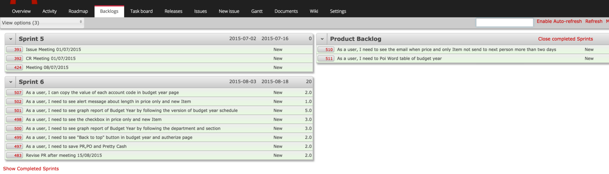
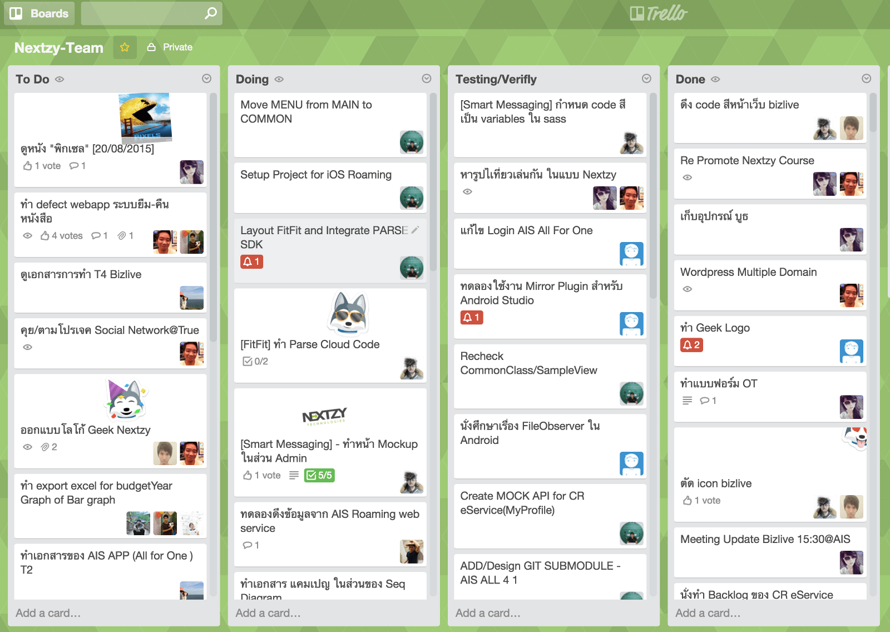
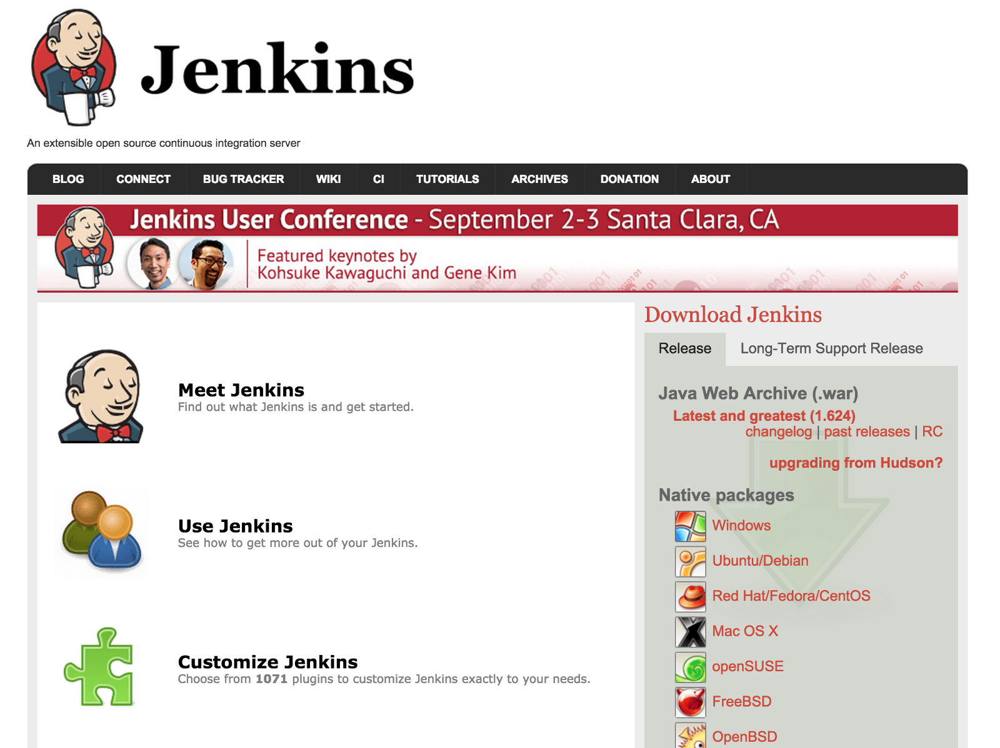
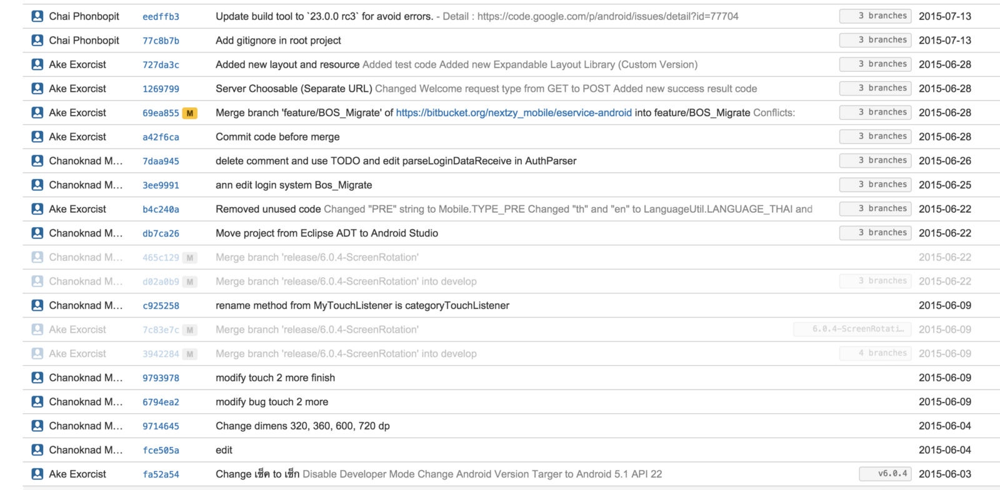
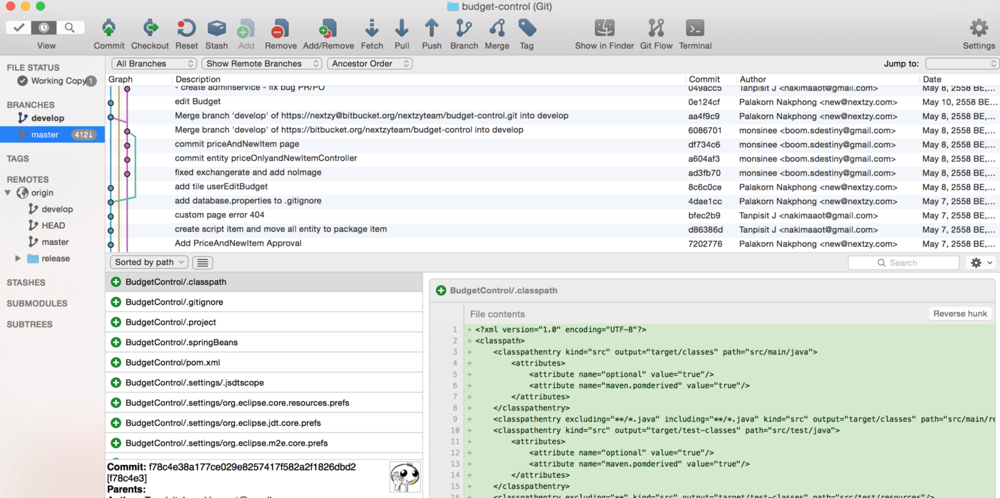
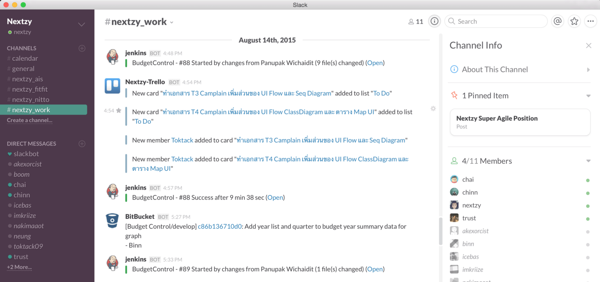
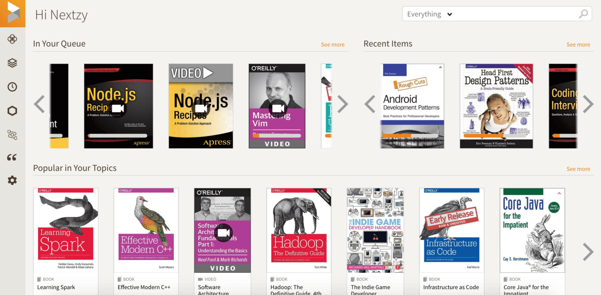
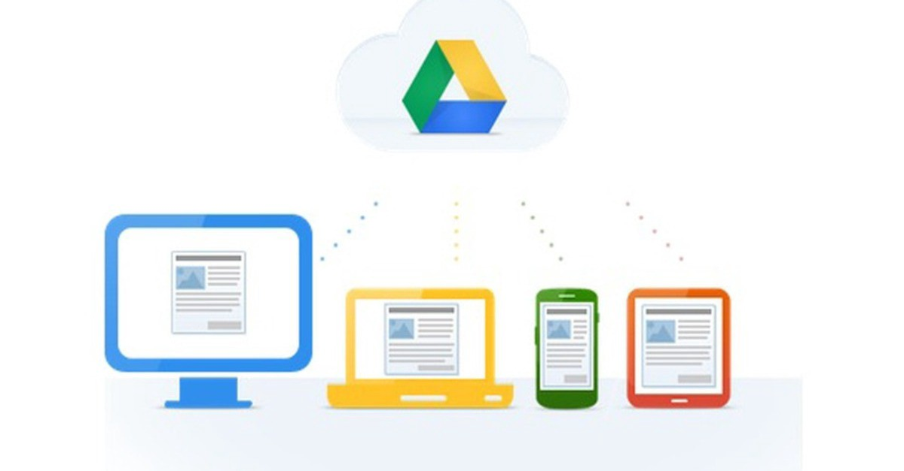
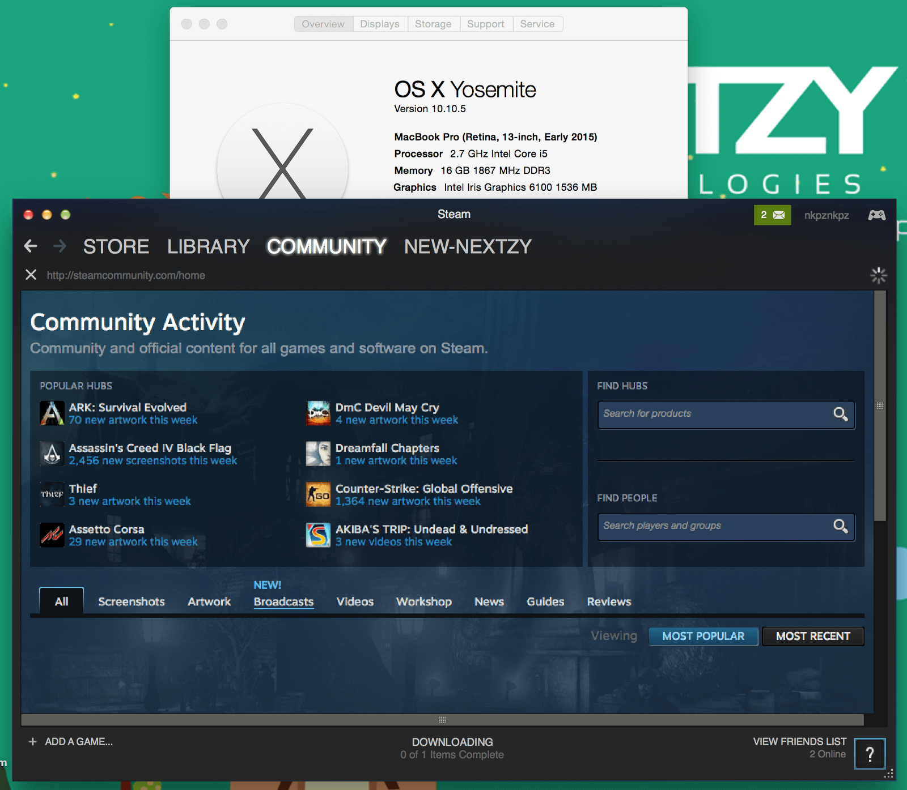

ถ้าไม่นับ IDE ในการเขียนโปรแกรม เครื่องมือที่ช่วยให้งานง่ายขึ้น และช่วยประสานงานให้กับคนในทีมก็มีความจำเป็นเอามากๆในยุคนี้

> _มันหมดยุคแล้วที่จะมานั่งเขียน Monthly Report ส่ง Manager ทุกเดือน พูดคุยส่งเอกสารผ่านอีเมล์_

ว่าแล้วผมจะแนะนำ Tool ที่เราได้เลือกใช้มาฝากกัน

### [1\. Redmine-Agile plugin (Project Management)](http://www.redmine.org/)

ตัวนี้เหมาะอย่างยิ่งสำหรับองค์กรที่เป็น Agile สามารถช่วยในการทำ Agile Process ตั้งแต่ Product Backlogs, User Story, ย่อยไปจนถึง Task สามารถ Estimate ออกมาเป็น burn down chart ได้อีกด้วย และตัว Redmine เองยังเป็น Issue Tracking ได้อีกครบสูตรจริงๆ

### [2\. Trello (Task Management)](https://trello.com/)

ถ้ากล่าวถึง trello คงจะไม่มีใครที่ไม่รู้จัดมันคือ Task Management ที่ดีและง่ายตัวหนึ่งเลยทีเดียว ถ้าเราใช้ Redmine มันจะเป็นการทำงานคนเดียวต่อ 1 งาน แต่ถ้าเกิดว่าในกรณีที่มีการทำงานร่วมกันหลายคน สามารถใช้ trello เข้ามาตอบโจทย์ตรงนี้ เช่นใส่บุคคลที่ร่วมกันทำงานนั้นๆให้เสร็จ ตัวอย่างนี้เป็นบอร์ดรวมของเราชาว Nextzy เป็นการบอกว่าใครทำอะไรกันอยู่ โดยยึดหลัก ระบบคัมบัง (Kanban System) ที่ประกอบด้วย Todo > Doing > Done แต่ของเราจะเพิ่มในส่วนของ Testing/Verifly เองเพื่อที่จะให้ Tester หรือ Product Owner ช่วยตรวจสอบว่าสิ่งที่ทำนั้นภูกต้องตาม User Story หรือไม่

### [3\. Jenkins CI(continuous integration)](https://jenkins-ci.org/)

หากคุณขี้เกลียดมานั่ง build, test, deploy ตัวนี้ช่วยคุณได้ มันจะช่วยรัน Build และรัน Unit Test ให้คุณ และหากคุณต้องการให้มัน Deploy ไปที่ Node เทส ก็สามารถให้มันไปดึงจาก Git Repo ได้เลย สนับสนุนทั้ง Mobile App(Native) และ Java Web ได้ เพราะเราก็ใช้อยู่

### [4\. BitBucket (Source Control)](https://bitbucket.org/)

ยุคนี้มันต้อง Git เท่านั้น Git มันมีหลายอย่างที่ SVN ทำไม่ได้ เช่น Git Sub Module, Git Flow มาใช้ BitBucket กันเถอะ เราสามารถ Push Code จากที่ไหนก็ได้บนโลกนี้ และทีมก็สามารถทำงานจากที่บ้านได้

### [5\. SourceTree (Git Client)](https://www.sourcetreeapp.com/)

ไหนๆเราก็ใช้ BitBucket ซึ่งเป็นของ Atlassian ซึ่งทาง Atlassian ก็ได้สร้าง Git Client มาอีกตัว ที่เราเลือกเพราะว่า GUI มันสวยงามและง่ายในการทำงาน ปกติยังไม่มี Tool ตัวนี้ ได้นั่ง Git Command กันอย่างเดียว ฮ่าๆ T T

### [6\. Slack (Modern Chat For Team)](https://slack.com/)

ตัวนี้เป็นพระเอกของงานนี้เลยก็ว่าได้ ทางเราจะพยายามใช้อีเมล์ให้น้อยที่สุดเราเลยได้ตัวนี้มา ซึ่งเราจะใช้ Slack เอาไว้แชดคุยงาน เมื่อก่อนเราคุยกันด้วย Line Group ซึ่งมันดูรกๆ พอได้ slack มาเราก็สามารถแบ่งกลุ่มกันคุยได้อย่างอิสระ และสามารถ Integrate กับ Tool อื่นๆได้อีก เช่นถ้าใครมีการเปลี่ยน Trello เราก็สามารถสั่งให้ Slack แชดบอกในกลุ่มได้ (ดังรูป)

สร้าง Bot เข้าไปเกรียนในกลุ่มได้

### [7\. Safaribooksonline (Ebook Online)](https://www.safaribooksonline.com/)

(399US/ 1 Year / User)

Geek ที่ดีต้องมีของดีเอาไว้อ่านแนะนำที่นี่เพราะมีหนังสือออกใหม่มาให้อ่านตลอด แถมสามารถอ่านเท่าไรก็ได้แบบบุปเฟ่เลยทีเดียว

### 8\. Google Drive

ตอนแรกเราใช้ Copy.com แต่ตอนนี้ Cop.com ได้ปิดตัวลลงไปเรียบร้อย เราใช้เอาไว้แชร์ไฟล์งานัน ข้อดี คือเราสามารถเลือกไฟล์เพื่อที่จะ Sync ลงมาในเครื่องได้ไม่เหมือน Dropbox ที่ต้องเอาไฟล์ไว้ในเครื่องทั้งหมด ทำให้เราประหยัดพื้นที่ไปได้เยอะเลยทีเดียว

### 9\. Macbook Pro Ratina 13″ CTO RAM 16GB

เนื่องจากส่วนตัวผมไม่ค่อยชอบ Windows เท่าที่ควร เพราะใช้ คำสั่งๆอะไรๆก็ลำบาก จะสั่ง make อะไรก็ไม่ได้ ใช้ vi ก็ไม่ได้ Tool บางตัวก็มีเฉพาะบน Mac อีก และปัญหาเรื่องการละเมิดลิขสิทธิ์กันมากมายเราเลยตัดสินใจซื้อ Mac เพราะ OS มันฟรี 555 และเวลาลง Stream เอาไว้เล่นเกม Ram มันชอบหมด เลยสั่ง CTO เป็น Ram 16 GB จะได้ไม่มีปัญหา Stream กระตุกอีกต่อไป อีกอย่างคือแบตมันอยู่ได้ถึง 9 ชั่วโมงเวลาไปนั่งทำงานตามร้านกาแฟก็ไม่ต้องไปหาร้านที่มีปลั๊กสามาารถทำงานได้อย่างสบายๆทั้งวัน

เป็นไงกันบ้างครับ สำหรับเครื่องมือที่กล่าวไป ลองนำไปประยุกต์ใช้ดูนะครับ การใช้เครื่องมือที่ดีก็ช่วยให้เราลดระยะเวลาในการทำงานไปได้มากเลยนะครับ

> _โชคดี โค๊ดไม่มีบัค คร๊าบบบบบ ปลอดภัยจากอันตรายทุกท่านครับ^^_

---

_Originally published at_ [_blog.nextzy.me_](https://blog.nextzy.me/9-tools-for-work-remotely/) _on February 10, 2016._
