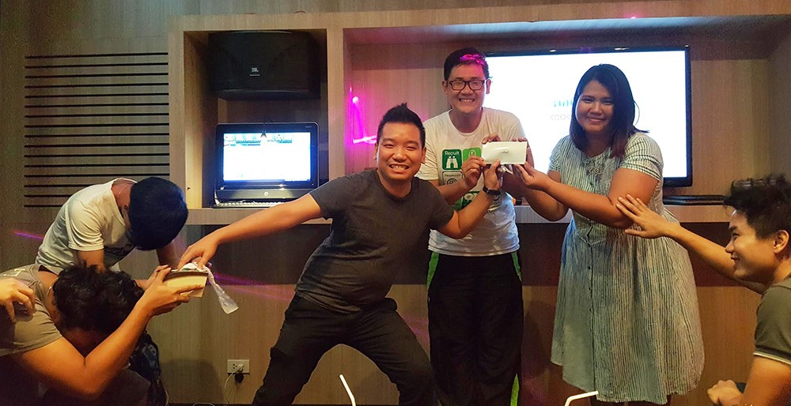
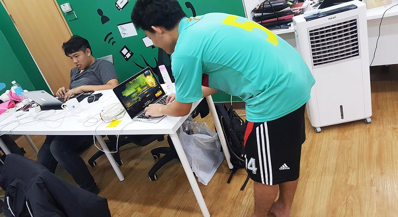
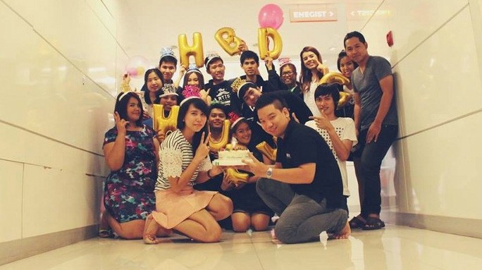

สวัสดีครับ ผมนิวคนเดิม เพิ่มเติมให้แอด [Line](http://@codingz) มา

ช่วงนี้รู้สึกว่าจะเห็นดราม่าเกี่ยวกับชุดแต่งตัวบ่อยเหลือเกิน ไม่ว่าจะเป็นชุดที่ใส่เข้าห้องสมุด ชุดที่เอาไว้ใส่เข้าสถานที่ราชการ และอะไรอีกก็ไม่รู้เยอะแยะไปหมด ซึ่งผมก็เข้าใจนะว่ามันเป็นเรื่องของการเคารพสถานที่ แต่ว่าบางอย่างหรือบางสถานที่ มันก็ไม่ต้องก็ได้หรือป่าว?

ถ้าแบบนั้น ทำไมราชการไม่ใส่ชุดแบบนี้มาล่ะ? นี่คือชุดไทยที่ถูกต้องเลยนะ

](./asset-2.jpeg)

> “บ้า หรา นี่มันชุดไทยโบราณ”

แต่มันผิดไหมที่เด็ก Gen ใหม่อย่างพวกเราที่เริ่มรู้สึกว่าทำไมเวลาไปทำงานจะต้องแต่งตัวตามที่บริษัทกำหนด ทั้งๆที่มันไม่ได้ช่วยให้เราทำงานได้ดีขึ้นเลย!!!

---

**ดังนั้นผมจะมาแชร์ให้ฟังว่าการใส่ชุดอะไรก็ได้ไปทำงานที่บริษัทนั้นมีข้อดีอะไรบ้าง**

1.  **บอกลาพวกขายประกัน**  คุณสามารถไปไหนมาไหนก็ได้อย่างสบายใจด้วยเสื้อยืด กางเกงยีน รองเท้าแตะ โดยที่ไม่มีใครมาคอยเรียกหรือขัดจังหวะคุณเพื่อนำเสนออะไรบางอย่าง เช่น “น้องๆสนใจกระเป๋าฟรี ไหม” “น้องๆมีบัตรกสิกรไหม” ผมพบว่าเราสามารถลดเวลาในชีวิตไปกับเรื่องพวกนี้มาก อารมณ์ก็ดีขึ้น ประสิทธิภาพการทำงานก็ดีขึ้น
2.  **ประหยัดเงิน** เพราะไม่ต้องคอยเสียเงินซื้อชุดเพราะจำเป็นต้องซื้อ จะดีกว่าไหมถ้าเราใส่ชุดอะไรก็ได้ เสื้อธรรมดาๆตัวเดียวกันกับที่เราใส่อยู่ที่บ้าน ใส่เดินเล่น หรือเสื้อที่ได้ฟรีจากงาน Event ต่างๆ ดีกว่าการใส่รองเท้าหนังที่คู่นึงก็หลายบาทแล้ว ไหนจะเข็มขัดและเสื้อเชิ้ตอีก บอกเลยใส่แปบเดียวก็พังครับ เพราะเมืองไทยเป็นเมืองร้อน เกลือขึ้นหลัง สีตก บางทีก็ฝนตกน้ำท่วม รองเท้าหนังพัง จบเห่อยู่ดี
3.  **ช่วยประหยัดเวลาไปได้มาก** เวลามีนัดกับเพื่อน ก็ไม่ต้องเอาชุดมาเปลี่ยน เพราะมีบางบริษัทชอบบังคับพนักงานใส่ชุดสีขาว กางเกง Slack รองเท้าหนัง ซึ่งผมก็สงสัยเหมือนกันว่ามันช่วยให้ทำงานดีขึ้นยังไง เพราะคำตอบที่ผมค้นพบก็คือ “ไม่” เวลาขายงานให้ลูกค้า เค้าก็ตัดสินใจจากตัวสินค้า ไม่ใช่การแต่งตัวของพนักงานขายแล้ว ดังนั้นเมื่อเราแต่งชุดอะไรก็ได้ เวลามีนัดต้องไปเที่ยวกับเพื่อนหลังเลิกงาน ก็สามารถใส่ชุดที่ต้องการมาทำงานได้เลย ยกตัวอย่างเช่น เรามีนัดกินข้าว/ไปแฮงเอาท์ “Coding” กับเพื่อน ก็แต่งชุดสุดหล่อสุดสวยของเรามาเลย ไม่ต้องกลับไปเปลี่ยนที่บ้าน ทำให้เรามีเวลาทำอะไรได้มากขึ้น
4.  **ไม่ถูกมองเป็นเด็กปั๊ม หรือ ก๊วนทัวร์จีน** อันนี้เจอมากับตัว คือได้ชุดพนักงานมาเป็นเสื้อโปโล แต่ลายดันเป็นสีขาวฟ้า มีคาดๆตรงแขน บวกกับหน้าตาก็ไม่ดีอยู่แล้ว ถ้าหัดใช้เครื่องเติมน้ำมันอีกนิดหน่อยไปเป็นเด็กปั๊มได้เลย และนอกจากนี้บางบริษัทนอกจากแจกแล้วยังบังคับพนักงานให้ใส่มาทุกวันศุกร์อีกนะ (หึหึ)
5.  **เย็นสบายกว่าคนอื่นๆ** เพราะเมืองไทยเป็นเมืองร้อน ถ้าเราใส่แค่เสื้อยืด กางเกงขาสั้น เวลาเดินทางอากาศร้อนๆเราจะสบายมาก เพราะไม่ร้อนมากเท่าเสื้อเชิ้ต (แถมเสื้อเชิ๊ตเวลาเปียกเหงื่อมันดูแย่ด้วย)
6.  **แสดงออกถึงความเป็นตัวตนของเราได้อย่างเต็มที่** ข้อนี้ผมเน้นมาก เพราะชีวิตเราก็เป็นของเรา เรื่องการแต่งตัวผมว่ามันบ่งบอกความเป็นตัวตนของเรามากๆ ซึ่งการแต่งตัวของแต่ละคนไม่เหมือนกัน ดังนั้นมันเป็นเรื่องที่เราไม่ควรไปบังคับ บางคนเป็นคนขี้ร้อน ก็ไม่ควรใส่เสื้อแขนยาว กางเกงขายาว บางคนเท้าเหม็นก็ไม่ควรให้เค้าใส่ผ้าใบให้มันอับเหม็นแล้วมาถอดให้เพื่อนร่วมงานดม
7.  **โฟกัสกับงานอย่างเต็มที่** บางบริษัทจะมี Theme ชุดแต่งกายประจำวันกันเลยทีเดียว ซึ่งผมว่ามันชักจะไปกันใหญ่ (555) วันจันทร์ — พุธ แต่งทางการนะ พฤหัสแต่งชุดบริษัท วันศุกร์ค่อยแต่งตัวตามสบาย สุดท้ายไม่ได้สบายกันซักวัน เพราะหาชุดใส่ได้ไม่ครบทุกวัน ฝนตกบ้าง รองเท้าไม่แห้งบ้าง เสื้อไม่ได้รีดมาบ้าง ดังนั้นปัญหาเหล่านี้จะหมดไปหากทุกวันทุกๆคนสามารถใส่ชุดอะไรก็ได้
8.  **สร้างบรรยากาศให้กับคนรอบข้างให้รู้สึกผ่อนคลาย** เวลาเรามาทำงานที่บริษัทจะบอกว่าไม่เครียดเลยก็จะเป็นไปไม่ได้ แต่จะดีกว่าไหมหากบรรยากาศใน Office ดูไม่เครียดด้วยการแต่งตัวตามสไตล์ หลากสีสัน หรือชิวๆ ลากแตะไปกินข้าว ไปซื้อขนม หรือเดินกลับบ้าน
9.  **หลอกเพื่อนได้ว่าวันนี้ไม่ได้ไปทำงาน** และทำให้เพื่อนอิจฉา 555

---

สุดท้ายแล้ว สิ่งที่ผมบอกมาทั้งหมดนี้ก็คงจะเป็นเรื่องยากที่จะให้องค์กร/บริษัทต่างๆเปลี่ยนกฎเกณฑ์เรื่องชุดแต่งกาย ดังนั้นพนักงานอย่างเราๆก็คงได้แต่ก้มหน้าทำตามกฎเดิมๆต่อไป

แต่ถ้าถามว่ามีบริษัทไหนที่ให้พนักงานใส่ชุดอะไรมาทำงานได้ บอกเลยว่าบริษัทยุคใหม่หลายๆแห่งเค้าไม่ซีเรียสเรื่องชุดแต่งกายกันแล้วครับ อย่างน้อยก็ที่ [Nextzy](http://nextzy.me/) นี่แหละ

