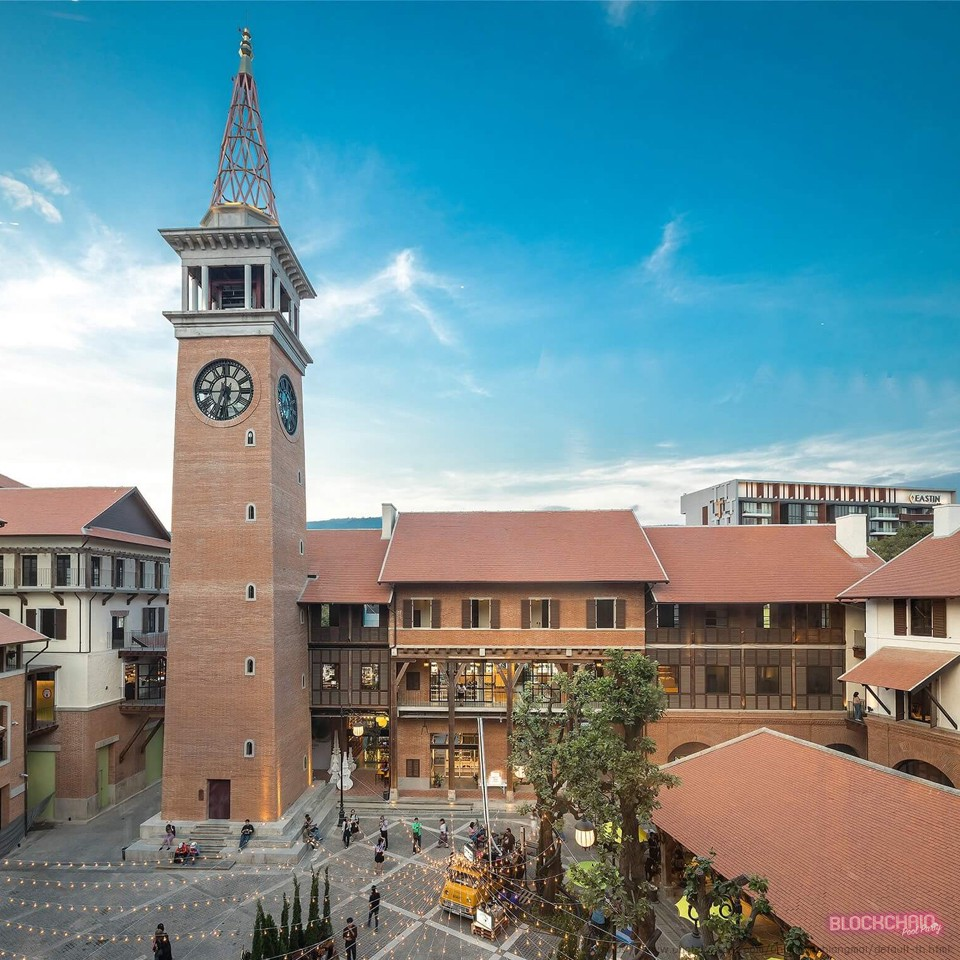

#### พบกับงาน Blockchain Conference ที่ยิ่งใหญ่ที่สุดในปี 2019 ที่จัดขึ้นในเมืองจังหวัดเชียงใหม่ ซึ่งเป็นเมืองท่องเที่ยวชั้นนำของประเทศไทย

---

ทางบริษัท The Existing Company (ผู้จัดงาน) ได้ไปทำการสำรวจว่าเชียงใหม่เป็นเมืองที่น่าทำงานมาที่สุดติดระดับโลกโดยทาง

Nomadlist.com เว็บรีวิวสถานที่ยอดนิยมสำหรับ Digital Nomad(ชนเผ่าเร่ร่อนในยุคดิจิทัล) ทำการสำรวจกลุ่ม Digital Nomad มากกว่า 250,000 คนทั่วโลก โดยใช้เกณฑ์ในการพิจารณาหลากหลายสาขา เช่น ค่าครองชีพ ความปลอดภัยจราจร สัญญาณอินเทอร์เน็ต สภาพอากาศ การใช้ภาษาอังกฤษของคนในพื้นที่ แหล่งท่องเที่ยว กระทั่งความเป็นมิตรของชาวเชียงใหม่

ผลสำรวจล่าสุดพบว่า เชียงใหม่ติดอันดับท็อปเท็นเคียงคู่ภูเก็ตและกรุงเทพฯ โดยมีคะแนนสูงเกือบทุกหมวด โดยเฉพาะค่าครองชีพ, สภาพอากาศ และคุณภาพชีวิต ด้วยบรรยากาศชิลๆ ตะต่อนยอน กับวิวทิวทัศน์อันสวยงาม ทำให้ผู้คนเกิดความคิดสร้างสรรค์ และเพิ่มศักยภาพในการทำงานได้ดีอีกด้วย

จะเห็นได้ว่า Co-Working Space ในเชียงใหม่มีมากกว่า 10 แห่งรอบเมือง อาทิ Punspace ที่ได้รับความนิยมเป็นอันดับต้นๆ หรือสายเฉพาะทาง Makerspace ที่เป็นดั่งสรวงสวรรค์ของช่างฝีมือ เพราะมีบริการ 3D Printing, Laser Cutter และอุปกรณ์อิเลคโทรนิคต่างๆ หรืออยากชมวิวริมแม่น้ำปิงก็สามารถย้ายตัวเองไปที่ Co — Working Cafe เรียกได้ว่า สามารถเลือกสรรบรรยากาศการทำงาน ให้ตรงตามรสนิยม ไลฟ์สไตล์ หรือแนวทางธุรกิจของตนเองได้เลย

ปัจจุบันนี้เทรนด์การใช้นวัตกรรมดิจิทัลจะเข้ามามีอิทธิพลต่อชีวิตประจำวันและการ ดำเนินธุรกิจ ตลอดจนพลิกโฉมอุตสาหกรรมอย่างหลีกเลี่ยงไม่ได้ อาจส่งผลให้การจ้างงานมนุษย์ลดลง มีเทคโนโลยี สำคัญ 8 ประเภท (Essential Eight) ที่ภาคธุรกิจทั่วโลกต้องจับตา อาทิ ปัญญาประดิษฐ์ (Artificial intelligence หรือ AI), ความเป็นจริงเสริม หรือโลกกึ่งเสมือนจริง (Augmented Reality หรือ AR) และบล็อกเชน (Blockchain) **ซึ่งบล็อกเชน (Blockchain) เป็นเทคโนโลยีเป้าหมายของการจัดงานในครั้งนี้**

Blockchain Technology จะเปลี่ยนโลกของข้อมูลอย่างไร หลายคนอาจมีคำถามนี้เกิดขึ้นมา จากกระแสของ Blockchain Technology ที่กำลังถูกกล่าวถึงในวงกว้าง ณ ขณะนี้ เพื่อให้เกิดการสร้างการตระหนักรับรู้ทั้งในเชิงความรู้พื้นฐานและเชิงลึก จึงได้มีการดำเนินการจัดงาน CNX Blockchain Conference 2019 เพื่อตอกย้ำความเข้าใจหลักการทำงานของเทคโนโลยีบล็อกเชน ที่ทำหน้าที่ในการบันทึกกิจกรรมทางเศรษฐกิจ ตัวตน เจ้าของ สถานภาพ สิทธิ หรือเรื่องราวอื่น ๆ

[](https://www.eventpop.me/e/4816-blockchainpoolparty2019)

### ทำไมคุณต้องมางานนี้ ?

การจัดงานในครั้งนี้ จึงเป็นเสมือนจุดเริ่มต้นของการสร้างความตระหนักรับรู้ให้กับ  
 ผู้ที่ให้ความสนใจเทคโนโลยีบล็อกเชนทั้งความรู้พื้นฐานและเชิงลึก ตลอดจนการสนทนาพบปะระหว่าง ผู้ประกอบการที่ใช้เทคโนโลยีบล็อกเชนด้วยกันกับผู้ที่มีแนวคิดจะทำธุรกิจโดยประยุกต์ใช้เทคโนโลยีฯนี้ด้วย หรือผู้พัฒนาเทคโนโลยีด้านบล็อกเชนพร้อมกับได้มีโอกาสในการแสดงความคิดเห็นอย่างเปิดกว้างจากหลากหลายภาคส่วน ยังผลให้เกิดเครือข่ายของผู้ประกอบกิจการด้านบล็อกเชน ผู้ประกอบการด้านการพัฒนาเทคโนโลยีและผู้ประกอบธุรกิจที่เกี่ยวข้อง

#### พบกับ Speaker ชั้นนำมามาย

จากบริษัทชั้นนำจำพวก Bitkub, Omise และบริษัทชั้นนำในวงการ Blockchain ไปใครกันบ้างไปดูกัน

#### **หัวข้อคุณภาพ อัดแน่นไปด้วยความรู้**

1.  **Overview Into the Blockchain technology** ที่จะพาคุณไปในโลกของ Blockchain ว่ามีอะไรที่น่าสนใจบ้าง กับสิ่งที่เปลี่ยนแปลงไปในปี 2019

**2\. The evolution of Blockchain** มาพบกับวิวัฒนาการ และตามโลกปัจจุบันว่าโลก ของ Blockchain นั้นไปไกลถึงไหนแล้ว เหมาะมากกับผู้ประกอบการ ที่ต้องการมาอับเดทความเปลี่ยนแปลง

**3\. Deep into Blockchain technology** ลงลึกเทคโนโลยีที่สามารถเอาไปพูดกับใครก็ได้กับความรู้จริงในด้านเทคโนโลยี ที่ไม่ได้จำกัดอยู่แค่ Crypto currency ที่ใช้ในการเก็งกำไรเพียงอย่างเดียว แต่มันคือเทคโนโลยีที่จะมาเปลี่ยนแปลงโลกใบนี้

**4\. Prospects and opportunities of cryptocurrencies platforms** พบกับโอกาสที่ผู้ประกอบการที่จะเข้ามาในวงการ Blockchain และ cryptocurrencies ต้องรับ

[](https://www.eventpop.me/e/4816-blockchainpoolparty2019)

#### **มาดิ่มด่ำบรรยากาศสุดหรูบนดาดฟ้าโรงแรม**

ทำเลที่โดดเด่นที่สุดบนถนนนิมมานเหมินทร์ คือที่ตั้งของ ONE NIMMAN ที่เชื่อมโยงระหว่างรูปแบบชีวิตสมัยใหม่ กับวัฒนธรรมท้องถิ่น โดยรวบรวมร้านอาหาร พื้นที่ศิลปะ คาเฟ่ บาร์

#### **ช่วงค่ำคืนสุดพิเศษ**

พบกับ DJ Ching Char & MC Ching Jai ที่จะมามอบความสนุกและเสียงเพลงสุดมัน บนดาดฟ้าโรงแรมสุดหรูบน One Nimman พร้อมกันพบป่ะ

#### ยกบรรยากาศ Silicon Valley มาถึงเชียงใหม่

นอกจากงาน CNX Blockchain Conference 2019 แล้วยังมีการรวมตัวของ Tech Community ที่ใหญ่ที่สุดในจังหวัดเชียงใหม่ ต่างเชื้อชาติ ต่างภาษา แต่ทุกคน Local Tech Companies ที่กำลังช่วยกันขับเคลื่อนจังหวัดเชียงใหม่ให้ก้าวต่อไปข้างหน้า ซึ่งเป็นเป้าหมายเดียวกับเราทีมงาน CNX Blockchain Conference 2019 ซึงในสัปดาห์เดียวกันนั้นเรายังได้ร่วมจัดงานดังนี้  
  
**วันที่ 15 Feb — 16 Feb 2019 : HACKATRAIN** รถไฟขบวน HACK จากหัวลำโพงมุ่งหน้าสู่เมืองเชียงใหม่ ระยะเวลา 12 ชั่วโมง กับความท้าทายที่คุณเองก็คาดไม่ถึง  
  
**วันที่ 16 Feb 2019 : CODE IN THE DARK** ร่วมค้นหาเทพแห่ง FRONTEND CODING ไปพร้อม ๆ กัน  
  
**วันที่ 16 Feb 2019 : BarCamp ChiangMai#8** มาแชร์ความรู้ อัพเดทความรู้ และแลกเปลี่ยนความคิดเห็นเกี่ยวกับเรื่องเทคโนโลยีกันระหว่าง developer

เมื่อจบงานแล้ว **วันที่ 17 Feb 2019 ก็มาพบกับเรา CNX Blockchain Conference 2019 ได้เลย**

> อย่าช้าจองเลย

[](https://www.eventpop.me/e/4816-blockchainpoolparty2019)

#### เท่านั้นยังไม่พอ งานนี้พกใจมากก็พอ

เรามีคานาเป้ให้กับทุกท่านสามารถพบปะสังสรรค์กันได้เต็มที่โดยที่อิ่มท้อง และเสริพพร้อมเบียร์และค๊อกเทลสุดหรูเพื่อเพิ่มอรรถรสในการสร้าง Connection ที่ดีเยี่ยม

> อย่ารอช้า จองเลยตั๋วราคาพิเศษมีจำนวนจำกัด

[](https://www.eventpop.me/e/4816-blockchainpoolparty2019)
