สวัสดี ทุกท่าน วันนี้เมื่อปีที่แล้วผมมีความคิดที่อยากจะเปิดออฟฟิตสาขาที่ 2 ให้กับ Nextzy Technologies ทำไมผมถึงเลือกมาเปิดที่นี่

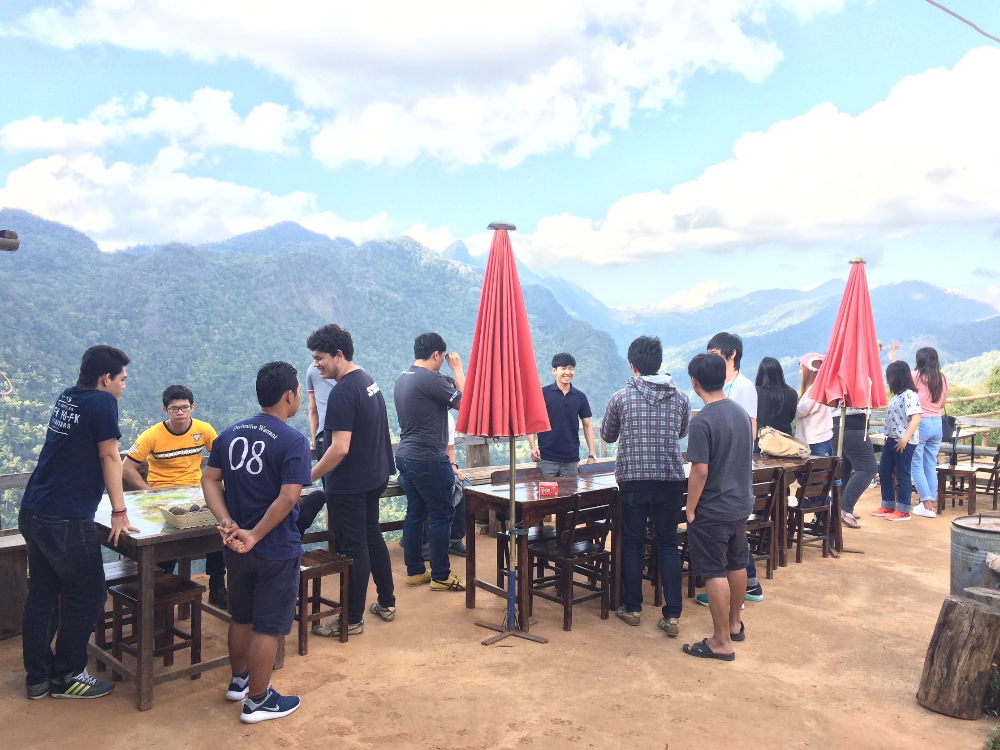

Q: ก่อนแรกเท้าความก่อน ทำไมถึงต้องเปิดสาขาที่ 2 ?

A: เนื่องจากจำนวนคนเราเพิ่มปริมาณอย่างรวดเร็วทำให้เราไม่สามารถขยายอ๊อฟฟิตได้ทัน และค่าใช้จ่ายในการ renovate office ค่อนข้างสูง หากทำการย้ายที่ เพราะอ๊อฟฟิตที่เราอยู่ที่เก่าเรายังเช่ามาได้ไม่นานและลงทุนตกแต่งไปเยอะมาก ทำให้ไม่คุ้มทุนที่จะย้ายไปที่ใหม่ ง่ายๆว่ายังใช้ไม่คุ้ม

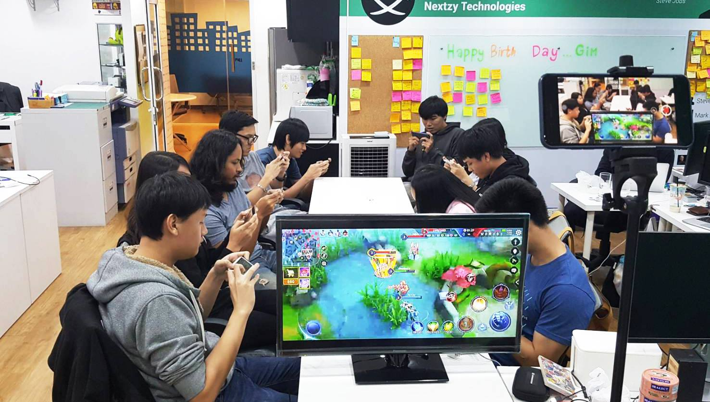

Q: เปิดสาขาใหม่แล้วจะรับงานจากที่ไหน ที่สาขาใหม่เลยไหม แล้วจะประสานงานกันยังไง

A: เราทำตัวเป็น Head Quarter ส่งงานจากสาขาหลักไปยังสาขารอง เราจะส่งงานจากกรุงเทพลงไปให้สาขาอื่นๆทำ ส่วนเรื่องการประสานงาน แต่ก่อนเปิดบริษัท พวกเราได้ Setup ระบบทุกอย่างให้อยู่บนออนไลน์ทั้งหมด ไม่ว่าจะเป็นการติดต่องาน ประชุมงาน หรือเอกสารและ Sourcecode ทุกอย่างอยู่บน ออนไลน์ทั้งหมด [นี่เลยเครื่องมือที่เราเลือกใช้](https://blog.nextzy.me/9-%E0%B9%80%E0%B8%84%E0%B8%A3%E0%B8%B7%E0%B9%88%E0%B8%AD%E0%B8%87%E0%B8%A1%E0%B8%B7%E0%B8%AD%E0%B8%97%E0%B8%B5%E0%B9%88-nextzy-%E0%B9%80%E0%B8%A3%E0%B8%B2%E0%B9%80%E0%B8%A5%E0%B8%B7%E0%B8%AD%E0%B8%81%E0%B9%83%E0%B8%8A%E0%B9%89%E0%B8%AA%E0%B8%B3%E0%B8%AB%E0%B8%A3%E0%B8%B1%E0%B8%9A%E0%B8%99%E0%B8%B1%E0%B9%88%E0%B8%87%E0%B8%97%E0%B8%B3%E0%B8%87%E0%B8%B2%E0%B8%99%E0%B8%97%E0%B8%B5%E0%B9%88%E0%B8%9A%E0%B9%89%E0%B8%B2%E0%B8%99-aa043915a635)

มีพี่ๆและเพื่อนๆมามายที่รู้จักกัน แนะนำผมอยู่นานให้มาเปิดบริษัทที่จังหวัดเค้าสิ มีทุกอย่างให้พร้อม ไม่ว่าจะเป็น ชลบุรี ขอนแก่น สุราษฎร์ธานี แต่ก็ยังไม่ได้ติดสินใจอะไร

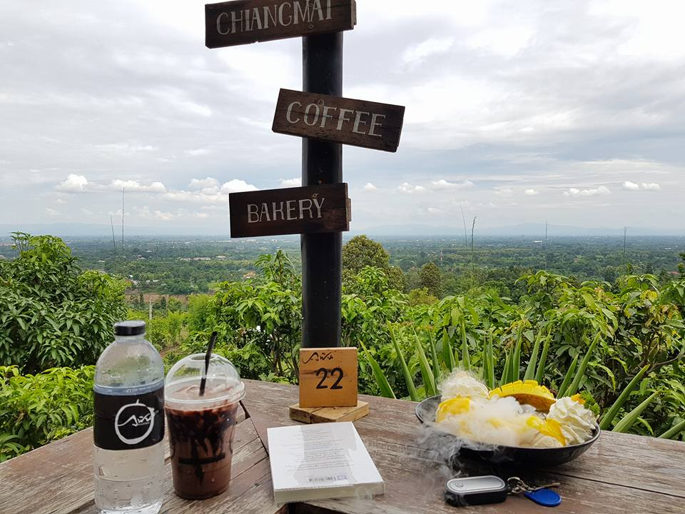

> **และแล้วผมก็ตัดสินใจ มาเปิดสาขาที่เชียงใหม่**

อ่าวเฮ้ย ทำไมไม่มีในลิสที่แนะนำข้างบนเลย ทำไมถึงได้มาเปิดเชียงใหม่ได้

เดี๋ยวผมจะบอกถึงปัจจัยที่มาเปิดเชียงใหม่ให้ฟัง

อย่างแรกคือจำนวนนักศึกษา จากสถิติปี 2553 จำนวนนักศึกษาในจังหวัดเชียงใหม่มีเยอะเป็นอันดับที่ 3 ของประเทศ ดังนี้

> **1 กรุงเทพมหานคร 836,568**

> **2 นนทบุรี 156,082**

> **3 เชียงใหม่ 89,728**

> **4 ปทุมธานี 83,834**

> **5 นครปฐม 68,656**

> **6 สงขลา 57,331**

และอีกทั้งจำนวนมหาวิทยาลัยยังเยอะติดอันดับของประเทศอีกเช่นกัน

ต่อมาคือ ในเรื่องการเดินทาง จังหวัดเชียงใหม่มีสนามบินที่อยู่ใกล้ตัวเมืองสามารถนั่งรถเข้ามาที่ตัวเมืองได้ไม่ถึง 10 นาที นั่นสิเพราะสนามบินมันอยู่ในตัวเมืองเลยแหละ ไม่ต้องรถติดกันมากกมาย

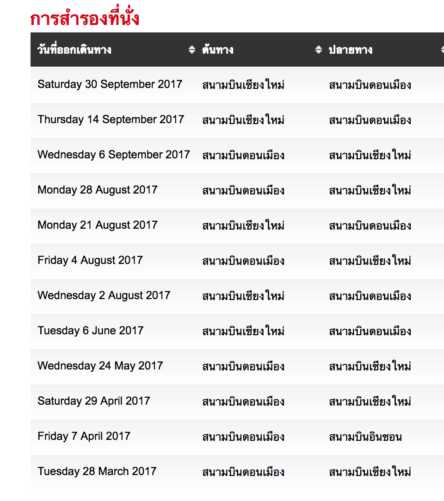

แถมค่าเดินทางถูกมาก ไปกลับสามารถทำราคาได้ไม่ถึง 1,500 ก็มีหากจองตั๋วในช่วงโปรโมชั่น และใช้เวลาเดินทางจากกรุงเทพ ไม่เกิน 2 ชั่วโมงเท่านั้น

ส่วนต่อมานั่นคืออสังหาริมทรัพย์และค่าครองชีพของที่นี่ นั้น ราคายังไม่แพง เมื่อเทียบกับจังหวัดอื่นๆ ทั้งๆที่จังหวัดนี้เป็นแหล่งท่องเที่ยวที่สำคัญ ของประเทศ

และปัจจัยสุดท้ายนั่นคือตัวผมเอง ก็จบมหาวิทยาลัยแม่โจ้ซึ่งอยู่ในจังหวัดเชียงใหม่อีกด้วย และมีความตั้งใจมาเปิดบริษัทในจังหวัดเชียงใหม่ เพื่อเป็นที่รองรับนักพัฒนาที่มีฝีมือแต่ไม่อยากไปทำงานกรุงเทพด้วย

Day One

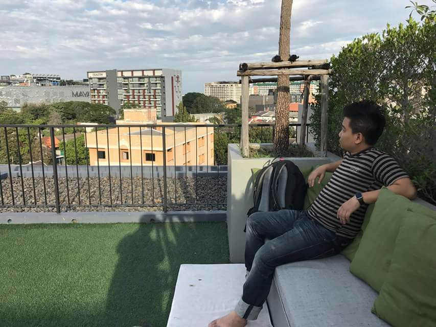

เอาว่ะเข้ามาสำรวจเชียงใหม่ก่อน โดยเริ่มจากสถานที่สุดชิคย่านนิมมาน มาสอบถามอัตราค่าเช่า และ ลงพื้นที่ดูราคาคอนโด บ้านที่ดิน บริเวณนั้น เพื่อจะได้ประมาณงบประมาณในการเช่าอ๊อฟฟิตได้

มีแว๊ปหนึ่งมีความคิดว่า เฮ้ยไปเปิดอ๊อฟฟิตบนดอยแม่มเลย แนวดี ให้สวัสดิการทำบ้านอยู่ในอ๊อฟฟิตเลย กินอยู่นอนดอย ชิวๆยาวไป

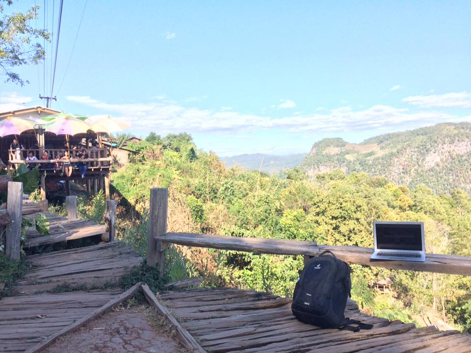

หรือว่าเชียงใหม่มันยังไม่ชิคพอแว๊นต่อไปหาที่ปาย แม่ฮ่องสอน ปรากฏว่าที่ดินแม่มแพงมากครับ แพงกว่าเชียงใหม่อีก เหตุเพราะต่างชาติและนายทุนไปซื้อไว้ เปลี่ยนมือไปกันไวมากทำให้ที่ดินราคาพุงไปไกลเลย

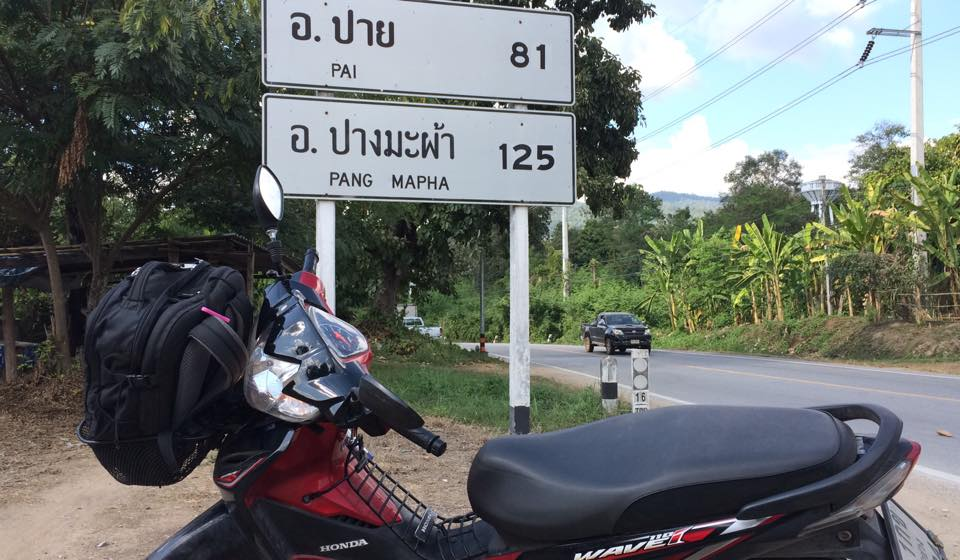

มาๆต่อตอนนี้ก็วนๆหา ยังหาไม่ได้ เลยวุ้ย เนื่องจากเราเรื่องมาก 555 เพราะเราอยากได้บรรยากาศอ๊อฟฟิตแบบร้านกาแฟ และอยากให้บรรยากาศมันชิวที่สุดเท่าที่จะเป็นไปได้

สุดท้ายได้หุ้นส่วนมาช่วยหา เลยได้อ๊อฟฟิตเรียบร้อย อยู่ในย่านศิริมังคลาจารย์เลย และมีบรรยากาศอย่างที่อยากได้ นั่นคืออ๊อฟฟิตมันอยู่ในร้านกาแฟเลย

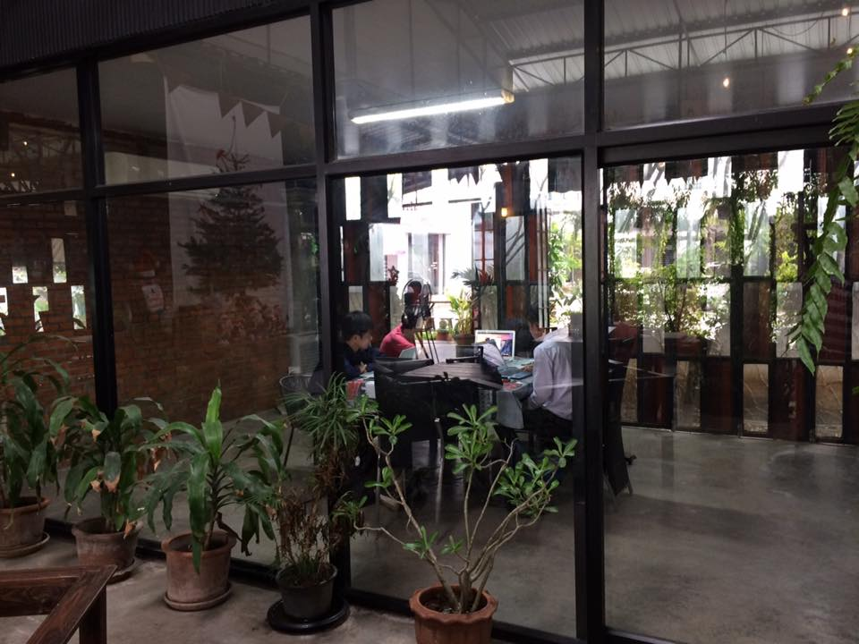

ห้องยังไม่ได้ตกแต่งยืมเก้าอี้ของร้านมาใช้ชั่วคราวก่อน รอโต๊ะเก้าอี้ที่สั่งมาส่ง

มองออกไปเป็นร้านกาแฟ และสามารถออกไปนั่งทำงานข้างนอกได้ ชิวๆ มีเพลงจากร้านกาแฟให้ฟังตลอดทั้งวัน

มุมนั่งเล่นก็มาเพิ่ม เอาไว้เล่นบอร์ดเกม พร้อมบอร์ดเกมที่สั่งมาใหม่สดๆร้อนๆ

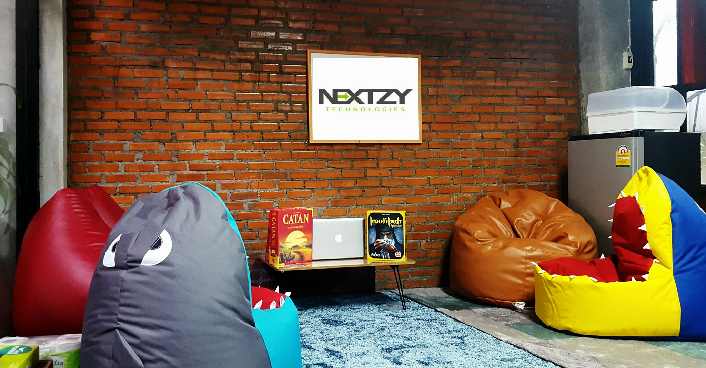

และทีวีเพื่อที่เอาไว้ประชุมกับทางสาขากรุงเทพ

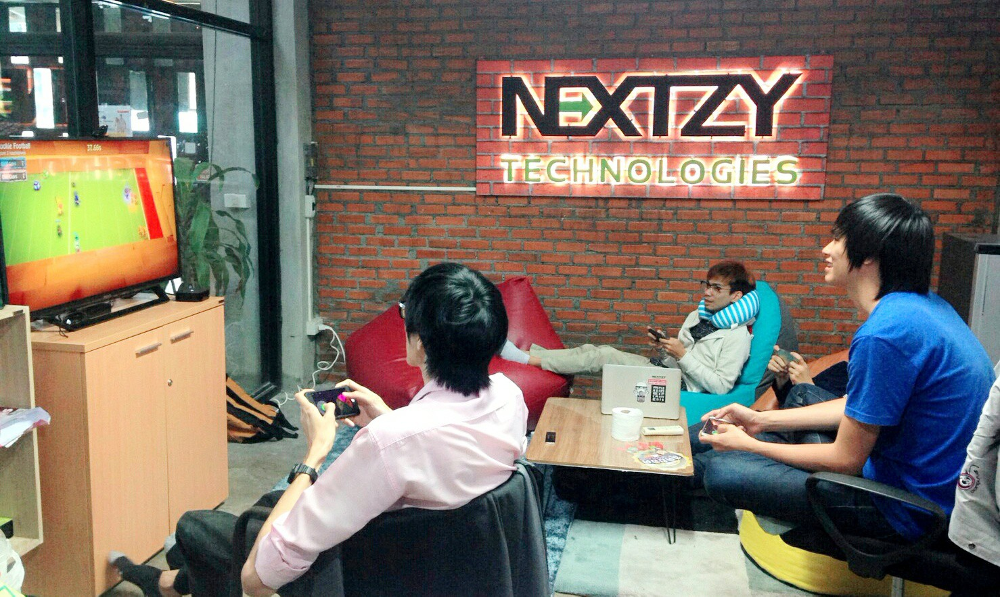

เป็นการจัด Meetup ที่เชียงใหม่ครั้งแรกๆ ที่คนล้น ร้านกาแฟแทบระเบิดออกมา

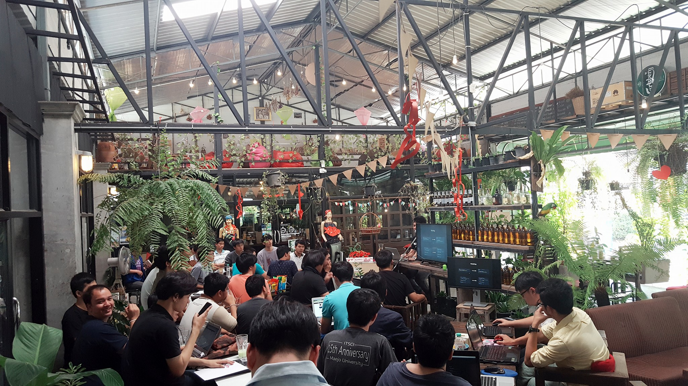

เมื่อผ่านไปเพียง 4 เดือนที่นั่งไม่พอ เพราะบริษัทขยายตัว 2 เท่าทำให้เราต้องเช่าที่เพิ่ม แต่ไม่เป็นไร เราคิดการไว้แล้ว ทำการเช่าเพิ่มและทุบกำแพงข้างๆออก

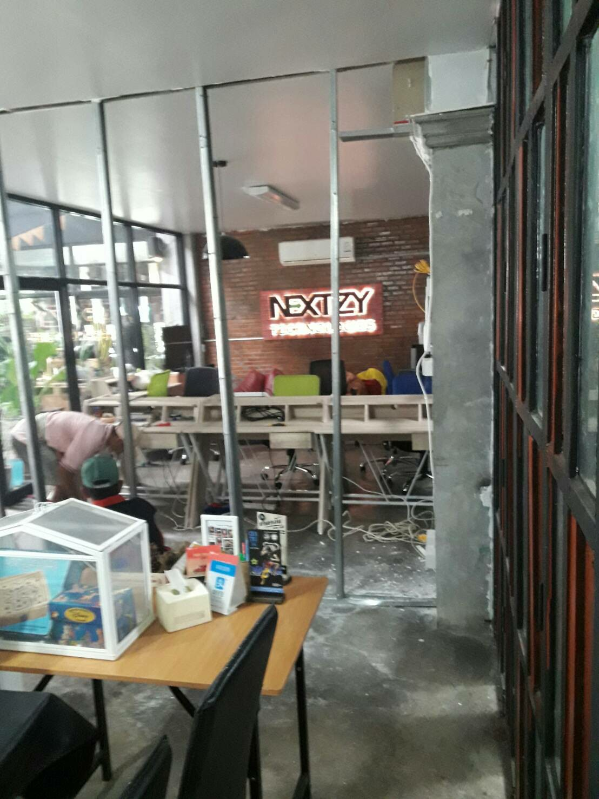

พื้นที่ใหม่ กว้างแบบกว้างมาก

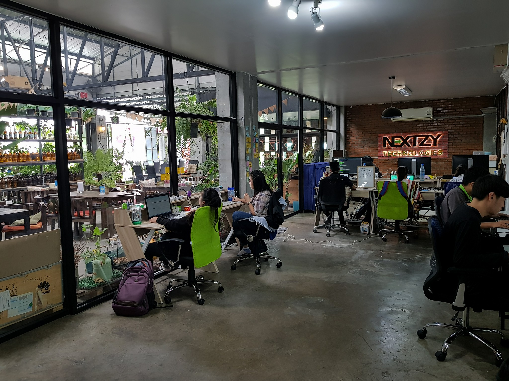

ทำสุกี้กินนั่งล้อมวงกันสบายๆ

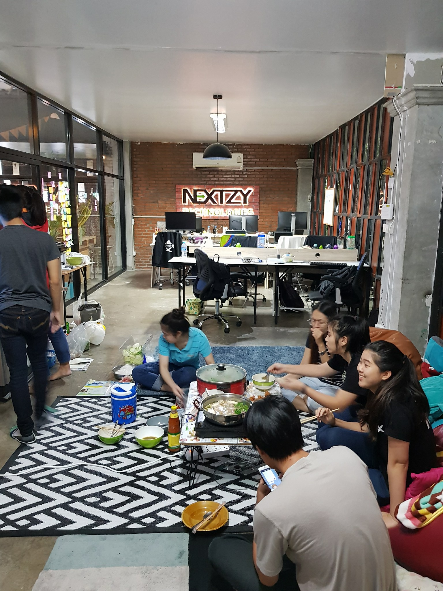

อีกฝั่งก็จะเป็นห้องประชุม ที่เอาไว้ต้อนรับ ทุกท่านจากทั่วทุกมุมของเชียงใหม่

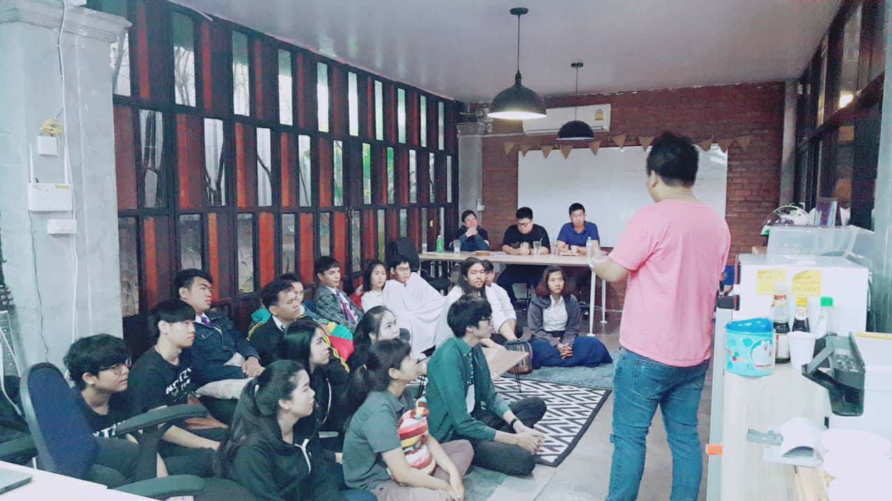

สุดท้ายนี้ สิ่งของอุปกรณ์สถานที่ อ๊อฟฟิตมันไม่ใช่สิ่งที่สำคัญที่สุด แต่ความเอื้อเฟื้อแบ่งปันทัศนคติที่ดีของทุกคนต่างหากที่ทำให้ อ๊อฟฟิตนั้นเป็น อ๊อฟฟิตที่น่าอยู่ และมันจะพาทุกคนไปสู่ความสำเร็จ

> ไม่จำเป็นต้องมีอ๊อฟฟิตหรูๆห้าดาว

> ไม่จำเป็นต้องมีอุปกรณ์และ Server ขั้นเทพมากมาย

> ไม่จำเป็นต้องมีเมาส์และคีบอร์ดขั้นเทพ

สิ่งที่บริษัทยึดถือมาตลอดคือทุกคนที่เข้ามาอยู่ที่นี่จะต้องมีทัศนคติที่ดี และอยากที่จะเก่งขึ้นอยู่ตลอดเวลา ไม่ใช่ลงเรือมาเพื่อที่จะเป็นเพียงลูกเรือ ลอยอยู่ในทะเลไปวันๆ

> **แต่สิ่งที่ทุกคนเป็นวันนี้ พวกเราคือโจรสลัด พวกเค้าจะดูแลตัวเอง ออกล่าด้วยตัวเอง เก่งขึ้น และรักพวกพ้อง**

ตอนนี้เกือบจะครบ 1 ปีพวกเรามีความยินดี อย่างยิ่ง สำหรับ Freelance Developer ในเชียงใหม่ ที่ไม่มีที่นั่งทำงาน หรือท่านอื่นๆที่สนใจมาเยี่ยมบริษัท เรา สามารถเข้ามาเยี่ยมหรือมานั่งทำงานกันได้ตามแผนที่ด้านล่าง

นี่เลย

[**Nextzy Technologies Chiang Mai**  
_Nextzy Technologies Chiang Mai, Chiang Mai, Thailand. 55 likes · 190 were here. Software Company_www.facebook.com](https://www.facebook.com/pages/Nextzy-Technologies-Chiang-Mai/220983345026521 "https://www.facebook.com/pages/Nextzy-Technologies-Chiang-Mai/220983345026521")

แล้วพบกัน
