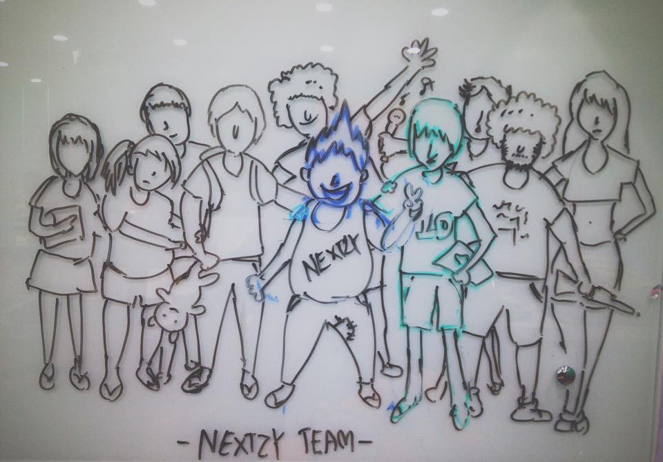
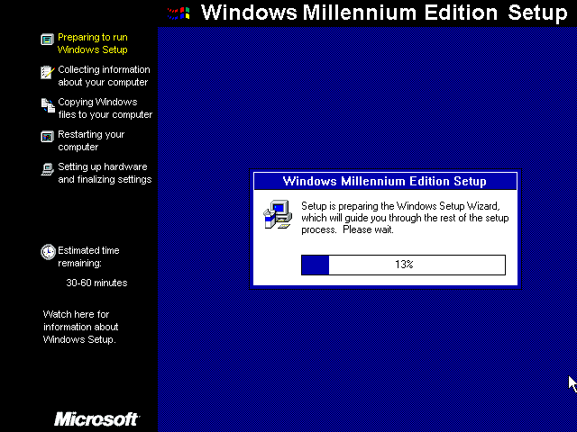

> _หากคุณเคยได้ยินคำว่า Geocities ที่เคยเป็นของ Yahoo_

> _หากคุณเคยรู้จัก free hosting ที่ชื่อ thai.net_

> _หากคุณเคยใช้ CMS ชื่อดังที่ชื่อว่า PHP-Nuke_

> _หากคุณคือเกรียนที่เขียนสคริปห้อง Pirch จนไปถึงกระทั่งเขียนสคริปไปยิงห้องชาวบ้านเค้า_

> _หากคุณคือเกรียนที่เปิดบอท Ragnarok จนมีเงินสามารถซื้อคอมใหม่ได้อีกเครื่อง_

### ยินดีครับที่คุณอยู่ในโลกที่ Software กำลังจะเข้าสู่ในยุคของความรุ่งเรือง…

### Day 0 หนทางของ IT Support

ย้อนไปสมัย ม.4 ผมมันก็ยังเป็นแค่เด็กคนนึงที่ยังเกรียนและบ้าคอมพิวเตอร์เป็นอย่างมาก เพราะอะไรหนะหรอ ก็เพราะผมติดเกมไงครับ กร๊ากๆๆๆๆ

แต่ผมก็ติดเทคโนโลยีด้วยแหละ ผมหลงไหลมันมาก ตอนนั้นคอมเสียยกไปร้าน ร้านมันก็ลง Windows ให้ฟรีก็ยังอยู่ในประกันหนะครับ

ผมเลยขอให้เค้า Write แผ่นให้มาเลย ตอนนั้นยังเป็น Windows 98SE เป็น Windows ที่แข็งแกร่งเวลาลงก็จะยุ่งยาก เช่น ต้อง Boot Floppy Disk A: ก่อนแล้ว \[highlight\] cd e: \[/highlight\] Enter แล้วก็ \[highlight\] setup \[/highlight\] Enter แล้วก็รอไปเหอะครับ 2 ชั่วโมงกับ Ram 256 MB

สนุกมากช่วงนั้น ชีวิตเกือบเบนเข็มไปทาง It Support เพราะว่า

> _มีรายได้จากการไปรับลง Windows ให้กับคนรู้จักแถวบ้าน ในราคาเพียง 300 บาท ตัดราคาร้านเค้าที่รับลงอยู่ที่ 500 บาท_

### Day 0.1 Network ที่แสนช้า

ตอนนั้น Search Engine ในเมืองไทยไม่ใช่ Google นะที่ดังและ Email ที่นิยมใช้ก็ไม่ใช่ Gmail แต่มันคืออออ Yahoo Search ครัชชชช

อีเมล์ถ้ามี @yahoo.com นี่เท่สลัดดด ครับ เพราะตอนนั้นกว่าผมจะสมัครได้ถึงกลับต้องปลอม Ip ทำ Proxy ไปต่างประเทศทำให้เหมือน US มันถึงยอมให้สมัคร

ต่อมาตัวที่มาตีตลาดก็คือ hotmail.com ครับ ให้พื้นที่ฟรีถึง 25MB ได้ยินไม่ผิด 25MB WTF แล้วความลำเอียงก็บังเกิดคือถ้าเป็น US มันให้ 250MB ทำไงครับก็เหมือนเดิมไปหา Proxy US สิครับ แล้วไปยืนยันที่หน้า Setting มาบ้านเกิดกรู อยู่ US นะให้พื้นที่มาเพิ่มซ่ะดีๆ มันเจ๋งจริงๆครับ ทำให้ผมได้ความรู้เรื่อง Network มากขึ้น ปัญหาตอนนั้นที่ติดอยู่อย่างเดียวคือ ADSL ความเร็ว 256 KB ในตอนนั้นเป็นอะไรที่ช้าหละต้อง Proxy ต่างประเทศอีก นรกเลยทีเดียว

> _ความรู้ในวันนั้นก็เกือบทำให้ผมแบนเข็มไปสาย Network เลยทีเดียว_

### Day 0.2 SWF Object

สมัยผมอยู่ ม.5 หนะหรอ อะไรมันจะมาดังสู้กับ Macromedia Flash MX ไม่มีอีกแล้ว ตอนนั้นใช้คู่กับ Macromedia Dreammerver MX รู้สึกว่านี่เรากำลังเทพกับโค๊ด HTML ที่อ่านไม่ค่อยรู้เรื่องกับ Flash Action Script ที่เขียนไม่เป็น ยังดีที่ยังพอใช้ Photoshop 5.0 ได้ ตั้งหน้าตั้งตาเรียน Photoshop อยู่ซ่ะนานเพราะหนังสือที่มีขายในตลาดมีแค่ Photoshop อย่างเดียวส่วน Dreammerver กับ Flash หนะหรอ หาอ่านเอาเอง ตามเน็ทความเร็วเต่า และสิ่งที่ทำให้ผมเขียน Flash ได้ไม่ใช่เพราะ Tutorial นะแต่มันคือโปรแกรมที่ชื่อว่า  
 **SWF Decompiler** ที่มันสามารถแยกร่าง SWF ออกมาได้ ทำให้ผมได้แนวทางการเขียน Actionscript มาพอเป็นตั้งแต่ตอนนั้น หลังจาก Adobe มาซื้อผมก็ไม่ได้หัด Flash อีกเลย

> _เกือบไปเป็น Designer แล้วเรา_

### Day 0.3 H4ck3d By C0ding2

สมัยก่อนจบ ม.5 ก็เข้าสู่ยุค Hacker ล้นเมืองเฮ้ย ดูมันจะน่ากลัวเกินไป เปลี่ยนเป็น Torjan ล้นเมืองดีกว่า น่าจะเป็นยุคตกต่ำของ AntiVirus ที่โทรจันสามารถหลบ AntiVirus ได้ด้วยวิธีการแก้เพียง Bytecode บางส่วนแถมมี Tool เอาไว้สร้าง Torjan พร้อมหลบ Anti เลยทีเดียว ถ้าจำไม่ผิดชื่อว่า Sub7 ผมก็เริ่มศึกษามาจากตอนนั้นแถมมีคนโพสสอนไว้ก็ไม่ใช่ใครที่ไหน คือพี่ Windows98SE ของเรานี่เองเจ้าของกลุ่ม 2600 Thailand ตอนนั้นความรู้ยังไม่แพร่หลายไม่มีบล๊อกมาสอน ต้องสร้าง Website เอารูปมาแปะๆกันอย่างเดียว ไม่มี wordpress ไม่มี joomla เขียนกันสดๆ html กันเลยทีเดียว สมัยนั้นก็ไม่มีอะไร เล่นกันสนุกๆแนบไฟล์ Torjan เอาไว้ใน Crack แล้วก็อับโหลดรอเยื่อมากดรันให้ แล้วเราก็สามารถ คุมเครื่องเค้าจากระยะไกลจุดๆนี้ทำให้ผมรู้จักกับด้านมือที่เรียกว่า Hacker ผมก็ศึกษามันจริงจังไปเจอเว็บ TryToHack เข้า ประมาณว่าถ้าคุณแน่ก็มาเล่นจำลองการ Hack ของเรา แน่นอนว่าผมเล่นมันจนครบทุกด่านเรียบร้อย มันยิ่งทำให้ผมหลงไหลมากขึ้น ทำให้ผมร้อนวิชา ตอนนี้ผมก็เริ่มมีความรู้ในการเขียน Web เบื้องต้นอยู่บ้าง และทำให้ผมลองกับเว็บไซต์จริงๆแน่นอนว่าร้อยละ 90% รั่วแบบประเภทที่ว่าสามารถ Drop Database ได้ หรือได้สิทธิเจ้าของเลยทีเดียว และความรู้นั้นผมก็มาประยุคทำให้ผมเขียนเว็บได้รัดกุมยิ่งขึ้น ไม่ว่าจะเป็น XSS, SQL Inject, Exploit ผมลองมาหมด บางทีแจ้งเจ้าของเว็บไปดันมา Ban User ผมอีก เลยจัดยึด ID MOD แล้ว

> _ฆ่าสัตว์เลี้ยงของสมาชิกไปหลายตัวในเว็บบิตแห่งหนึ่ง เกือบเข้าด้านมืดเลยทีเดียว จำไว้ไอ้เว็บ torren…ve_

### Day 0.4 เคยสงสัยไหมว่าทำไมเค้าสร้างเว็บไวจังมีหลายหน้าเชียว

เฮ้ยผมอยากจะมีเว็บห้องเป็นของตัวเอง ไหนๆก็จะจบ ม.6 แล้วมาทำเว็บห้องกันหน่อยดิ ว่าแล้วก็ Code HTML กันเลยสิครับ รออะไรกันอยู่ ยิ่งเว็บดุ๊กดิ๊กยิ่งเท่ Gif Animaion อ่ะใส่เข้าไป tag <marquee></marquee> ให้ตัวหนังสือมัน ไหลๆ แต่เฮ้ยเวลาจะแก้ไขข้อมูลนี่ตูต้องมา

1\. เปิด Dream

2\. แก้ๆๆๆๆๆ

3\. อับไฟล์ไปทับของเดิม ชีวิตมันเศร้าเสียนี่กระไร

เลยได้รู้จักกับคำว่า CMS ถึงกับร้องกรี๊ดกันเลยทีเดียว มันคือ PHP-Nuke ครับพี่น้อง มันมาพร้อมกับ Script PHP เป็นร้อยไฟล์ซึ่งตอนนั้นผมเขียน PHP ไม่เป็นได้แต่ทำตาม Readme.txt เลยได้รู้จักกับคำว่า PHP MySQL ตอนนั้นนี่ได้ Appserv ช่วยไว้เลยทำให้ไม่ต้องมาติดตั้งแยก ApacheHttpd PHPCGI MySQL มันมาพร้อมกันหมด PHP-Nuke นี่มันคือต้นแบบของเว็บราชการไทยเชียวนะ CMS ที่มาพร้อมกับ Layout 3 Column ซ้ายและขวาขนาดเท่ากัน ที่มาพร้อมกับ นาฬิกา Flash และ Poll ที่ขาดไม่ได้เลยเว็บต้องมี Guestbook นะครัช หรือที่เรียกว่าสมุดเยี่ยม ไว้คอมเม้นต่อๆกันจะได้มีกำลังใจในการเขียนเว็บ 555 ทำจนได้เว็บห้องออกมาจริงๆมันน่าจะเสร็จนานแล้ว

> _ดันไปติดเกมที่เพิ่งเข้ามาใหม่ที่ชื่อว่า Ragnarok_

### Day 0.5 เมื่อผมอายุ 18 ปีครั้งแรก

ก็น่านแหละ ใครจะอายุ 18 ปี 2 ครั้ง แบบว่าตอนนี้ติดเกมแบบเข้าขั้นหนักกะไอ้เกม Ragnarok จแล้วก็เข้ามหาวิทยาลัยได้เรียนคณะวิทยาการคอมพิวเตอร์อย่างที่ตั้งใจไว้ จริงๆจะเลือกหมอนะแต่หยิ่ง 555 ไอ้เราว่าเทพแล้วเจอภาษา Java นี่ถึงขั้นว่าโทรไปบอกพ่อตอนจบเทอมแรกเลยทีเดียวว่าไม่ไหวแล้ว อยากย้ายสาขา จริงๆปี 1 นี่แทบไม่ได้ทำอะไรเลยเกี่ยวกะซอฟต์แวร์ เรียนแค่วิชาสถาปัตยกรรมคอมพิวเตอร์ก็จะตายอยู่แล้ว ยากเกิน เย็นๆเลยแก้เครียดไปเล่น Dota จนทำให้เกรดตกต่ำจนแทบติดพื้น ปี 1 ผ่านมาด้วยดี ถ้าบางทีอาจารย์เห็นใจก็ให้ D+ มาบ้าง จะเอาอะไรกับเด็กกิจกรรมเยอะแบบผม

> _เรียกได้ว่าทั้งปีจะได้สกิลในการเปลี่ยนตัวแปร และการจัดเรียงโค๊ดเพื่อไม่ให้อาจารย์จับได้ว่าลอกกัน_

### Day 0.6 ผมมันชอบขี้โม้เลยได้มาเป็น TA

พอขึ้นปี 2 และลากยาวไปถึงปี 3 ผมก็ได้รับมอบหมายให้เป็น TA สอนหลากหลายวิชามากเกี่ยวกับคอมนี่แหละ จริงๆไม่มีใครอยากเป้นเพราะคาบว่างของผมทั้งหมดผมต้องมาเป็น TA ไม่ได้สบายเหมือนคนทั่วไปและค่าตอบแทนน้อยมากๆ ผมมีโอกาสได้สอนวิชา Basic VB.NET, Java Programming, System Analyst And Design, Software Engineer รวมไปถึง คอมพิวเตอร์พื้นฐานที่สอนให้กับสาขาอื่น มาถึงตอนนี้จากเขียนไม่เป็นก็ต้องเขียนเป็น เพราะต้องตรวจงานให้น้อง ทำให้รู้เลยว่า โอ้วววว นี่ลอกกันมานี่หว่า ตัวแปรเหมือนกันเลย ฮั่นแน่ ดัดแปลงไม่เนียน เลยนึกถึงเราสมัยเรียนเลยทำไมอาจารย์จะไม่รู้ว่าเราลอกมา หึหึ ผมได้อะไรจากตรงนี้เยอะมาก จากแรกๆตอนสอนน้องในภาคบรรยายนี่มือสั่นมาก เหมือนอย่างกับเจ้าเข้า จนรุ่นน้องมันแซวว่าพี่ๆ เสพยามาป่าว สึส จนพูดเริ่มคล่องก็หลังจากนั้นก็ไม่มีปัญหาสำหรับผม

> _จนมาถึงวันนี้ผมก็ยังไม่ค่อยเข้าใจ OOP เล้ยยยยย_

### Day 0.7 เงินเริ่มไม่ค่อยพอใช้และจุดเปลี่ยน

ผมได้มีโอกาสทำงาน Parttime สมัยเรียนเนื่องจาก ตอนเรียนมีพี่เค้าเข้ามาแนะนำบริษัทให้เป็นที่รู้จัก ก็เลยบอกพี่ไปว่าพี่มีงานอะไรให้ผมทำไหม แล้วเค้าก็ติดต่อมาให้ผมไปทำงานด้วยในตำแหน่ง Programmer Parttime ทำให้ผมได้รู้จักกับ Spring Framework และ Struts Framework ที่เป็น Java Framework ยอดนิยม และยังมี ExtJs ที่เป็น Javascript ที่เขียนยากสัดๆ มาให้เล่นอีกด้วย ตอนนั้นทำงานเงินเดือนไม่มีเค้าจ่ายเป็น งานที่ได้ตาม Man/day ได้ Man ละ 500 บาท บางครั้งก็ได้ 250 บาท เพราะงานทำไม่เสร็จตาม Man/day แต่ก็ต้องทำครับ เพราะจะไม่มีเงินจ่ายค่าห้อง เอาเงินค่าห้องไปเที่ยวหมดแล้ว ฮ่าๆ เรียกได้ว่าจุดต่ำสุดของชีวิตเลยทีเดียว ทำงาน 7 โมงเช้า ถึงห้อง 22:00 ทำโปรเจคจบต่อถึงตี 2 วน Loop อยู่แบบนี้ ยังไม่รวมงาน Freelance .NET ที่รับมา อีกแทบไม่ได้นอนเลยทีเดียว

> _ผมได้อะไรเยอะมากจากที่นี่ ทำให้ผมรู้สึกรัก Java ขึ้นมากทีเดียว EjB ESB JavaEE อีเฮี่ยอะไรเต็มไปหมด_

### Day 0.8 โปรแกรมเมอร์น้อยเดินทางสู่เมืองใหญ่

นั่งรถทัวร์กับ Notebook 1 ตัวเสื้อผ้า 3 ชุด ของทั้งหมดทั้งไว้ห้องเพื่อน เข้ากรุงเทพ… ผมแวะมาพักกับพี่ เพราะผมยังไม่ได้งาน เริ่มจากวางแผนจะไปสมัครงาน ที่ไหนดี เอาว่ะ ปริ้น Resume ใส่เป้ไป 20 ชุด เดินออกจากห้องพัก นั่งรถเมล์ไปหาสมัครงาน JobsDB คืออะไรยังไม่รู้เลยตอนนี้ จำได้เลยว่านั่งรถเมล์ไปลงที่ตึก พหลโยธินเพลส เดินอย่างเหนื่อยล้าเข้าไปใต้ตึก… ในใจคิดมันจะมีบริษัท IT ป่ะว้า เลยเดินไปดูที่ป้ายใต้ตึก โอววววววสวรรค์ชัดๆ มีรายชื่อบริษัทด้วย หาเลยๆ บริษัทไหนมันชื่อคล้ายๆจะเป็น IT บ้าง อะไรที่ชื่อมันมีคำว่า ware, soft, app จดๆชั้นมาไว้หมด แล้วเดินลุยไปเลยครับพี่น้องจะรออยู่ไย จำได้เลยว่า เดินไปถึง HR ถามนี่น้อง Walk in เข้ามาเลยหรอน้อง ผมตอบไปงงๆว่าครับ ก็ทำข้อสอบทิ้งไว้ หลายที่มากๆ ทิ้ง Resume ไว้บ้าง ทำแบบนี้ไป 1 อาทิตย์ ปรากฏว่า ยังไม่มีที่ไหนเรียกเลย T T เศร้าจัง ฝาก Resume ไว้ หมดไปเกือบ 30 ชุด นี่ยังไม่รวมทะเบียนบ้าน บัตรประชาชน สำเนาการยกเว้นทหาร ใบจบ ใบแสดงเกรดอีก เยอะจริงๆ ไม่รู้จะเอาไปทำไม เหอะๆ

ได้งานแล้วววววว ปรากฏว่าไปได้งานที่อาจารย์เค้าแนะนำให้ว่าไปบริษัท เพื่อนอาจารย์สิ ก็เลยได้งานเรียบร้อย เขียนภาษาแรกเลยหละกันสำหรับการทำงาน

> _มันคือ ภาษา Ruby On Rails ชื่อไม่ค่อยคุ้นนะฮ่ะ และแน่นอนผมเขียนไม่เป็นครับ_

### Day 0.9 UI&UX และ Java return true;

ช่วงมาทำงานใหม่ๆได้เรียนรู้วิถีของ Startup เป็นอย่างมาก และที่สำคัญคือได้ทำ UX และ UI ไปด้วย ซึ่งตัวเองทำได้ กาก มากกกก แต่ก็ยังทำทำให้ได้สกิล Javascript ระดับสูงสุดเรียกได้ว่าทำงานที่นี่ เกือบ 2 ปีเขียน Javascript อย่างเดียวไปซ่ะปีครึ่ง เพราะ Ruby On Rails มันเขียน Backend ได้ไว้มาก ทำให้ Backend เสร็จเร็วจนไม่มีอะไรทำก็มานั่งอ่าน Solr Elasticsearch, BackboneJS, UnderscoreJS เล่นเพื่อฆ่าเวลา ได้ความรู้ Unix ,Vim แถมมาอีกเพราะต้อง Deploy เอง ตอนนั้น Bootstrap ยังไม่เกิดไปใช้อะไรหนะหรอ ใช้ CSS [**Grid960**](http://960.gs/) ตัวนี้เลยแล้ว Bootstrap ก็มาก็ใช้ jQuery กะ Bootstrap กันไป แถมยังได้พี่ๆมาสอน NodeJs กับ Phonegap ให้อีก แต่ Core Library บัคเยอะจริงๆเพราะมันเพิ่งออกกันมาสดๆ จนคิดว่าสมควรแก่เวลาและมีพี่มาชวนไปเขียน Java อีกครั้งก็เลยได้

> _ไปเขียน Java อีกครั้ง แต่ครั้งนี้ไปในฐานะมือปืนรับจ้างนั่นคือสัญญาจ้างแบบ Outsource นั่นเอง_

### Day 1.0 เมื่อผมคนเดียวตามเทคโนโลยีไม่ทันเลยต้องมี “ทีม”

เท้าความเมื่อ [ผมเปิดร้านซ่อมคอม](http://codingz.org/post-06-%E0%B9%80%E0%B8%A1%E0%B8%B7%E0%B9%88%E0%B8%AD%E0%B9%82%E0%B8%9B%E0%B8%A3%E0%B9%81%E0%B8%81%E0%B8%A3%E0%B8%A1%E0%B9%80%E0%B8%A1%E0%B8%AD%E0%B8%A3%E0%B9%8C%E0%B9%80%E0%B8%9B%E0%B8%B4%E0%B8%94/)

หลังจากนั้นเพื่อผมก็แนะนำให้ผมเปิดสอนดีกว่า มันบอกคำเดียวว่าระดับมรึงน่าจะทำได้ และดี เลยรวบความความกล้าและตรวจสอบความพร้อม จากการที่เคยเป็นเด็กกิจกรรมในมหาวิทยาลัย อีกทั้งยังเคยสอนมาหลายต่อหลาย Class ตอนที่เป็น TA อีกอย่างยังได้ความรู้จากบริษัทที่เราเคยทำงาน Parttime มีความรู้ JavaEE พอสมควรและยังทำงาน Java มาตั้งหลายปี สถานที่หละที่ไหนดี นึกไปนึกมาก็ห้องที่เปิดร้านซ่อมคอมนี่แหละ

เอาว่ะเปิดเลยยยยยย สภาพสอนครั้งแรกกับนักเรียน 1 คน สนุกสนานเป็นไปได้ด้วยดี นักเรียนมาถึงกับงงว่าผมเรียนคนเดียวหรอก็ไม่รู้จะตอบยังไง เลยบอกว่าพี่เป็นระดับ VIP 555 สอนมา 3 เดือนก็นึกในใจว่านี่เราทำให้พ่อแม่ภูมิใจแล้วที่เราได้เป็นครูสอนคนอื่นแบบจริงๆจังๆครั้งแรก ผมก็สอนเก็บประสบการณ์ไปเรื่อยๆจนมีบริษัทติดต่อให้ไปสอน แต่ต้องออกบิลในนามบริษัท เลยไม่ได้ไปสอนพลาดไปอย่างแรง ทุกวันชีวิตต้องทำงานประจำไปด้วย ตกเย็นมากลับบ้านมานั่งเขียนหลักสูตร ตอบเมล์ลูกค้า โทร Confirm โทรอธิบายหลักสูตรต่างๆนานา

มาวันหนึ่งก็มีคนโทรเข้ามาอยากที่จะคุยกับผมเป็นเจ้าของบริษัทที่ผมเคยทำงานให้ ผมก็เลยเข้าไปคุยตอนนั้นบรรยากาศตื่นเต้นมากๆ ขนาดลาออก 3 บริษัทใน 1 ปียังไม่ตื่นเต้นขนาดนี้เลย ประโยคของผมที่พูดกับเค้าเหมือนอ้อนวอนแต่เต็มเปี่ยมไปด้วยความหิวกระหาย

> _ผมบอกเพียงว่าพี่มีงานอะไรให้ผมทำไหม ผมเขียน Java ได้ เพียงแต่ผมไม่มีบริษัท พี่เอาด้วยกับผมไหม_

ถึงวันนี้ผมมีทีมเป็นของตัวเองเรียบร้อยแล้ว พร้อมที่จะมาแชร์ความรู้และก้าวลงเรือไปเป็นโจรสลัดล่าค่าหัวด้วยกัน เฮ้ยย ล่างานไปด้วยกัน ดังคำที่ว่า อยากไปไวไปคนเดียว อยากไปไกลไปด้วยกัน และผมเชื่อว่ามันเป็นอะไรที่สนุกมากเพราะผมได้ใส่ชีวิตผมทั้งชีวิตไปกับมัน…

ผมก็ไม่รู้หรอกว่าข้างหน้ามันจะเป็นอะไร ผมรู้อย่างเดียวว่าผมชอบเขียนโปรแกรม ดังที่จ๊อบบอกไว้

“คุณไม่สามารถเชื่อมต่อจุดด้วยการมองไปข้างหน้า”  
 “คุณจะสามารถเชื่อมต่อจุดเหล่านั้นด้วยการมองไปข้างหลังเท่านั้น”  
 “ดังนั้นคุณต้องเชื่อว่าจุดใดที่จะเชื่อมต่อกันในอนาคต”

–Steve Jobs

แล้วหุ้นส่วนผมบอกว่าถ้าเปิดแล้วอย่าปิดมันนะ ผมก็ไม่ได้พูดอะไรพยักหน้าไป เลยมานึกในใจว่าจะไปเลิกได้ไงผมคือโปรแกรมเมอร์ นี่หว่า

> _เป็นโปรแกรมเมอร์มันเลิกไม่ได้ มันเป็นไปตลอดชีวิต ส่วนคนที่เลิกนะหรอเค้ายังไปไม่ถึงคำว่าโปรแกรมเมอร์ครับ_

---

_Originally published at_ [_codingz.org_](http://codingz.org/from_zero_to_new_company/) _on June 1, 2015._
