## **Nextzy ไม่ใช่บริษัท แต่คือผู้คน…**

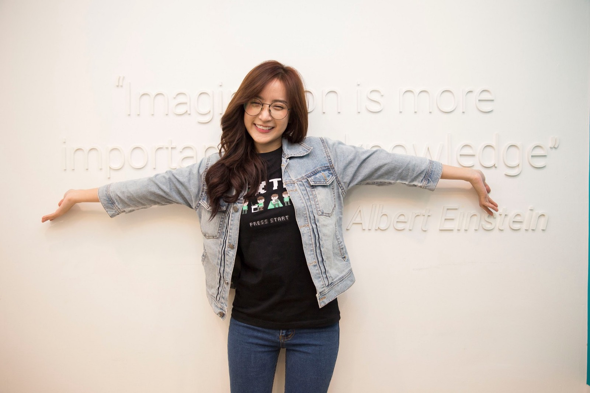

เกริ่น ก่อนมาเป็น Nextzy…

มันเริ่มโปรแกรมเมอร์ตัวเล็กๆที่ไม่มีใครรู้จัก ไม่มีหน้ามีตาในสังคม ไม่ได้เรียนจบนอก ไม่ได้เรียนสถาบันดัง

เกิดคำถามขึ้นมาว่า

ทำไม Software มันต้องเขียนแต่โครงสร้างเดิมๆที่มันไม่เวิค หรือสิ่งนั้นมันเคยเวิคมาเมื่อนานมาแล้ว ตอนนี้เทคโนโลยีมันไปไกลแล้ว

ทำไมผมถึงต้องให้ผมไป Copy Code ของ ซีเนียที่มันเก่าคร่ำครึ ทำไมผมไม่สามารถเขียนเองได้ ต้อง Copy เท่านั้น

ทำไมผมต้องทนใช้ Library ที่ไม่มี LTS แล้ว เพราะรุ่นก่อนเค้าทำกันมาเปลี่ยนก็ไม่ได้ จำกัดที่ Server ที่ไม่ยอมเปลี่ยนสถาปัตยกรรม

ทำไมผมถึงไม่มีทางเลือกอะไรเลยในการเขียนโปรแกรม ถ้างั้นผมขอออกมาเปลี่ยนแปลง…นับจากวันนั้น…

ก็ 4 ปีกว่าๆมาแล้ว เลยอยากจะมาเขียนอะไรบางอย่างเก็บไว้

---

> **เครื่องมือ สถานที่ และสวัสดิการ ที่ใช้จนถึงวันนี้**

เราตัดสินใจไม่ผิดที่เลือกใช้ Macbook Pro Ratina และซื้อให้เป็นเครื่องมือให้กับพนักงานทุกคน สำหรับ Developer ที่ใช้งานหนักก็จะเป็น Macbook Pro RAM 16GB ส่วนถ้าเป็น QA SA ใช้งานไม่หนักมากและส่วนมากเป็นผู้หญิงเราจะเน้นน้ำหนักเบาเป็น Macbook AIR ดูสวยงามน่ารักพอดีมือ

ส่วนพวก Tool อื่นๆที่เราใช้มาจนปัจจุบันสามารถเข้าไปดู Review ได้เลยที่นี่

#### [9 เครื่องมือที่ Nextzy เราเลือกใช้สำหรับนั่งทำงานที่บ้าน](https://blog.nextzy.me/9-%E0%B9%80%E0%B8%84%E0%B8%A3%E0%B8%B7%E0%B9%88%E0%B8%AD%E0%B8%87%E0%B8%A1%E0%B8%B7%E0%B8%AD%E0%B8%97%E0%B8%B5%E0%B9%88-nextzy-%E0%B9%80%E0%B8%A3%E0%B8%B2%E0%B9%80%E0%B8%A5%E0%B8%B7%E0%B8%AD%E0%B8%81%E0%B9%83%E0%B8%8A%E0%B9%89%E0%B8%AA%E0%B8%B3%E0%B8%AB%E0%B8%A3%E0%B8%B1%E0%B8%9A%E0%B8%99%E0%B8%B1%E0%B9%88%E0%B8%87%E0%B8%97%E0%B8%B3%E0%B8%87%E0%B8%B2%E0%B8%99%E0%B8%97%E0%B8%B5%E0%B9%88%E0%B8%9A%E0%B9%89%E0%B8%B2%E0%B8%99-aa043915a635)

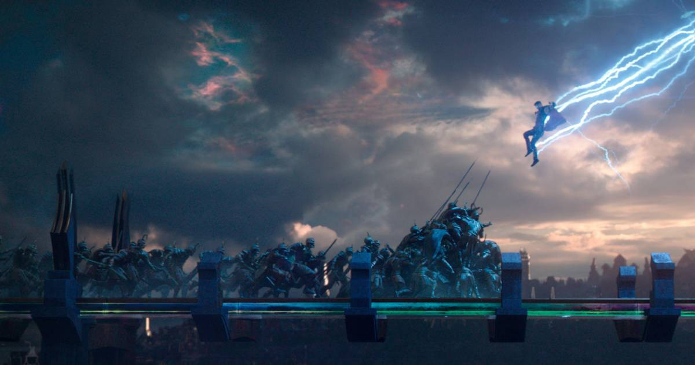

สวัสดิการเรานั้นเยอะมาก เดี๋ยวมาอับเดทสวัสดิการให้ฟังว่าตอนนี้มีอะไรกันบ้างและมีที่มาที่ไปอย่างไร ถึงมีสวัสดิการนี้ มันสะสมมาเรื่อยๆจนถึงในปีนี้มาอับเดทกัน

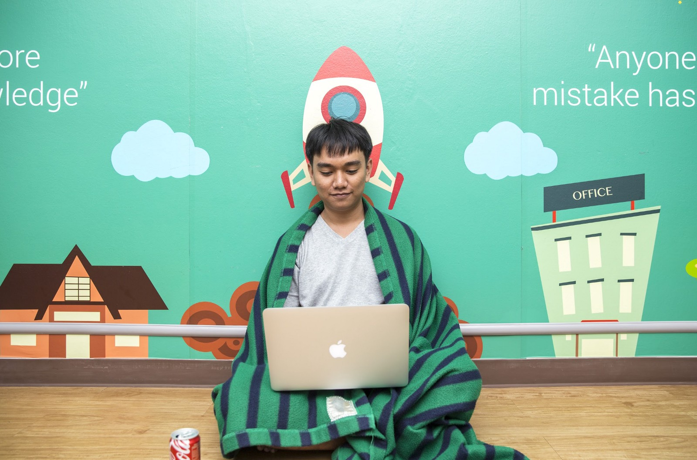

-   **เวลาเข้า-ออกงานที่ Flexible** ผมเชื่อว่าทุกคนที่รับมานั้นมีความรับผิดชอบมากพอโดยที่ไม่มีเงื่อนเวลามาบังคับ ทุกคนต้องรักษาวินัยตัวเอง
-   **พาไปนั่งทำงานกันที่ Co-working Space เป็นบางเวลา** (สาขาเชียงใหม่ไปทุกอาทิตย์) เป็นความชอบส่วนตัวเพราะสมัยทำงานเราทำงานอยู่แต่อ๊อฟฟิตมันก็เหมือนอยู่ในโรงเรียนมันต้องมีโดดเรียนกันบ้างจริงม่ะ ทุกอย่างฟรีหมดเพราะอยากให้ทุกคนไปโดยไม่มีเงื่อนไขอะไร
-   **วันหยุดลาพักร้อน 15 วัน/ปี เพราะชีวิตเราไม่ได้มีแต่การทำงาน ไปพักผ่อนบ้างเถอะ (ไม่นับวันเที่ยวของบริษัท)** วันลานี้ได้ตั้งแต่วันแรกเมื่อเริ่มงานจะได้เดือนละ 1.25 วันต่อเดือนไปเรื่อยๆ ตั้งแต่ปีแรก ที่ให้เยอะๆเพราะอยากให้มันวันหยุดมากกว่า รอยเตอร์ ส่วนตัวเคยไปสัมภาษณ์เค้าบอกว่าเค้าให้วันลาเยอะสุดในประเทศไทย เมื่อเปิดบริษัทผมเลยเกทับแม่ม

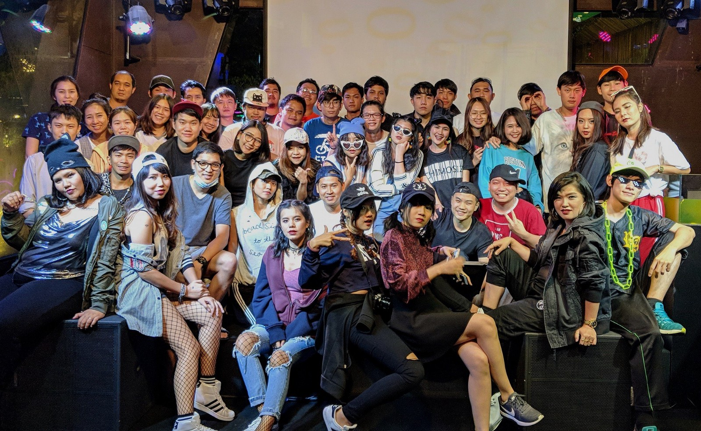

-   **เลี้ยงฉลองวันเกิด วันปิดโปรเจค วันรับพนักงานใหม่ ฯลฯ หรือบางครั้งก็ไม่มีเหตุผล** เวลากินเวลาเที่ยวเราเที่ยวกันจนสุดบิลล่าสุดก็หลายหมื่นอยู่ ปาดเหงื่อแปร๊บ
-   **ประกันสังคมและประกันสุขภาพ** เราเพิ่มค่าทำฟันมาด้วย 6,000 ต่อปีเมื่อทำงานครบ 1 ปีเพราะน้องๆเรียกร้องกันมา 6,000 นี่ผมว่าเยอะกว่าประกันสุขภาพ AIA อีก

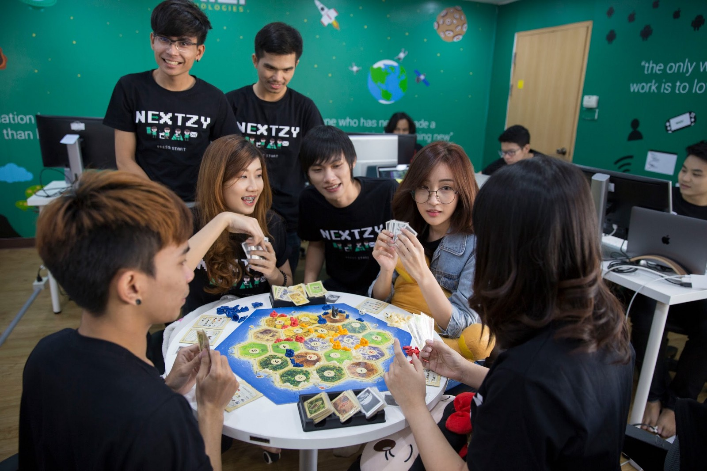

-   **เล่นเกมในเวลาทำงาน** โดยที่นี่มีเกมที่หลากหลายมากจึงเหมาะกับทุกเพศทุกวัยที่จะมาเล่นเกมด้วยกัน สมัยผมทำงานไม่ได้เล่นหรอกเกม มันอัดอั้น จะเล่นได้ก็ตอนกินข้าวเที่ยงเท่านั้น เลยอยากให้ทุกคนที่เครียดมาผ่อนคลาย พอเราประชุมกันน้อยมาก เราก็คุยกันน้อยลง เกมเนี่ยแหละจะเป็นตัวกลางให้เราคุยกันมากขึ้น

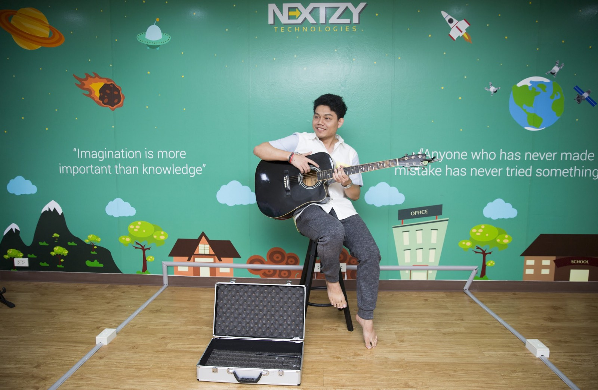

-   **สามารถทำงานจากที่บ้านได้ถ้ามีเหตุจำเป็น 2 วัน/สัปดาห์ (แต่ทุกคนในทีมก็ชอบที่จะมาเจอหน้ากันที่ออฟฟิศมากกว่า)** ผมเชื่อนะว่าเมื่อผมมีเหตุจำเป็นและบริษัทเห็นในความจำเป็นนั้น ผมจะตอบแทนบริษัทอย่างคุ้มค่า
-   **หากในวันธรรมดามีสัมมนาที่น่าสนใจ เราจะส่งไปอบรมทันที หรือมีงาน Meetup ก็ไปได้** อันนี้ไม่จำกัดงบเลย ถ้าเห็นว่าน่าสนใจก็พาไป ไปงาน Startup ที่สิงคโปร์ อินโดก็ไปกันมาหละ ส่วนงาน Meetup ที่น่าสนใจก็สามารถไปได้เลยในวันธรรมดา ไม่เสียวันลา ขอแค่มาแชร์ให้คนอื่นๆในทีมก็พอ
-   **ยกก๊วนไปดูหนัง 2–3 เดือน/ครั้ง** ผมชอบอันนี้มากเลยที่บริษัทเก่าผมพาไปดูผมว่ามันเหมือนเป็นครอบครัวกันเลยนะขอบอก

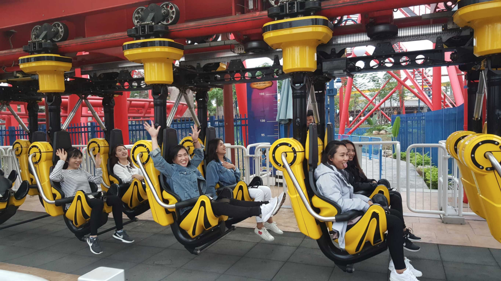

-   **ท่องเที่ยวประจำปี บางครั้งก็แล้วแต่อารมณ์จะพาไป** อันนี้ผมสายเที่ยวเลยอยากให้บริษัทผมมีด้วย แต่เที่ยวของเราคือเที่ยวจริงๆ ไม่มีมายกๆป้ายบริษัทหรือทำกิจกรรมอะไรเยอะเกินคำว่าเที่ยว
-   **โบนัสประจำปี** ทำงาน 1 เดือนในปีนั้นเราก็ให้เราถือว่าเค้าทำงานกับเราในปีนั้น ก็ได้ตามสัดส่วนกันไป โบนัสเป็นอะไรที่สามารถลดภาระได้เยอะมาก เห็นใจ Dev ที่ตั้งใจทำงานและมีปัญหาเรื่องเงิน

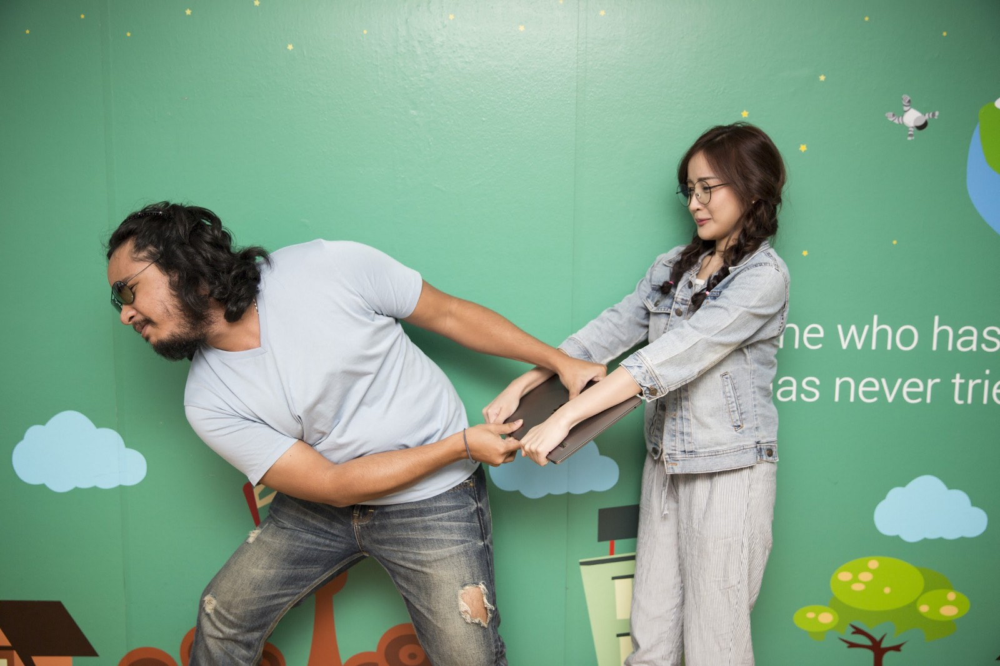

-   **(เฉพาะสาขากรุงเทพฯ) จะมี Notebook ให้ใช้ทำงาน และถ้าเป็น Developer จะเป็น Macbook Pro (RAM 16GB) เพื่อให้ทำงานได้อย่างเต็มที่** สาขาเชียงใหม่ก็ซื้อให้แล้วตอนนี้
-   **มีมาม่าให้กินที่ออฟฟิศฟรี มีประโยชน์มากในตอนสิ้นเดือน** อันนี้ผมก็ชอบเหมือนกัน บางครั้งการทำงานดึกๆนอกจากได้ OT แล้วก็มีมาม่านี่แหละที่บริษัทสามารถให้ได้เลย นอกจากนี้ยังมีพวกน้ำ ขนม ที่ขายกันในราคาทุน เพราะถ้าแจกฟรี ได้เข้าโรงบาลกันเป็นแถวเพราะน้ำตาลเยอะแน่ๆ

---

> **Nextzy ไม่ใช่บริษัท แต่คือผู้คน…**

คำนี้มาอีกแล้ว 555

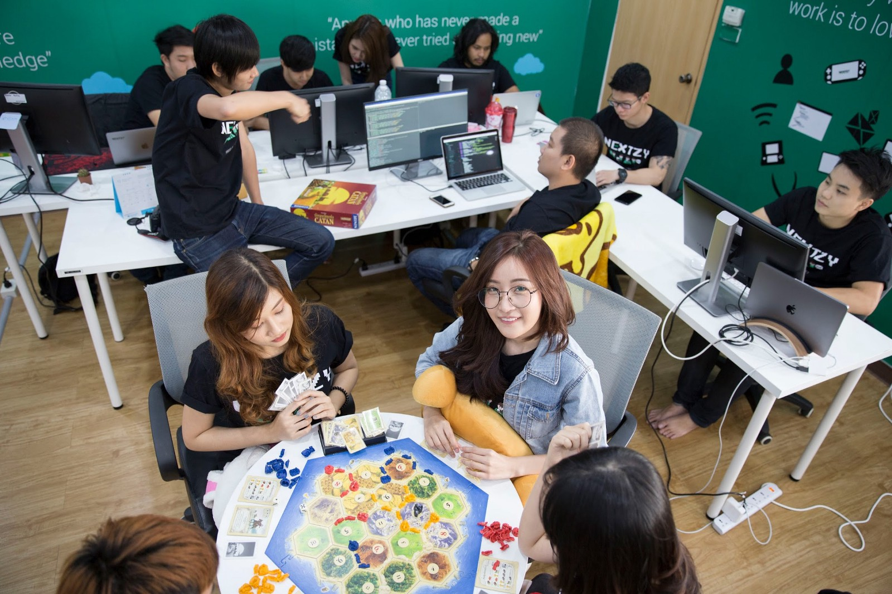

ผมเริ่มขับเคลื่อนบริษัทด้วยตัวของทีมงานไม่ใช่ผม เริ่มมาตั้งแต่เมื่อกลางปีที่แล้วจนถึงปัจจุบัน น่าจะเรียกว่า Bottom up หรือป่าวหว่า ไม่แน่ใจ ศัพท์ เริ่มจาก

-   ให้น้องในทีมตีราคาเอง กำหนดราคาที่อยากจะได้ แล้วส่งมาให้ผมตรวจสอบแล้วส่งต่อให้ลูกค้า
-   ให้แบ่งเวลาทำงานเองเลือกว่าจะทำงานหรือพัฒนาตัวเอง
-   ไอเดียในการทำโปรดักเกิดจากตัวทีมงาน ไม่ได้เกิดจากผมหรือคนที่มีตำแหน่งสูง แต่ผมจะใช้เหตุผลและหลักการเข้าไปดูวิเคราะห์ความเป็นไปได้ด้านอื่นๆ เถียงกันจนกว่าจะจบ ถ้าผมสู้ได้ก็จะเป็นไอเดียใหม่ๆจากผม ผมสู้ไม่ได้ก็จะเป็นไอเดียใหม่ๆจากน้องๆในทีม
-   สวัสดิการและงานเลี้ยงเกิดได้จากพนักงานทุกคน เลี้ยงปีใหม่ เลี้ยงฉลองพนักงานใหม่เลี้ยงส่งน้องฝึกงาน ไม่ได้เกิดจาก HR หรือใครคนใดคนหนึ่งเป็นคนกำหนดวัน แต่เกิดจากทีมงานคุยกันว่าทุกคนว่างวันไหนและอยากไปกันที่ร้านไหน ให้มานัด CEO อีกที เพราะ CEO ว่างทุกวัน
-   ทุกคนเป็นเจ้าของ Nextzy อย่างน้อย ก็ช่วยประชาสัมพันธ์ให้บริษัทเป็นที่รู้จัก เงินทุกบาทก็จะมาลงกับทุกคนในทีม เพราะเราไม่ต้องจ้างนักการตลาดมาทำตลาดให้เรา ไม่ต้องเสียค่าโฆษณาไปลง Job Web ต่างๆให้เสียเงินไป
-   เมื่อทุกครั้งที่ในทีมไปเจอเทคโนโลยีใหม่ๆก็จะเอามาเสนอ ผมก็จะไปนำเสนอลูกค้าอีกทีว่ามันดีอย่างไร เมื่อสำเร็จน้องในทีมก็จะได้ทำเทคโนโลยีใหม่ ลูกค้าก็จะได้ของดีๆใช้

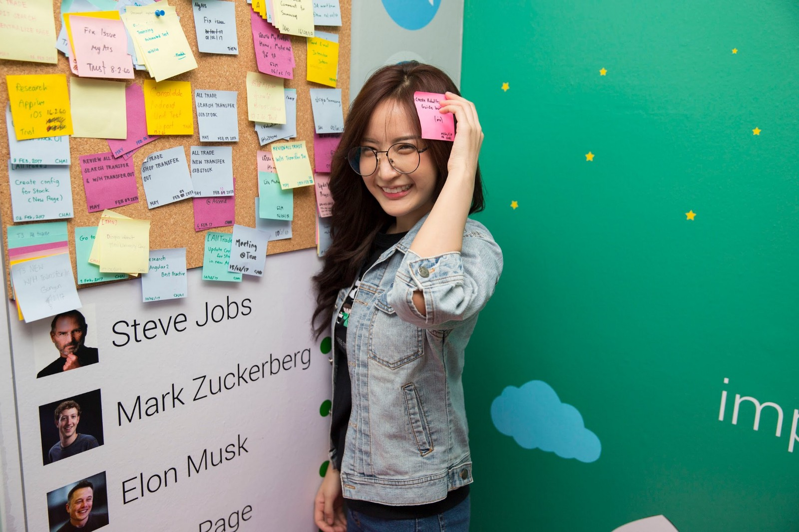

ในช่วงครึ่งปีที่ผ่านมา Nextzy ซึ่งเป็นบริษัท Tech Company ต้องปรับตัวเยอะมาก เพราะรอรับคลื่นลูกใหม่แห่งเทคโนโลยีที่เข้ามา ไม่ว่าจะเป็น Mobile Native Cross Platform, AR, Blockchain, ML เราได้เลือกและซุ่มทำ Blockchain มาได้ซักพักเรียบร้อยแล้ว ก่อนที่ FB จะเปิดตัวทีมงานด้านนี้ซ่ะอีก ก็ถือว่าเรามาถูกทาง

> ทุกบริษัทวิ่งเข้าหาเส้นทางนี้หมดถ้าเราไม่แน่จริงหรือเราไม่เปลี่ยนแปลงอะไรซักอย่างคลื่นนี้จะพัดเราลงไปสู่ก้นทะเลปีนี้คงเป็นปีที่เราเปลี่ยนมากที่สุดนับตั้งแต่เปิดบริษัทมา

มาถึงคำถามยอดฮิตที่ถามเข้ามาในเรื่องการสเกลและการรับคน มีความคิดเห็นอย่างไรบ้าง ทางเราก็รับคนตลอดทั้งปีนะ ไม่ว่าจะเป็นน้องๆฝึกงานหรือทีมงาน เราเปิดรับตลอด ทุกๆวันจะมี Resume ส่งมาเฉลี่ย 2–3 ฉบับ เราไม่ได้สเกลคนเยอะแบบบริษัทอื่นๆ 40 คนกำลังดีนะ เพราะทีม Instagram, Snapchat ก็มีคนประมาณนี้ก็สามารถสร้างอะไรที่สุดยอดได้ ปีนี้ก็ยังเป็นปีที่ไม่ได้จ้างตำแหน่งการตลาดและตำแหน่ง Manager เลย 40 คนที่เรามีนั้นก็เป็นสาย Developer ล้วนๆ PA,SA,QA มีแค่เนี่ย ส่วนตัวผมก็หน้าที่ต่อรองจัดการราคา เป็น IT Support เป็น R&D ไป

โจทย์ของ Nextzy ที่ผมคิดมามันน่าจะเป็นแบบนี้

> เราจะไม่ทำงานเพื่อสร้างเงิน…….ในวันนี้  
> แต่…  
> เราจะทำงานเพื่อสร้างเงินในอนาคต

ใครกำลังคิดจะทำอะไร แล้วมันน่าจะส่งผลดีต่อคุณ ก็ควรทำมันซะ อย่ารอใครมาบอกว่าต้องทำ แต่ทำเพราะเราอยากจะทำ มันจะเป็นผลดีต่อเรามากกว่า

สุดท้าย…

> ความท้าทายมันอยู่ตรงที่ในอนาคตก็ไม่มีใครรู้ว่าเงินนั้นมันจะมาจากไหน ผมเองก็ไม่รู้ ปีนี้จะเป็นปีที่ให้ทีมงานของ Nextzy ทำอะไรก็ได้ ที่มันวิ่งไปหาทางเดียวกันนั่นคือเทคโนโลยีแห่งอนาคต มันไม่ใช่แค่มาทำตามคำสั่งหรือมาทำงานจบไปในแต่ละวัน เพราะถ้าหากไม่มี Nextzy อยู่ก็ยังมีทุกคนอยู่และพร้อมจะสร้างอนาคตของแต่ละคนได้ โดยมี Nextzy เป็นแบบอย่าง  
>  — New CEO & Risk Lover @ Nextzy Technologies

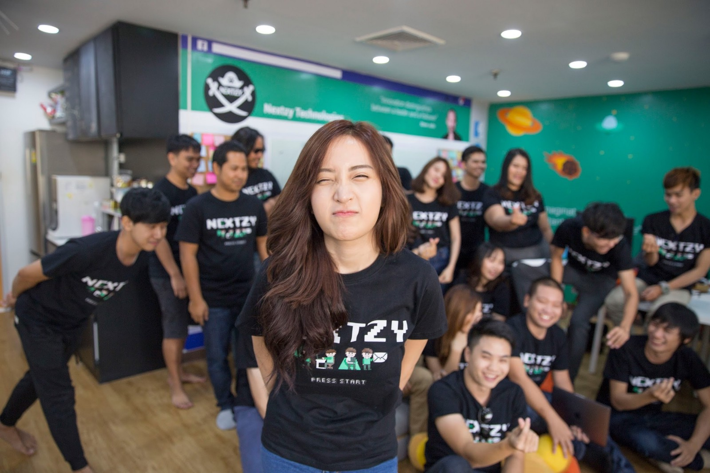

**โชคดี We are Hiring นะครับ**
