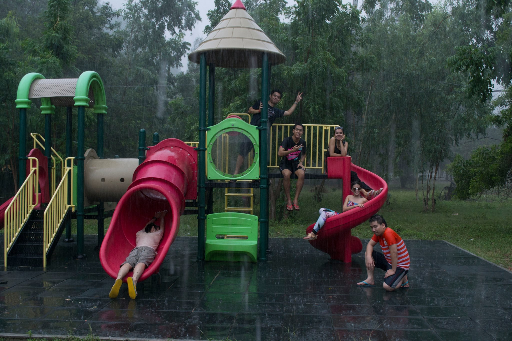
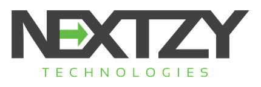

สวัสดีผู้อ่านทุกท่าน วันนี้อารมดี เลยมานั่งเขียนเพราะกว่าจะบิ้วอารมได้นี่ก็นานพอสมควร มาเขียนภาคต่อจาก [From Zero To New Company กับเวลา 10 ปีที่ผ่านมา](https://medium.com/@codingz/from-zero-to-new-company-%E0%B8%81%E0%B8%B1%E0%B8%9A%E0%B9%80%E0%B8%A7%E0%B8%A5%E0%B8%B2-10-%E0%B8%9B%E0%B8%B5%E0%B8%97%E0%B8%B5%E0%B9%88%E0%B8%9C%E0%B9%88%E0%B8%B2%E0%B8%99%E0%B8%A1%E0%B8%B2-a3ce7565fd0d#.ff0lj652g)วันนี้จะมาเล่าว่า 2 ปีที่ผ่านมาเป็นอย่างไรกันบ้าง มีทุกสุขเศร้า และข้อคิดอะไรบ้าง

> น้ำตา ความท้อ สิ้นหวัง เงินหมด อยากเลิก ทำไมไม่เป็นเหมือนคนอื่น ผิดหวัง ฯ

1.  **บทเรียนแรก บทเรียนราคา 400,000 บาท** ก่อนเปิดบริษัทได้ประมาณ 1 เดือนผม ได้เสียเงินจากการเล่น DW(Derivative Warrants) ไปหมาดๆ เป็นบทเรียนราคาแพงสำหรับผม เนื่องจากเราทำในสิ่งที่เรา “ไม่ถนัดมากพอ” ความเสียหายในครั้งนั้นทำให้ผมรู้ว่า การที่ทำอะไรที่เสี่ยงๆนั้น เราต้องยอมรับผมของความเสี่ยงที่เกิดขึ้นได้ ต้องไม่เสียใจที่ได้ทำมัน

> หากเราทำสำเร็จได้มันก็ดี แต่ถ้าไม่ได้ก็เฉยๆ

**2\. การหางานชิ้นแรก/ลูกค้าคนแรก** เป็นอะไรที่ยากมากๆ ถ้าไม่มี Connection หรือมีเงินเพื่อมาจ้างทีมก่อน ซึ่งผมเองไม่มีทั้งเงินและ Connection เนื่องจากเงินที่มีเสียไปกับข้อ 1 เรียบร้อยแล้ว 555 ส่วนเงินที่บ้านนี่ไม่ต้องบอกครับ บ้านผมก็ทำอาชีพรับราชการ เปิดอู้ซ่อมมอเตอร์ไซต์ [พ่อเป็นครูสอนเกษตร](https://blog.nextzy.me/หนุ่มน้อยพ่อเป็นครูสอนเกษตร-แต่ไม่ทำเกษตร-มาเป็นโปรแกรมเมอร์-หลักล้าน-9813994c0fe8#.sh84ilhhy) ปกติคงไม่มีใครให้เงินเยอะขนาดนั้นผมมาแน่นอน

วิธีแก้ผมก็มาคิดดูว่าตอนนี้ผมมีอะไรอยู่ในตัวบ้าง แน่นอนผมก็มี Connection นี่หว่า เต็มมือถือเลยเนี่ย ใน Facebook อีก เพื่อนที่ทำงานอีก เพื่อนของเพื่อนอีก พี่ของพี่ น้องของน้อง เฮ้ยนี่มันเยอะแยะไปหมด จัดการเปลี่ยนโปรมือถือเป็น Max 888 โทรแหลกครับ เพื่อนที่ทำงานอยู่ เจ้านายเก่า ตามที่นึกได้เลยครับ จนได้รับงานแรกมาทำ ใช้เวลาทั้งสิ้น 8 เดือนหลังจากเปิดบริษัทมา ยังไม่ได้รวม เพราะผมทำ List บริษัทมหาชน 500 กว่าบริษัท ไล่โทรทั้งหมดที่อยู่ในตลาดหลักทรัพย์

**3\. ทีมงานนั้นหายาก ต้องลำบากออกเรือไป** ขนส่งจากแดนไกลใช้น้ำแข็งเปลืองน้ำมัน พอได้รับงานมาก็ประกาศรับคนครับ (ไม่มีเงินจ้างคนมาก่อนได้งานหนะครับ ไม่ใช่อะไร 555) สิ่งแรกที่ทำตอนเปิดบริษัท คือนามบัตรครับ และโลโก้สุดเท่ โครตแอ๊ปสแตก ได้มาเป็นรูปนี้

ไม่ได้บ่งบอกว่าเราจะทำธุรกิจเกี่ยวกับอะไร คอนเซบ คงประมาณว่าทำทุกอย่างเทคโนโลยีใหม่ๆเพื่อที่จะไปต่อข้างหน้ามั้งครับ เช่นไปเขียนโค๊ดที่นอกโลกประมาณนี้ นอกประเด็นไปไกล ฮ่าๆ พอได้นามบัตรสุดเท่มาแล้ว จะไปครับ เปิด Eventbrite หา Event ไปหมดทุกอีเวนต์ครับ ไปหาคน ส่วนในเฟสก็แชดไปหาทุกคนที่อยู่ในแวดวง IT เปิดบริษัทมา 1 ปี ได้ทีมเป็น Dev คนแรก

**4\. ในสองปีที่ผ่านมาชีวิตได้ผ่านประสบการณ์ที่เลวร้ายตามด้านบน** แต่สิ่งที่ได้มาคือหัวใจที่เข้มแข็ง ชีวิตได้ก้าวข้ามผ่านขีดจำกัดของตัวเองมาเยอะโครตๆ เพราะด้วยทีมงานที่เก่ง และคนรอบๆตัวที่เก่ง ทำให้ตัวผมเองนั้นเก่งขึ้นไปด้วยอีกขั้น และสิ่งแวดล้อมของบริษัทก็ท้าทายผม โดยมอบโจทย์ที่ยากขึ้นเสมอ วิธีการที่จะอยู่รอดได้คือต้อง “คิดบวก” และอยู่กับคนที่ “คิดบวก” มีพี่คนนึง ซึ่งปัจจุบันคือหุ้นส่วนบอกว่า เราจะเป็นแบบไหนให้ดูคนที่อยู่กับเราทุกวันรอบตัวเราที่สนิทกับเรา 5 คน เราก็จะนิสัยเป็นแบบนั้น หากรอบตัวเรายังไม่มีคนที่คิดบวก ก็จงใช้กฏของแรงดึงดูด ให้แชร์มากๆในสิ่งที่เราอยากจะได้ ถ้าอยากจะได้คนที่คิดบวกเราก็ต้องส่งพลังทางด้านบวก หรือพูดทางด้านบวกออกไป ทุกอย่างจะถูกดึงดูดมาที่คุณเอง

**5\. ชีวิตและบริษัท ถูกผสานเป็นหนึ่งเดียวกัน** ผมเชื่อแบบนั้น ก่อนมาเปิดบริษัทผมก็ทำงานเป็นโปรแกรมเมอร์มา และผมอยากให้บริษัทที่ผมอยู่นั้นเจริญก้าวหน้า เพื่อที่ว่าผมจะได้ก้าวหน้าไปด้วย มีอะไรทำให้ทุกอย่าง หาคน หาเทคโนโลยีใหม่ๆมาให้ทีม สอนคนในทีม เป็นเพื่อนคุยได้ในทุกๆเรื่องกับคนในทีม ผมไม่เคยคิดว่า เวลาทำงานกับเวลาส่วนตัวนั้นแยกกันเลย น้อยคนที่แยกได้ก็ยินดีด้วย ผมเคยเจอมี 2 ประเภท

ประเภทแรกคือเวลามาทำงาน ก็มาทำงานจริงๆไม่เล่นอะไรเลย ครบ 8 ชั่วโมงก็กลับบ้าน อ่านสกิลพัฒนาตัวเอง ไม่ทำงานของบริษัท

ประเภทที่ 2 มาบริษัทก็ทำงานและ “ทำเรื่องส่วนตัว เรื่อยเปือย” ครบ 8 ชั่วโมงกลับบ้าน และไม่ทำงานของบริษัท

ผมเจอประเภทที่ 2 เยอะมากๆ ในชีวิตเคยเจอประเภทแรกอยู่ไม่ถึง 10 คน แล้วคนประเภทที่ 2 ก็จะมีข้ออ้างกับตัวเองว่านอกเวลางาน ฉันจะไม่ทำงานบริษัท ชีวิตของคนประเภทที่ 2 นี้ต่อให้มีโอกาสมาอยู่ตรงหน้า เค้าก็ไม่สามารถรับ และรักษามันไว้ได้

ชีวิตทั้งหมดทุกวินาทีคือการทำงานครับ เราต้องกินข้าว เราต้องอยู่ต่อไป เราต้องดูแลคนที่เรารัก เราต้องเป็นความภูมิใจของคนที่เรารู้จักและคนในครอบครัว

> จงเติบโตและก้าวต่อไปในงานที่คุณรักครับ

6\. **สกิลในการพูด** สำคัญมากๆ ก่อนการพูดต้องวางแผนอย่างรวดเร็วเพราะการพูดแต่ละครั้งนั้นอาจจะมีผลกระทบเป็นวงกว้าง นึกถึงใจเขาใจเรา ฝึกพูดให้เยอะ ทำกิจกรรมให้มาก การพูดคือการเจอคน เจอคนให้เยอะ ชีวิตเรานั้นเต็มไปด้วยการเจรจา นั่นหมายถึง “การขาย”

-   ไม่ว่าตั้งแต่เราเขาเรียน เราก็ต้องพูดหรือขายตัวเรา วิชาความรู้ที่เรามี เพื่อที่จะได้เข้าเรียน
-   ทำงาน เราก็ต้องสัมภาษณ์ เป็นนักขาย ที่มีตัวเราเองเป็นสินค้า
-   จีบสาว เรายังต้องขาย ตัวเราเองเลย ว่าเรามีข้อดีข้อเสียยังไง

วิธีการที่ผมใช้ คือจะพยายาม คุยกับคนที่ไม่รู้จักกันเลย เดือนละ 2 คน ไม่สนใจอาชีพ คุยหมด ถามเรื่องต่างๆ ผลัดกันแชร์ ทำให้เราได้ข้อคิดและคำแนะนำจากคนนั้นๆเยอะมาก อีกทั้งเรายังมีความรู้ที่แตกต่างกับสิ่งที่เรามีอีกต่างหาก

> เป็นสกิลที่ต้องฝึก นอกจากพูดแล้วเราต้องรับฟัง และรับฟังด้วยใจ

<Embed src="https://www.youtube.com/embed/oD0LwD39_XM?feature=oembed" aspectRatio={undefined} caption="ผมแนะนำวีดีโอนี้" />

7\. **บริษัทคือการแชร์ บางอย่างร่วมกัน** หลายคนบอกว่าจริงชิวิตเราทั้งชีวิตเราใช้ทำงานมากที่สุด ส่วนตัวผมคิดแบบนั้น แชร์อะไรบ้างผมจะยกตัวอย่างให้ดู

-   แชร์ความคิด คิดดูว่าถ้าเรามีคนที่คิดบวกในทีมเยอะๆ เราจะดีขนาดไหน ไม่มีการทะเลาะกัน คุยกันด้วยเหตุผล คิดถึงประโยชน์ส่วนรวมของทีม มากกว่าประโยชน์ส่วนตัว แชร์ประสบการความรู้ต่างๆที่ตัวเองมีให้กับเพื่อนร่วมทีม
-   แชร์ความรู้สึก สมมติว่า ผมมีเรื่อง ผมไปปรึกษาเพื่อนที่คิดลบ เนี่ยเพิ่งโดนหัวหน้าด่ามาหวะ เออกูก็ไม่ค่อยชอบขี้หน้าหัวหน้าเท่าไร พรุ่งนี้ไม่ทำงานแม่มหละ เอองั้นไม่ทำด้วยนั่งเล่นอย่างเดียวดีกว่า กรณีกลับกัน ถ้าเป็นคนที่คิดบวกและเป็นกลางจะคอยช่วยเหลือและแก้ปัญหา ด้วยการใช้หลักเย็นประทะร้อน
-   เราไปเที่ยวและแฮ้งเอาส์ด้วยกัน ได้แชร์อาหารการกินต่างๆ ทำให้กินได้หลากหลายขึ้นด้วยจำนวนคนในทีมที่มาก เราจึงมีตัวเลือกเยอะ ไปเที่ยวก็อยู่เป็นบ้าน ซึ่งประหยัดกว่าการไปคนเดียว
-   เราแชร์อุปกรณ์ที่เจ๋งๆบางอย่างร่วมกัน อย่างผม เอากีต้าไป น้องอีกคนเอาเกมไป เอาเครื่อง Play ไป บริษัทก็ซื้ออุปกรณ์เจ๋งๆไว้แบ่งกันเล่น ไม่ต้องเสียเงินซื้อเอง บอร์ดเกมไหนที่ทีมอยากเล่น บริษัทก็ซื้อให้

> นำเงินคน 10 บาท มาวางรวมกัน เมื่อแยกกันไปก็ได้ไปคนละ 10 บาท แต่ถ้าหากบริษัทและพวกเราช่วยกันแชร์มันจะเป็นทวีคูณ

**8\. ความรู้ไม่สำคัญเท่าความคิด** หากเจอคนที่คิดว่าเค้าพูดว่าผมเก่งแล้วผมรู้แล้ว ให้คิดไว้ในใจเลยว่านั่นคือขาลงของชีวิตเขานับตั้งแต่วันที่เขาพูด เป็นการยากมากที่ บริษัทจะรวมกลุ่มคนที่มีความคิดแบบเดียวกันมาอยู่ได้เยอะขนาดนี้ แต่ความรู้ก็สำคัญเช่นกัน ทุกวันตอนก่อตั้งบริษัทใหม่ๆ ผมต้องอ่านหนังสือหนักมาก ไม่ว่าจะเป็นเรื่องการบริหาร เซลล์ การเงิน ทุกวันนี้ผมก็ยังอ่านอยู่ แต่ผมบอกได้เลยว่า

> บริษัทหลังจากนี้ ไม่ได้เดินหน้าด้วยความรู้อย่างเดียวครับ แต่เดินหน้าด้วยความคิดและทัศนคติที่ดีครับ

9\. **แผนคือ “ไม่มีแผน”** สำหรับบริษัทแล้ว เราพร้อมรับสิ่งใหม่เสมอ การทำงานเดิมๆมันหมดความท้าทาย เราก็หาสิ่งใหม่เรื่อยๆอยู่แล้ว เราต้องเดินไปข้างหน้า และเจอปัญหาอยู่ตลอดเวลาบางทีแผนที่วางไว้ต้องแต่เปิดบริษัท มันอาจจะไม่เวิค ก็ได้

สิ่งที่ควรทำก็คือเมื่อเจอกับปัญหา คนที่รับปัญหาเป็นด่านแรกก็คือเจ้าของ และแตกปัญหาออกเป็นชิ้นเล็กๆ แล้วช่วยกันแก้ และพร้อมที่จะเดินหน้าต่อไป และปรับเปลี่ยนแผนได้ทุกเมื่อ

ผมอยากให้ดูคลิบนี้ เป็นบทสัมภาษณ์ของในหลวงท่านได้ให้สัมภาษณ์ไว้เมื่อ 30 ปีที่แล้ว

<Embed src="https://www.youtube.com/embed/dWtf0hiJpCU?feature=oembed&start=58" aspectRatio={undefined} caption="สำนักข่าว BBC" />

สุดท้ายนี้ มันไม่สำคัญเลยครับชีวิตที่มีคุณค่า และบทบาทของเรานั้นจะเป็นใคร อาชีพไหน ชีวิตที่ดีไม่ใช่ว่าต้องเป็นเจ้าของบริษัท รวย บ้านหลังโต มีคนนับถือมากมาย แต่ชีวิตที่มีคุณค่า คือเผยแพร่สิ่งที่ดี มีประโยชน์แก่คนรอบข้าง และสุดท้าย คือ

> ชีวิตที่มีคุณค่า คือการช่วยให้ชีวิตคนอื่นที่อยู่รอบตัวเรา “มีค่า”

ประสบการณ์ การทำงานที่ Nextzy ของ [Chai Phonbopit](https://medium.com/@phonbopit) [อ่านได้ที่นี่](https://blog.nextzy.me/my-life-at-nextzy-1532aa6af0f5#.4fp3km5y2)

ประสบการณ์ การทำงานที่ Nextzy ของ [Ake Exorcist](https://medium.com/@akexorcist) [อ่านได้ที่นี่](https://blog.nextzy.me/วิถีแห่ง-android-dev-เกือบสองปีที่-nextzy-eaf44891db8f)

ประสบการณ์ การทำงานที่ Nextzy ของ [Trust Tanapruk](https://medium.com/@tanapruk) [อ่านได้ที่นี่](https://medium.com/@tanapruk/1-%E0%B8%9B%E0%B8%B5-%E0%B9%82%E0%B8%9B%E0%B8%A3%E0%B9%81%E0%B8%81%E0%B8%A3%E0%B8%A1%E0%B9%80%E0%B8%A1%E0%B8%AD%E0%B8%A3%E0%B9%8C-eadd26dcdc29#.qbf8ytgva)
