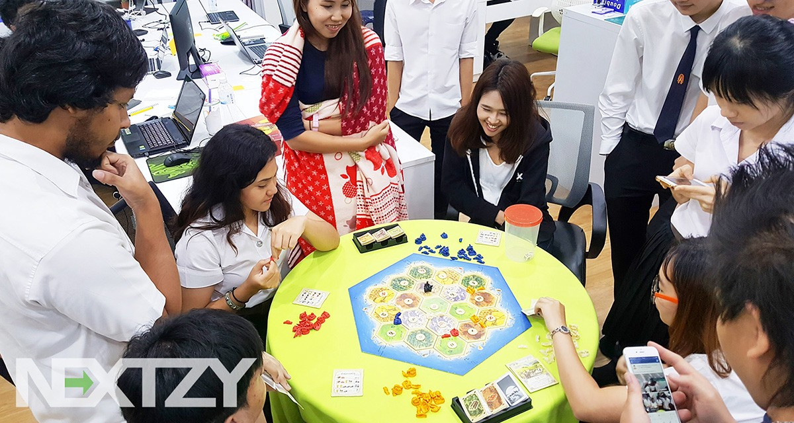
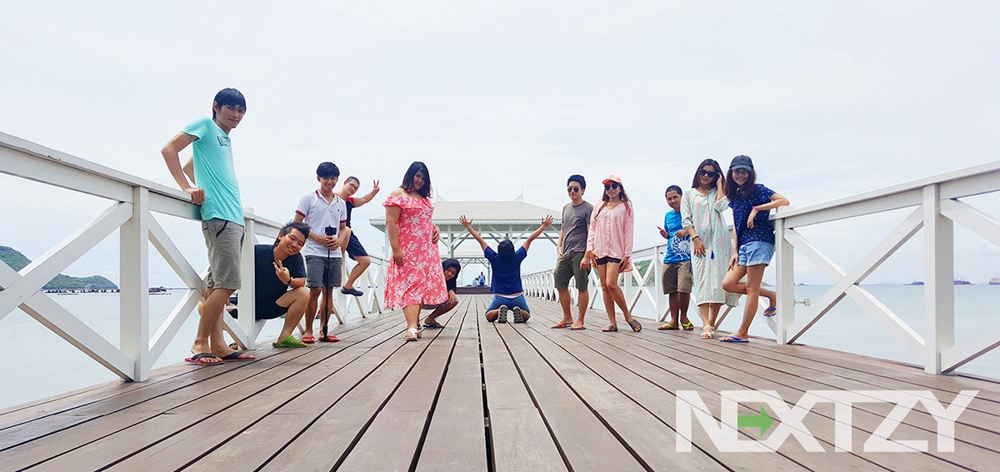

พวกเราคือโจรสลัดแห่งวงการ Software Development ที่มีความเก่ง ความกล้า ความซ่า และความบ้าอยู่ในตัวเองที่พร้อมจะวิ่งเข้าสู้กับคลื่นลูกใหญ่ในระดับ Enterprise เพราะเป้าหมายของพวกเราคือ “พัฒนาและเปลี่ยนแปลง Software ในระดับ Enterprise ให้ดียิ่งขึ้นและมีคุณภาพมากขึ้น

ที่นี่ไม่มีคำว่าหัวหน้าและลูกน้อง ที่นี่มีแต่คำว่าพี่น้องเท่านั้น เพราะพวกเราสนิทสนมกันเป็นอย่างมาก **แม้แต่ CEO ก็ไม่มีข้อยกเว้นเช่นกัน** ทุกวันนี้ CEO ก็โดนน้องๆในทีมรุมแกล้งกันอยู่เป็นประจำ

---

### Company Culture

-   พวกเราคือเหล่าโจรสลัด และเป็นโจรสลัดที่พร้อมจะออกล่างาน **Web and Mobile Development**
-   คำว่า **“ทีม”** คือสิ่งที่สำคัญที่สุดในการทำงานของที่นี่ ดังนั้นทุกคนที่นี่คือทีมเดียวกันและมีความสำคัญเท่ากัน และทุกคนภายในทีมจะพูดคุยด้วยกันอยู่เป็นประจำ เพราะงานที่นี่ไม่ใช่ของคนใดคนหนึ่งเท่านั้น
-   สนใจเทคโนโลยีใหม่ๆอยู่เสมอไม่ว่าจะเป็นเรื่อง Software และ Hardware Technologies รวมไปถึงเรื่องการใช้ชีวิต แรงบันดาลใจ การเงิน และข่าวสารต่างๆที่น่าสนใจในแต่ละวัน เพราะพวกเราเป็นโจรสลัดที่มีจิตใจไม่ใช่เครื่องจักรที่นั่งทำงานงกๆไปวันๆ
-   ที่นี่ใช้ Agile Development ในการทำงาน เพราะนอกจากงานผลงานที่ออกมาดีแล้ว เราให้ความสำคัญกับพัฒนาการของคนในทีมด้วยเช่นกัน ดังนั้นทุกตนที่นี่จะต้องพัฒนาตัวเองมากขึ้นอยู่เสมอ ไม่ใช่การทำงานซ้ำซากไปวันๆเพื่อรอได้เงินไปวันๆ
-   การแต่งตัวมาทำงานจะค่อนข้างมีอิสระมาก แต่งตัวแบบไหนก็ได้ จัดเต็มครบชุดเพราะมีนัดกินข้าว หรือสบายๆชิวๆอย่างเสื้อยืดกางเกงขาสั้นรองเท้าแตะ ตามใจชอบเลย (กล้าใส่มาทำงานก็พอ)
-   ทำงานให้เต็มท่ี เสร็จแล้วเราก็จะฉลองกันอย่างเต็มที่ (แต่บางครั้งก็ไปฉลองกันทั้งๆที่งานไม่เสร็จ) เพราะเราเชื่อว่างานเลี้ยงฉลองเป็นอย่างหนึ่งที่สำคัญมากในชีวิตการทำงาน
-   มีความกระหายในการเรียนรู้และชอบการพัฒนาตัวเองอยู่ตลอดเวลา ดังนั้นทุกคนที่นี่พร้อมที่จะลองเทคโนโลยีใหม่ๆที่ถาโถมเข้ามา และพร้อมที่จะนำไปใช้ในการทำงานจริงๆเสมอ
-   พวกเราไม่ส่งคนในทีมไป Outsource ให้กับที่ต่างๆแน่นอน เพราะทีมนั้นสำคัญมาก การส่งคนไปนั่งประจำที่ต่างๆมันไม่ได้เกิดประโยชน์อะไรให้กับทีมเลย อย่างมากก็แค่ไป On-Site เพื่อคุยกับลูกค้าและ UAT นิดหน่อย
-   พวกเรารู้ดีกว่าการทำงานภายใต้แรงกดดันมากๆมันแย่ยังไง ดังนั้นงานของพวกเราส่วนใหญ่จะมีแรงกดดันน้อย เวลาที่ยืดหยุ่นมากพอในแต่ละงาน และมากพอที่จะมีเวลากิน เที่ยว เล่น เต้น และพัฒนาตัวเอง
-   อาจจะฟังดูเหมือนว่าที่นี่ชิวๆ ผ่อนคลายตลอดเวลา แต่เชื่อเถอะว่าการทำอะไรแบบนี้ได้ ก็เพราะพวกเราเป็นโจรสลัดมืออาชีพ จึงสามารถรับมือกับงานได้เป็นอย่างดี ไม่ใช่แค่รับผิดชอบและงานเสร็จตรงเวลาเท่านั้น แต่รวมไปถึงการพัฒนาฝีมือของแต่ละคนในทีม และใช้เวลาไปการผ่อนคลายด้วย
-   เนื่องจากความสัมพันธ์ระหว่างทุกคนในทีมเป็นเรื่องสำคัญ ดังนั้นพวกเราจะพูดคุยด้วยกันตลอดเวลา แลกเปลี่ยนความรู้และไอเดียที่มีอยู่เสมอ ไม่ว่าจะเป็นเรื่องที่มีสาระหรือไม่มีสาระก็ตาม (แต่เรื่องไร้สาระน่าจะบ่อยกว่า)
-   ทีมของเรามีมืออาชีพในแต่ละเรื่องแตกต่างกันไป นั่นเป็นเหตุผลว่าทำไมพวกเราจึงเป็นทีมที่พร้อมจะลุยไปด้วยกันตลอดเวลา และชอบมากกับการแบ่งปันความรู้ให้กับคนอื่นๆภายในทีม โดยเฉพาะสมาชิกคนใหม่ๆที่กระหายการเรียนรู้สิ่งใหม่ๆตลอดเวลา
-   และอื่นๆอีกมากมายที่พวกเรามั่นใจว่า มีไม่กี่ที่หรอก ที่จะมอบประสบการณ์เจ๋งๆในการทำงานได้แบบที่นี่

---

### MEAN Stack Developer

#### คุณสมบัติ

-   สามารถใช้ JavaScript รวมถึง ES6 (ES 2015) ได้เป็นอย่างดี
-   สามารถเขียน SPA (Single Page Application) ด้วย React หรือ Angular ได้
-   สามารถใช้ Node Web Framework ได้อย่างชำนาญ เช่น Express และ Hapi
-   สามารถใช้ MongoDB หรือ NoSQL อื่นๆได้อย่างชำนาญ
-   รู้จัก Testing Tools เช่น Jasmine, Mocha หรือ Tape
-   มีความเข้าใจและคุ้นเคย Web Service, RESTFul API
-   เข้าใจและสามารถเขียน HTML/CSS ได้ หรือเคยเขียน Bootstrap, Foundation หรือ Semantic UI อย่างใดอย่างหนึ่ง
-   รู้จัก Version Control สามารถใช้งาน Git ได้อย่างชำนาญ
-   สามารถเรียนรู้เทคโนโลยีใหม่ได้อย่างรวดเร็ว กล้าแสดงความคิดเห็น และสามารถเรียนรู้ได้ด้วยตนเอง
-   มีความรับผิดชอบต่องานที่ได้รับมอบหมายและสามารถติดตามงานของตัวเองให้เสร็จลุล่วงตามกำหนดได้
-   หากมีผลงานหรือตัวอย่างโปรเจ็คมาแสดงจะได้รับการพิจารณาเป็นพิเศษ

หมายเหตุ — ไม่จำเป็นต้องรู้ทั้งหมด แต่นี่คือสิ่งที่พวกเราใช้ในการทำงาน

### Java Web Developer

#### คุณสมบัติ

-   สามารถพัฒนาโปรแกรมด้วยภาษา Java ได้เป็นอย่างดี
-   มีความเข้าใจใน WWW, HTTP Protocol
-   สามารถเขียน HTML, CSS, Javascript ได้ หากมีความสามารถในการเขียน Javascript Framework เช่น jQuery หรือ AngularJS
-   เข้าใจและสามารถเขียนโปรแกรมแบบ Object-Oriented-Programming และ MVC Pattern ได้เป็นอย่างดี
-   หากมีความคุ้นเคยหรือเคยพัฒนาเว็บด้วย Spring Framework โดยใช้ Spring MVC จะพิจารณาเป็นพิเศษ
-   มีความคุ้นเคย Web Service
-   สามารถเรียนรู้เทคโนโลยีใหม่ได้อย่างรวดเร็ว กล้าแสดงความคิดเห็น และสามารถเรียนรู้ได้ด้วยตนเอง
-   มีความคุ้นเคยกับ Design Pattern สามารถนำมาประยุคใช้ในการพัฒนาซอฟต์แวร์ได้
-   เข้าใจคำสั่ง SQL Statement ได้เป็นอย่างดี และสามารถเขียน SQL Statement ที่ซับซ้อนได้
-   มีความรับผิดชอบต่องานที่ได้รับมอบหมายและสามารถติดตามงานของตัวเองให้เสร็จลุล่วงตามกำหนดได้

หมายเหตุ — ไม่จำเป็นต้องรู้ทั้งหมด แต่นี่คือสิ่งที่พวกเราใช้ในการทำงาน

### iOS Developer

#### คุณสมบัติ

-   มีประสบการณ์ในการพัฒนา Objective-C หรือ Swift
-   มีประสบการณ์การใช้ Cocoapods สามารถใช้ Library ได้อย่างว่องไว กด pod install ได้อย่างชำนาญ
-   มีประสบการณ์ในการเรียกใช้ RESTFul หรือ SOAP Web Services และสามารถใช้ งาน JSON และ XML ได้
-   มีความเข้าใจเรื่อง Protocol, Delegation, Callback เป็นอย่างดี
-   มีความเข้าใจเรื่อง Interactive Application Development, Memory management, multi-threading เป็นอย่างดี
-   มีความเข้าใจเรื่อง Design pattern และชอบลองของอยู่เสมอ เช่น MVC, MVVM, Reactive
-   สามารถใช้งาน Auto Layout และทำหน้า View ได้อย่างสวยงามหาที่ติมิได้ สายตาเฉียบคม มองเห็นแม้กระทั่ง Dead Pixel (เวอร์!!)
-   สามารถจัดการหน่วยความจำ และสามารถปรับประสิทธิภาพของ Application ให้สุดยอดได้
-   รู้จัก Version Control สามารถใช้งาน Git ได้อย่างชำนาญ
-   มีความรับผิดชอบต่องานที่ได้รับมอบหมายและสามารถติดตามงานของตัวเองให้เสร็จลุล่วงตามกำหนดได้
-   หากมีผลงานมาแสดงจะได้รับการพิจารณาเป็นพิเศษ

หมายเหตุ — ไม่จำเป็นต้องรู้ทั้งหมด แต่นี่คือสิ่งที่พวกเราใช้ในการทำงาน

### Android Developer

#### คุณสมบัติ

-   Android Studio เปรียบเสมือนอาวุธประจำกายของพวกเรา ส่วน Eclipse ก็เป็นได้แค่ความทรงจำจางๆเท่านั้น
-   มีความรู้เบื้องต้นเกี่ยวกับ Android มีความเป็น Android User ผสมผสานไปกับ Android Developer
-   เข้าใจในเรื่อง Life Cycle ของ Activity และ Fragment และจัดการกับมันได้อย่างถูกต้อง
-   OOP เป็นหัวใจสำคัญอย่างแรกสุดที่จะต้องรู้และเข้าใจ
-   MVC เคยเป็น Design Pattern ประจำทีม แต่ตอนนี้เทใจให้กับ MVP เป็นที่เรียบร้อยแล้ว
-   สมาชิกในทีมได้ขายวิญญาณให้กับ ReactiveX และ Kotlin เป็นที่เรียบร้อยแล้ว และยัดลงในโปรเจคใหม่ๆเป็นที่เรียบร้อยแล้ว
-   งานเกือบทั้งหมดต้องเชื่อมต่อกับ Web Service ดังนั้นจะต้องเชื่อมต่อกับ RESTFul หรือ SOAP และจัดการกับ JSON หรือ XML ได้
-   เรื่อง Layout เป็นเรื่องง่าย ดังนั้นการจัดการกับ Multiple Screen Support จึงง่ายดายราวกับมือที่บีบก้อนหินจนเป็นผุยผง
-   ชอบเรียนรู้และลองใช้ Library ใหม่ๆอยู่เสมอ และมองหาข้อดีข้อเสียของแต่ละตัวเพื่อเลือกใช้งานได้อย่างเหมาะสม
-   การประยุกต์ใช้ Library เป็นสิ่งสำคัญ รวมไปถึงพวก Custom View ด้วยเช่นกัน แต่บางครั้งก็ทำใช้เองซะเลย เพราะหายังไงก็ไม่ถูกใจซะที
-   อยากจะปรับปรุงฝีมือหรือโค้ดตัวเองอยู่ตลอดเวลา และคลั่งใคล้ในการเรียนรู้สิ่งใหม่ๆที่ใช้ใน Android
-   รู้จัก Version Control สามารถใช้งาน Git ได้อย่างชำนาญ
-   มีความรับผิดชอบต่องานที่ได้รับมอบหมายและสามารถติดตามงานของตัวเองให้เสร็จลุล่วงตามกำหนดได้
-   หากมีผลงานมาแสดงจะได้รับการพิจารณาเป็นพิเศษ

หมายเหตุ — ไม่จำเป็นต้องรู้ทั้งหมด แต่นี่คือสิ่งที่พวกเราใช้ในการทำงาน

### System Analyst

#### คุณสมบัติ

-   รับ Requirement จากลูกค้า
-   ออกแบบระบบ Flow การทำงาน ออกแบบ UI และ UML Diagram ต่างๆ สำหรับการพัฒนาระบบ
-   จัดทำเอกสาร Requirement Specification, SRS
-   มีความรู้เรื่อง OOP และ Design Pattern เบื้องต้น
-   ใช้งาน MS Office และโปรแกรมอื่นๆที่ใช้ในการออกแบบ ได้อย่างชำนาญ
-   มีทักษะในการสื่อสารดี สามารถจับใจความสำคัญ วิเคราะห์ แยกแยะ และสรุป เพื่อความเข้าใจในการทำงานที่ตรงกัน
-   สามารถเขียน Testplan Testcase ได้
-   มีความรับผิดชอบต่องานที่ได้รับมอบหมายและสามารถติดตามงานของตัวเองให้เสร็จลุล่วงตามกำหนดได้

หมายเหตุ — ไม่จำเป็นต้องรู้ทั้งหมด แต่นี่คือสิ่งที่พวกเราใช้ในการทำงาน

### **Software Test Automation/Software Tester**

#### คุณสมบัติ

-   เป็นผู้ที่มีอำนาจวิเศษ จับหรือเทสอะไรเป็นต้อง พังไปซ่ะหมด กดนิดกดหน่อยพัง
-   ชอบและหลงไหลในการหาข้อผิดพลาด ช่องโหว่ของ Software ต่างๆ
-   สามารถออกแบบและสร้าง Test Condition, Test Script
-   สามารถอ่าน Test Plan/Testcase ได้ ถ้าเขียนเป็นจะดีมาก
-   มีความรู้ในเรื่อง Software Test Life Cycle, ประกอบด้วย Unit Test, Integration Test, System Test, User Acceptance Test and Load Test
-   สามารถจัดทำเอกสาร Test Result ประกอบด้วย Unit Test, Integration Test, System Test, User Acceptance Test and Load Test
-   เคยใช้หรือเคยรู้จัก Test Automation Tool ที่ช่วยให้งานง่ายขึ้น เช่น Appium, Robot Framework, JMeter,QTP เพราะเราไม่อยากที่จะทำงานซ้ำๆ
-   ถ้าเป็น Automation Test ควรมีความรู้ในการเขียนโปรแกรมบ้าง อย่างเช่น ภาษา Python เป็นต้น
-   มีความขี้เกียจเป็นทุนเดิม แต่ขยันที่จะหา Tool/Framework เทคโนโลยีที่มาช่วยลดงานเทสและทำให้ชีวิตมันง่ายขึ้น

หมายเหตุ — ไม่จำเป็นต้องรู้ทั้งหมด แต่นี่คือสิ่งที่พวกเราใช้ในการทำงาน

---

### Benefit

-   เวลาเข้า-ออกงานที่ Flexible (แค่ไม่น่าเกลียดจนเกินไปก็พอ)
-   วันหยุดลาพักร้อน 15 วัน/ปี เพราะชีวิตเราไม่ได้มีแต่การทำงาน ไปพักผ่อนบ้างเถอะ (ไม่นับวันเที่ยวของบริษัท)
-   เลี้ยงฉลองวันเกิด วันปิดโปรเจค วันรับพนักงานใหม่ ฯลฯ หรือบางครั้งก็ไม่มีเหตุผล
-   ประกันสังคมและประกันสุขภาพ
-   สามารถทำงานจากที่บ้านได้ถ้ามีเหตุจำเป็น 2 วัน/สัปดาห์ (แต่ทุกคนในทีมก็ชอบที่จะมาเจอหน้ากันที่ออฟฟิศมากกว่า)
-   หากในวันธรรมดามีสัมมนาที่น่าสนใจ เราจะส่งไปอบรมทันที หรือมีงาน Meetup ก็ไปได้
-   ยกก๊วนไปดูหนัง 2–3 เดือน/ครั้ง
-   ท่องเที่ยวประจำปี บางครั้งก็แล้วแต่อารมณ์จะพาไป
-   โบนัสประจำปี
-   มี Notebook ให้ใช้ทำงาน และถ้าเป็น Developer จะเป็น Macbook Pro (RAM 16GB) เพื่อให้ทำงานได้อย่างเต็มที่
-   มีมาม่าให้กินที่ออฟฟิศฟรี มีประโยชน์มากโดยเฉพาะสิ้นเดือน
-   นั่งทำงานนอกสถานที่อย่างน้อยเดือนละ 1 ครั้งตาม Co-working Space
-   สิทธิ์ส่วนลดในการซื้อสินค้า IT เมื่อทำงานครบ 1 ปี
-   สิทธิ์ในการทำฟัน 4,000 ต่อปี เมื่อทำงานครบ 1 ปี
-   หากต้องการของเล่นเพิ่มและคนในทีมเห็นด้วย เท่าไรเราก็จะไปซื้อมาให้คุณ

### สมาชิกแบบไหนที่เราสนใจ?

-   สนุกสนาน เฮฮา และปรับตัวเข้ากับทุกๆคนภายในทีมได้เป็นอย่างดี (ไม่เช่นนั้น เราจะเปลี่ยนให้เป็นแบบนั้นแทน)
-   ไม่มีคำว่า Developer พูดไม่เก่งหรือพูดไม่รู้เรื่อง เพราะพวกเราไม่ใช่ Developer แบบนั้น
-   มีความกระหาย (ย้ำว่ากระหาย) ในการเรียนรู้อยู่เสมอ และสามารถเรียนรู้ได้ด้วยตัวเองอยู่ตลอดเวลา
-   สามารถเฮฮาปาร์ตี้ได้ ในขณะที่ยังรับผิดชอบงานได้ตรงตามเวลา
-   จบจากที่ไหนไม่สำคัญ เพราะมันไม่ได้บอกว่าเราทำงานได้ดีแค่ไหน
-   เกรดเฉลี่ยก็ไม่ค่อยสำคัญซักเท่าไร แต่เราก็สนใจเกรดของวิชาที่จำเป็นต้องใช้งาน
-   มีผลงานที่ทำให้พวกเรารู้สึกสนใจ เพราะถ้าไม่มีผลงานพวกเราจะตัดสินใจยาก

### สามารถส่งใบสมัคร Resume ภาษาอังกฤษและ “ผลงาน” ที่เคยทำได้ที่ geek@nextzy.com หรือดูรายละเอียดเพิ่มเติมได้ที่ [http://www.nextzy.com](http://www.nextzy.com/) หรือติดต่อสอบถามรายละเอียดเพิ่มเติมได้ที่ [Facebook Page ของ Nextzy](https://www.facebook.com/nextzy)

---

### Office Location

บริษัท เน็กซี่เทคโนโลยี จำกัด ตั้งอยู่ในกลางกรุงเทพฯ สามารถเดินทางได้สะดวก ใกล้รถไฟฟ้า BTS อโศก, MRT เพชรบุรี, MRT สุขุมวิท และ Airport Link มักกะสัน ทำงานวันจันทร์ถึงศุกร์

การเดินทางด้วยรถโดยสารสามารถนั่งรถไฟฟ้า BTS ลงที่สถานีอโศกหรือ MRT ลงที่สถานีสุขุมวิทและเพชรบุรี หรือ ARL ลงที่สถานีมักกะสัน แล้วเดินมาจนถึงบริษัทได้ แต่ถ้าเน้นไวก็สามารถนั่งมอเตอร์ไซค์รับจ้างได้เลย (บอกว่าไปตึกอโศกทาวเวอร์)

เลขที่ 219/23 ชั้น 7 อาคารอโศกทาวเวอร์ส ถนนสุขุมวิท 21 (อโศก) แขวงคลองเตยเหนือ เขตวัฒนา กรุงเทพมหานคร 10110

