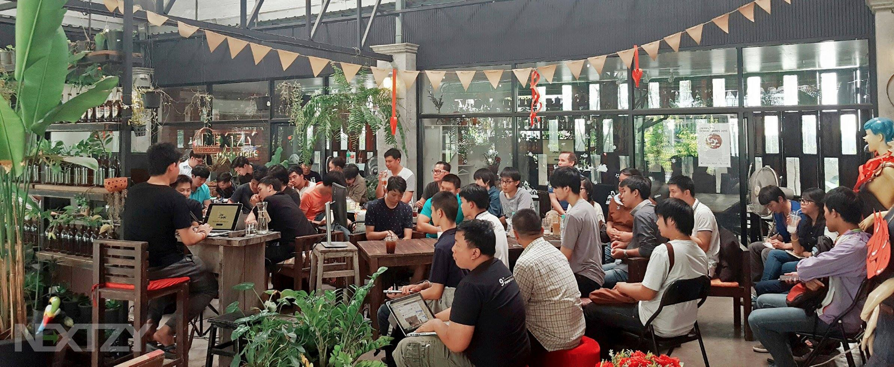

ไม่รู้จะเรียกการสรุปหรือป่าวนะ เพราะตอนนี้จะใช้เวลาประมาณ 20 นาทีก่อนที่จะขึ้นเครื่องมาเขียน เพราะคิดว่า คงจะเขียนได้ดี เพราะต้องรักษาเวลาและทำเวลาในการเขียนให้เร็วที่สุด

ปกติ 1 ปีจะเขียนสรุปแค่ปีหละครั้ง แต่ตอนนี้ทุกอย่างมันไปไวมาก เลยคิดว่าเขียน quarter ดีกว่า มีอะไรที่ดี ผิดพลาดจะได้แก้ไข หรือต่อยอดมันได้ทัน นี่ก็เป็นเวลาดีที่ Nextzy เกือบจะครบอายุ 3 ปีครั้งแรก ^^ (ยังไม่ถึง 3 นะ) บทสรุปนี้เขียนเตือนตัวเราเอาไว้เพราะหลังจากนี้มันอาจจะเปลี่ยนไปตลอดกาล

นึกย้อนไปเมื่อ 2 ปีที่แล้ว บริษัทเราไม่มีกำลังคนที่มากพอ ไม่มีทั้ง Connection ดีๆ แต่มาวันนี้เรามีทั้ง Connection และพี่ๆน้องๆเต็มไปหมดที่อยากจะช่วยเหลือเรา ทำให้ผมรู้สึกตื่นเต้นเอามากๆ ขนาดไปที่เชียงใหม่ มีคนบอก ใครๆเค้าก็รู้จักทั้งนั้นแหละ Nextzy บริษัทออกจะดัง เราก็ขอบคุณเค้าไปซ่ะยกใหญ่ด้วยความดีใจ ผมก็ไม่ลืมนะว่าผมเคยไม่มีมาก่อน

การที่มีทั้งชื่อเสียงและคนรู้จักมากมาย เรายิ่งต้องระมัดระวังในการกระทำของเรามากๆ ไม่ลืมตัวว่าเรามาจากไหน ซึ่งปกติผมก็เป็นคนเข้าถึงได้ไม่ยากอยู่แล้ว ไม่ได้หยิ่งหรือมียศใหญ่โตอะไร คิดว่านี่คงเป็นเหตุผลที่ผมเป็นคนง่ายๆ และบริษัทก็เป็นคนง่ายๆ ถ้าทำบริษัทให้มันซับซ้อน เต็มไปด้วยกฏเกณฑ์ มันคงไม่โตแน่นอน

Q1 เป็นการที่ผมและบริษัทได้เริ่มที่จะทำอะไรใหม่ๆ งานใหม่ๆก็ด้วย ได้ฉีกกฏของตัวเองออกมานั้นคือรับงานภาษาใหม่ๆ และให้ทีมงานได้เขียนภาษาใหม่ๆ ครั้งแรกก็อาจจะไม่ชินเท่าที่ควรแต่ บริษัทและผมก็ให้โอกาสให้ได้พัฒนา

สิ่งที่บริษัทให้ต่อมาก็คือความไว้ใจที่ “ใหญขึ้น” ปกติเราก็ให้ความไว้ใจอยู่แล้ว แต่มาปีนี้ความไว้ใจ และให้ใจกับทีมงานได้ขยายใหญ่ขึ้น ให้ทีมงานได้คิดเอง ติดสินใจเองในรูปแบบของความถูกต้องและเสียงส่วนใหญ่ ได้ฝึกที่จะบริหารเวลาด้วยตัวเอง แทนที่ ผมและบริษัทต้องเป็นคนบริหารให้

“ให้ความท้าทายและชี้ให้เห็นโอกาส” งานทุกคนให้สามารถพูดเป็น Public Speaker ได้ เป็นสิ่งที่บริษัทให้นอกจากเงินนั้นก็คือความ “ความท้าทาย” ที่หาไม่ได้จากที่ไหน ต่อให้มีเงินก็ซื้อไม่ได้ ซึ่งบริษัทจะ Support ค่าใช้ทั้งหมด รวมถึงให้โอกาสทีมงานได้บริษัทและจัด Event ด้วยตัวเอง

คำสำคัญที่ว่าการ “ให้โอกาส” ผมว่าคำนี้มันฟังแล้วรู้สึกว่าเฉยๆ แต่ผมเรียกมันว่า การทำ ”ให้เห็น”โอกาส มากกว่าฟังแล้วมันดูมีพลังดี

“ให้ความเป็นเจ้าของ” ไม่มีคนเก่งคนไหนอยากเป็นคนทำงานตามคำสั่งอย่างเดียว โดยเฉพาะยุคนี้โอกาสมีมากมาย เขาอาจจากเราไปเพราะเห็นโอกาสใหม่ที่ท้าทายกว่า  
เราต้องมอบความเป็นเจ้าของให้เขาตั้งแต่วันที่เขายังไม่ร้องขอ  
ให้เขาเห็นว่าโอกาสที่ท้าทายนั้น เขาอยู่ในฐานะอะไร สุดท้ายเค้าจะได้อะไร เช่นบทความใน Medium ซึ่งเข้าเป็นเจ้าของ 100% และตัวโปรเจคต่างๆที่ได้ทำมานอกเวลาหรือแม้กระทั่ง Side Project เค้าก็มีความเป็นเจ้าของ หรือถ้าอยากให้มันดังทางบริษัทก็ให้ความช่วยเหลือทั้งหมด ตามที่อยากจะร้องขอ

Q1 จบเพียงเท่านี้ไปหละ แว๊บบบบบบ

Edit มากรองคำผิด รีบมาก 555
