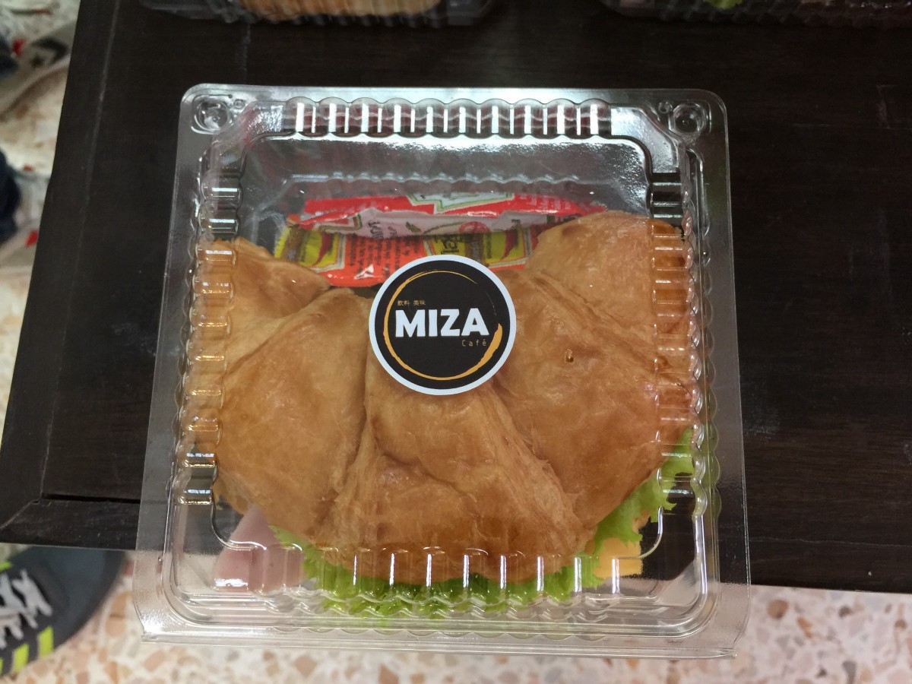
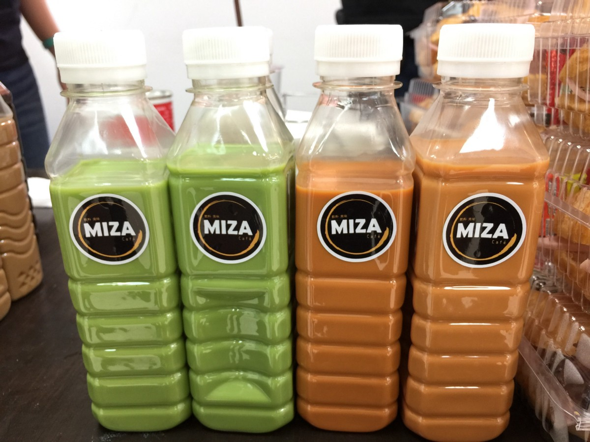

แวะมาเท้าความตอนที่จำความได้ ทางผู้จัด นั้นคือพี่เอกแห่ง Baania.com ก็เข้ามาคุยที่อ๊อฟฟิต ว่าเฮ้ย นิวมึงช่วยไปเป็น Judge ไอ้เราก็ตอบไปดิว่าได้ครับพี่ ตำแหน่งเท่ดี แต่ก็ไม่รู้หรอกว่าจะทำอะไร ตอบไปแบบงงๆ ฮ่าๆๆๆ

> แต่ก่อนหน้านี้เค้าชวนอยู่ 2 -3 รอบหละแต่ไม่ได้ไป ครั้งนี้ไปซักหน่อย 555+

ก็สอบถามไปหาน้องๆว่าไอ้ตำแหน่งที่ว่าเค้าต้องทำอะไรบ้าง ได้ความมาว่า ต้องตัดสินผลงานน้องๆจ้า (งานเข้าตรูแล้ว) เลยทำการบ้านหนักมาก ทั้งศึกษาเรื่อง Business ศึกษาเรื่องไอเดียในตลาด ฝึกการตัดสินใจ ฝึกการวิจารย์ต่างๆ ไปดูคลิบที่เค้าตัดสินกัน

ก่อนถึงวันงานประมาณ 1 อาทิตย์ หัวข้อบรรยายก็ตามมา ได้ไปบรรยายในหัวข้อ **Team & Culture in Tech Venture** ก็ปั่นสไลด์จนเสร็จก่อนวันงานจนได้ แต่ยังไม่เรียบร้อยดี

บ่ายวันก่อนเริ่มงาน ก็มีรถจากทางมหาวิทยาลัยสุรนารีมารับถึงบริษัทเลย ก็นั่งรถออกมา นั่งมาประมาณ 5 ชั่วโมงโดยประมาณก็เข้าพักโรงแรม ทางพี่ๆผู้จัดก็พามากินข้าว อยู่ใกล้มากแค่หน้าโรงแรมเท่านั้นเอง แต่ร้านดูเหมือนร้านเหล้ามากกว่าร้านกินข้าว กินข้าวเรียบร้อย ก็แวะไปพักผ่อนต่อ(ปั่นสไลด์ต่อ เป็นนิสัยส่วนตัวที่ชอบแก้สไลด์เรื่อยๆถ้ายังไม่ได้พูด 555)

---

### **แหกกระท้อน Day 1**

ต้องบอกก่อนงานนี้ได้จัดครั้งแรก ผมก็มาโคราชครั้งแรก พี่ๆก็จัดงาน Hack ครั้งแรก ผมก็พูดเรื่อง **Team & Culture in Tech Venture** ครั้งแรก เรามากันช่วงเช้ามานั่งฟังพี่เล๊ง Do In Thai กัน พี่แกจัดยาว 3 ชั่วโมงแบบไม่พักโหดจริงๆ มาถึงกำหนดการงาน SUT Hackathon เราบ้างเริ่มกันบ่ายโมงครึ่ง น้องๆก็เริ่มเข้ามา มีทั้งน้องนักศึกษา อาจารย์ และบุคคลทั่วไปที่เข้ามาแหกกระท้อนกันในงานนี้ โดยมีจุดมุ่งหมายเดียวกันคือทำให้เมืองโคราชน่าอยู่ขึ้น ก็มาถึงช่วงแบ่งกลุ่ม ได้ทีมและก็ชื่อทีมกันเรียบร้อย(มีแอบมาเปลี่ยนชื่อตอนนำเสนอด้วย สงสัยเวลาคิดชื่อทีมน้อยไป ฮ่าๆ) และก็มีต่อด้วย Session ของ [Ake Exorcist](https://medium.com/@akexorcist) ที่จะพาน้องๆทำ Mockup ขั้นเทพ และทุกคนก็เริ่มกิน ~~~~ เฮ้ย Hackathon กันโย่ววววววว

---

### แหกกระท้อน Day 2

มาตอนเช้ากันอีกเช่นเคย เพราะว่าเราไปบูตตตตอับกันเรียบร้อยแล้วที่ U-Bar วันนี้เลยมีกำลังเยอะเป็นพิเศษ ส่วนตัวผมก็มานั่งแก้สไลด์เช่นเคย (แก้จนกว่าจะถึงเวลาพูด ฮ่าๆ) ก็บรรยายถึงสิ่งที่ควรคำนึงในการทำโปรดัก การรวมทีม มาเล่าชีวิตผมในแบบย่อๆมั้งฮ่าๆ สุดท้ายคือการสร้างแรงบันดาลใจให้กับคนอื่น(งานถนัด) หละก็พักเบรค กินอีกแล้ว ข้าวเที่ยง หลักจากกินข้าวเสร็จก็กินขนม เฮ้ย ไม่ใช่ มานั่งแหกกระท้อนต่อ ระหว่างทำก็มีน้ำและของว่างจากร้าน MIZA Cafe จากธุรกิจของคนโคราชเอง ตามรูปด้านล่าง

### แหกกระท้อน Day 3

มาถึงที่งานประมาณ 9:30 พบว่าน้องยังมากันไม่ครบ ท่าทางสงสัยปั่นงานกันอยู่แน่ๆ เราก็มีไปแอบเดินๆดูบ้าง น้องเป็นยังไงกัน ทุกกลุ่มทำเสร็จเรียบร้อย เตรียมพร้อมที่จะโดนเชือด !!! เฮ้ยเตรียมพร้อมจะ Pitch กันเรียบร้อย และแล้วเวลาก็มีถึง บ่ายโมง พวกเราเดินทางไปที่ เกร๋ๆ กันที่ร้านกาแฟสุดชิคที่โคราชชื่อร้าน Class Cafe ก็ระหว่างที่รอน้องเซตอุปกรณ์ นอกจากเป็น Judge เป็น Mentor และยังเป็น **นายแบบ** อีกด้วย ตามรูปด้านล่าง ก็เป็นพิธีกรเสริมระหว่างรอ เพื่อกระตุ้นทีมต่างๆให้ตื่นตัวเตรียมพร้อม ก่อนโดนเชือดๆ

ทุกกลุ่มนำเสนอกันดีมาก จนครบพวกเราต้องตัดสินหาผู้ชนะ คะแนน ถูกทดเต็มกระดาษไปหมด เป็นเรื่องที่ยากมาก พวกเราเหล่ากรรมการคุยกันนานมาก หละผลก็ออกมา จนได้เหนื่อยกว่า 3 วันที่เฝ้าน้องๆอีก แต่ถ้ารวมกัน 3 วันแล้วสนุกมากกกก กอไก่ล้านตัว

---

---

### ทิ้งท้ายจากปลายปากกา

-   งาน Hackathon มันเป็นจุดเริ่มต้น แพ้ชนะไม่สำคัญ ขอให้ได้เริ่ม
-   พี่ๆน้องๆทุกคนต่างเข้ามาแลก Energy กัน และตัวผมก็ได้ Energy พี่ๆน้องๆ ด้วย
-   Mentor และ ผู้จัดงานเก่งกันมากๆ ถ้านับจำนวนคนแล้วจัดกันได้ดีขนาดนั้นผมต้องยกนิ้วให้เลย (แถมชวนผมและน้องในทีมมาได้ คาราวะ 555)
-   ร้านเหล้าในโคราชถ้าอยากมันให้ไป U-Bar เลย ร้าน Checkin ไม่ต้องไป
-   ต้องขอโทษน้องๆด้วยที่พี่ไปคุยกับน้องเยอะๆไม่ได้เพราะเป็นกรรมการอยู่ แต่หลังจากนี้สามารถทักมาได้เลยนะ ผ่านทาง [fb.com/codingz](http://fb.com/codingz) ก็ได้
-   ถึงคุณจะเกลียดผม คุณจะเกลียดผมก็ได้ แต่อยากให้รู้ว่าคุณอยู่ในเกมผมแล้ว — xxx ฟอ ออล
-   อยากเล่น Camel Up แต่ไม่ซื้อนะ เดี๋ยวจะไปเล่นที่โคราช

ป้ายสนับสนุนงานนี้มาจาก ร้านชื่อว่า “คำเดียวดีไซน์” เป็นของคนโคราชด้วยเช่นกัน เกือบจะไม่ได้ป้าย Nextzy แล้วเพราะไปกวนพี่เค้า 555 แต่พี่เค้าเป็นคนใจดีเลยยังทำให้ ไม่งั้นอาจจะไม่รอดกลับมาจากโคราชก็เป็นได้ถ้าไปแกล้งพี่เค้าเยอะกว่านี้ วันนี้ฝากไว้เท่านี้ ขอขอบคุณ มหาวิทยาลัยสุรนารีและผู้จัดงานทุกท่าน สำหรับงานนี้

> คิดใหญ่ใหญ่ แล้วเริ่มจากสิ่งเล็กๆ

> สำหรับคนที่ไม่ได้รางวัล ไม่สำคัญเท่าคุณไม่ได้ทำมันต่อ

> การให้สำคัญกว่าการรับเสมอ — New Nextzy

