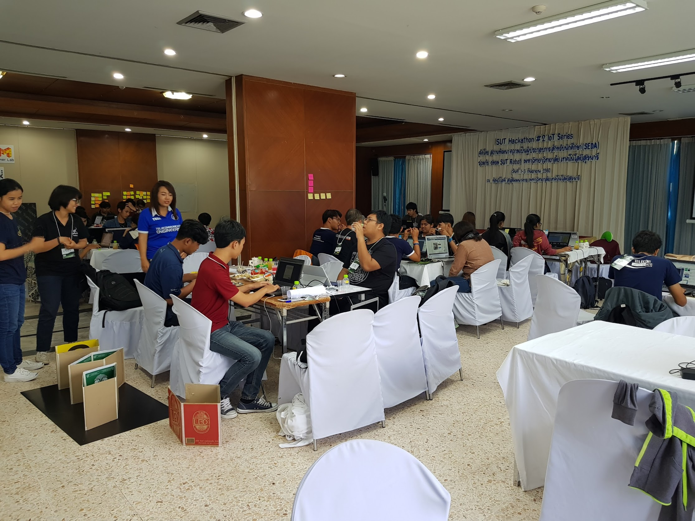

วันนี้ได้มาเป็นพี่เลี้ยงค่ายนี้ เลยมาเล่าาาาาาาา ไม่มีพิธีการอะไรเยอะเล่าดีก่า

ที่ขึ้นต้นแบบนี้ ไม่ได้เกี่ยวกับความรักแต่อย่างใด แต่เมื่อพูดถึงงาน Hackathon มันคือการที่ทำอะไรร่วมกัน ร่วมมือกัน แล้วมันส่งผลกระทบกับคนในวงกว้าง ด้วยของที่ทำร่วมกันมา นั่นคือผลิตภัณฑ์ หลายคนมีคำถาม ทำไม 2 วันถึงได้โปรดักเสร็จ แต่นั่นคือ คุณสมบัติของ 10x Programmer สนใจก็ไป [อ่านได้ที่นี่](http://antirez.com/news/112)

ถ้ายังไม่ค่อยเข้าใจลองไปอ่านบทความของน้องที่เขียนเกี่ยวกับ 10x Programmer

> ทุกอาชีพ ถ้ามีการทำซ้ำบ่อยๆ ก็จะเกิดความชำนาญในทักษะที่เกี่ยวข้องเอง ซึ่งในโลกโปรแกรมเมอร์เองก็ไม่ต่างกัน

> โปรแกรมเมอร์ที่เทพๆ มักถูกเรียกว่านินจา ผมก็ไม่เข้าใจว่าทำไม อาจเพราะเขียนไว แต่ผมชอบอีกคำที่ความหมายใกล้กัน อย่าง 10x Programmer นิยามนี้แปลว่า เทพโปรแกรมเมอร์คนเดียว ดีกว่าโปรแกรมเมอร์ดาษๆ 10 คน

> อันนี้ตอนแรกก็ไม่เชื่อ แต่พออยู่นานเข้าเริ่มเห็นผลนี้กับตัวเอง **แต่เฉพาะบางเรื่อง**ที่เคยทำซ้ำหลายรอบ อาทิ ถ้าเริ่มเขียนโปรแกรมเครื่องคิดเลขในช่วงเริ่มแรก ผมคงใช้เวลาเป็นเดือน แถมอาจไม่สมบูรณ์ด้วย แต่ถ้าตอนนี้ผมว่า 2 วันก็เสร็จ และไม่มีบั้คหรือบั้คน้อยมากด้วย ไม่ใช่จำกัดแค่คิดไวขึ้น หรือเขียนโค้ดบรรทัดได้จำนวนมากในระยะเวลาอันสั้น แต่เป็นงานมากขึ้น รู้ว่าไปหยิบโค้ดจากหลายที่มารวมเป็นโปรแกรมได้ เช่น หยิบ logic การคิดเลขจากแหล่งนึง หยิบ UI จากอีกแหล่งนึง หรือแม้กระทั่งไปหยิบเครื่องคิดเลข open source มาดัดแปลงให้อยู่ในแบบฉบับของเรา

reference [อ่านบทความเต็มที่นี่](https://blog.nextzy.me/2yearprogrammertrust-d3475d2be4fd)

ในส่วนของ IOT ในความหมายของผมเอง ย้อนไปสมัยเด็กๆ ใครจะไปคิดว่าเราสามารถพูดกับทีวี สามารถสั่งการลำโพงให้เล่นเพลงตามที่เราบอก สามารถสั่งหลอดไฟปิดเปิด ได้โดยที่เราไม่ต้องเดินไปกด รถที่สามารถวิ่งเองได้โดยที่เราไม่ต้องทำอะไร ตามความหมายของ Internet Of Thing นั่นคือ **ทุกอย่าง** จะถูกเชื่อมอยู่บนเครือข่ายอินเตอร์เน็ท ลองนึกภาพว่าในอนาคต **ทุกอย่าง** จะมีหมายเลขประจำตัวเอง นั่นคือ มี IP Address(ตอนนี้ ipv6 ซึ่งสามารถแจก IP ได้ทุกอุปกรณฺ์บนโลกใบนี้เลยทีเดียวโดยไม่ซ้ำกัน) ไม่ว่าจะเป็น ต้นไม้ รถยนต์ เสาไฟฟ้า เก้าอี้ หรือแม้กระทั่งในตัวมนุษย์ มันจะเจ๋งแค่ไหน และทุกอย่างเราสามารถสั่งการมันได้ หรือจะให้มันทำงานโดย อัตโนมัติก็ได้

มาดูกำหนดการคร่าวๆกัน

พามาดูบรรยากาศงานคร่าวๆ อันนี้เป็นโถงด้านหน้าซึ่งจัดอยู่ใน มหาวิทยาลัยสุรนารีเลยทางเข้าจะเป็นที่ทานข้าว ห้อง Hackathon เราจะอยู่ด้านใน

เข้าไปในช่วงเช้าจะเป็นช่วงบรรยาย พิธีเปิด ความเป็นมาต่างๆ โน่นนี่นั่น อธิบายไปคง ไม่ค่อยน่าสนใจเท่าช่วงที่เรามา Hack กันดีก่า เอ้าว่าแล้วเราก็มาเริ่มจับกลุ่ม แต่ละคนก็มานำเสนอ ไอเดียกัน แต่ละคนก็เตรียมมาพอสมควร กลุ่มหนึ่งก็ประมาณ 5–6 คน มาจากต่างสาขาวิชา ไม่ได้มีแค่ Software อย่างเดียวนะ สาขาไบโอ ชีวะ ก็มี หลายสาขาวิชามากๆ สังเกตุดูเริ่มมีการเอากล่อง มาวาง เตรียม Hack กันหละ บางคนก็ออกไป Validate Idea โดยทางมหาวิทยาลัยก็เตรียมรถให้ไป Validate Idea กัน เช่นออกไปถามว่าโปรดักที่กำลังจะสร้างนั่นมันโอเครไหม

นอกจากการเขียนโปรแกรมแล้ว IOT มันยุ่งเกี่ยวกับอุปกรณ์ ล้วนๆ เขียนโปรแกรมลงอุปกรณ์ ทางเรายังมี 3D Printer ให้สำหรับคนที่ต้องการปริ้นชิ้นงาน ซึ่งเครื่องนี้ใช้ประโยชน์จนคุ้มเลย ผมเห็น พริ้นตลอด 24 ชั่วโมงเลย 555

น้องๆทุกคนตั้งใจกันมาก บางคนยังไม่สามารถเขียนโปรแกรมได้เลย ก็มานั่งหัดเขียน IOS บางคนก็มานั่งอ่าน Doc กันเดี๋ยวนั้นเลย กล้าพูดได้เลยว่า 3 วันนี้กำเนิดว่าที่โปรแกรมเมอร์ขั้นเทพกันหลายคน และสำคัญไม่ได้จบสายโปรแกรมเมอร์มาด้วย

อ่ะจัดไป รูป Node MCU

บอร์ดที่เรียกว่า NodeMCU นั่น มีความสามารถเยอะมาก พูดง่ายๆมันคือคอมขนาดเล็ก พกพา สามารถเขียนโปรแกรมเข้าไปควบคุมมันได้ เนื่องด้วยตัวมันเองสามารถต่อ Module อื่นๆเช่น ตัววัดอุณหภูมิ ตัววัดค่าความเข้ม หลอดไฟ ยังมีถึงที่ตรวจจับควัน Hack กันมาสุดๆ

วันที่สองก็ยังคง Hack กันต่อ หิวพวกเราก็ทานอาหารบุปเฟ่ ซึ้งเติมได้ไม่อัน เหมาะมาก สำหรับงาน Hack เพราะต้องใช้พลังงานทั้งหมดที่มี และกองทับก็ต้องเดินด้วยท้อง

อดหลับอดนอน มาจนถึงวันสุดท้าย และได้กลายเป็นกรรมการตัดสินแบบจำเป็น 555 มาดูผลงานน้องๆที่ทำกันมา 3 วันแบบไม่ได้นอน บางคนก็เอาที่นอนมานอน ด้วย การตัดสินก็มีเกณฑ์ ต่างๆมากมาย

จนได้ผู้ชนะ 1 ทีมไปดูงานต่อที่ประเทศเกาหลี ซึ่งเหมาะสมก็รางวัลดี ทางเราก็ตัดสินใจยากพอสมควร แต่ก็อยากจะบอกทุกทีมเหมือนกัน จริงๆ การแข่งแล้วได้ชัยชนะ มันไม่สำคัญเท่าเรา ได้กลับมาทำมันต่อหรือไม่ ถ้าเกิดว่าเอามาทำต่อผมก็ดีใจด้วย มีทีมที่ดีอยู่แล้วก็รักษาให้ดี

อ่ะรูปรวมมมมมมม

