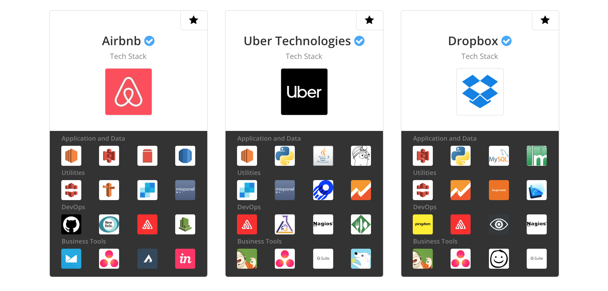
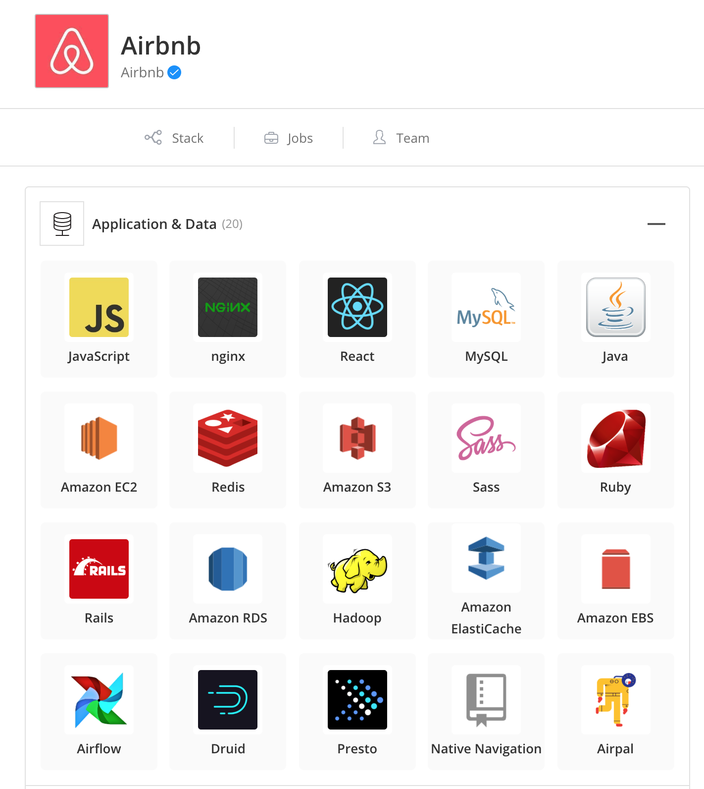
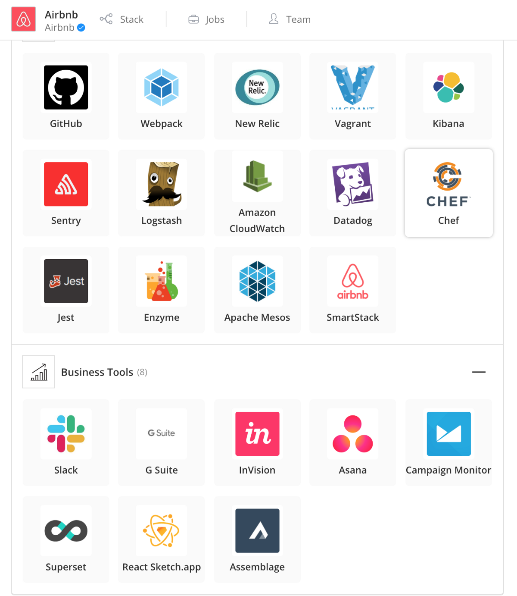
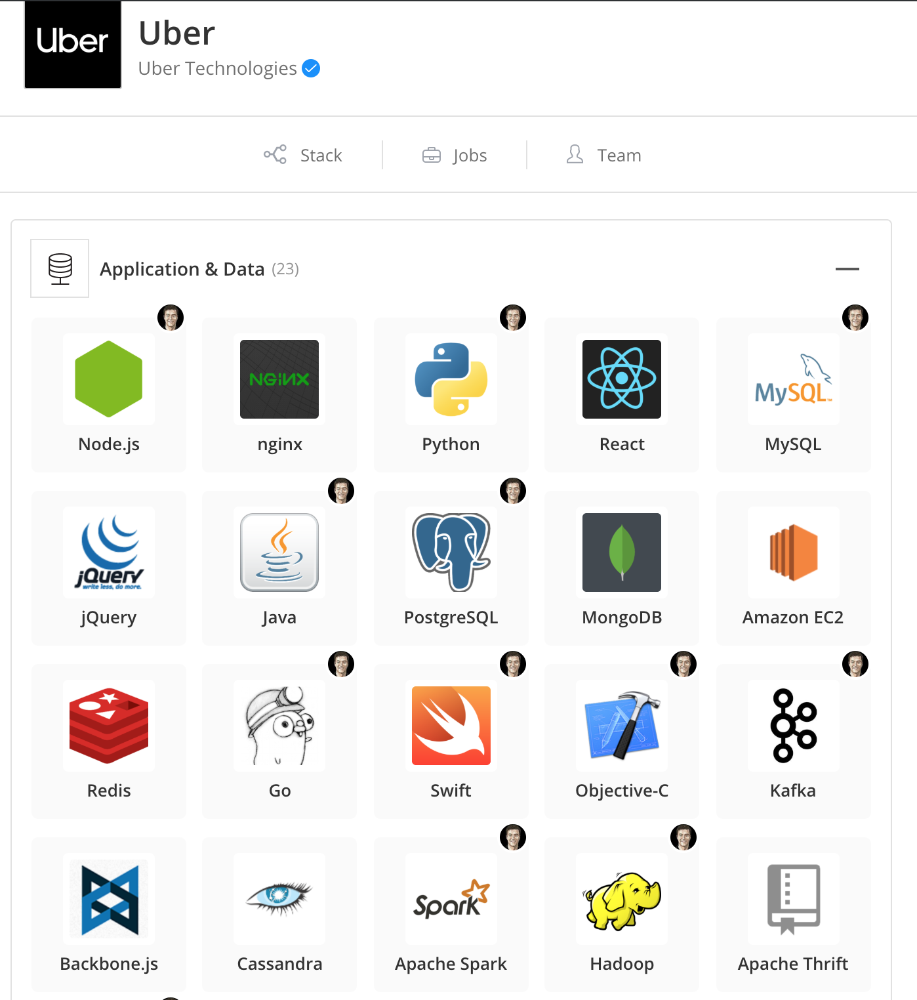
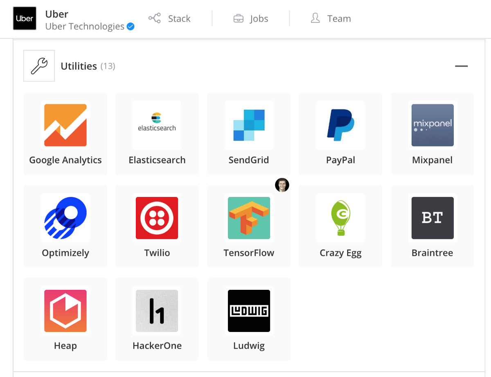
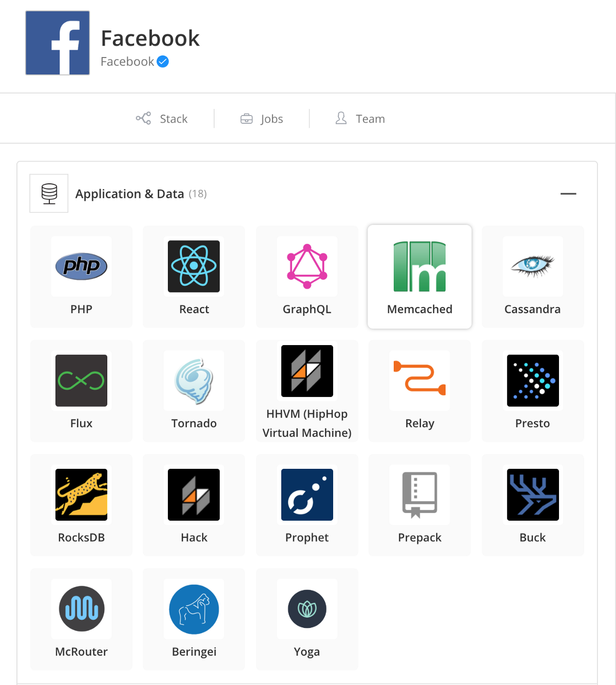
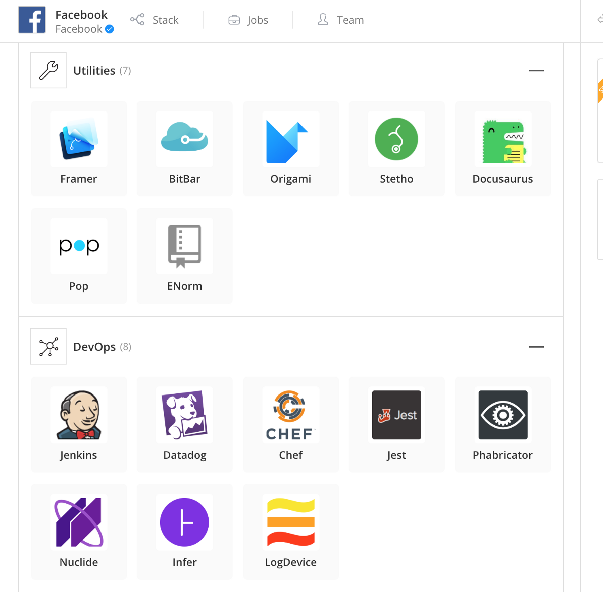
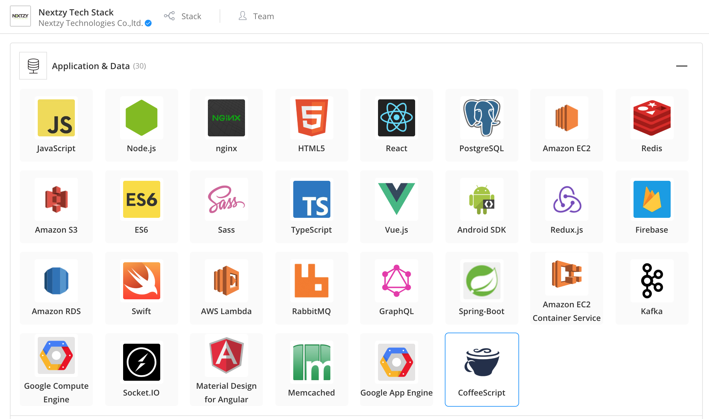

สวัสดีครับแนะนำตัวผม “นิว เน็กซี่” วันนี้ผมจะมาแนะนำวิธีเลือก Technology Stack for Web ที่ใช่สำหรับปี 2019 ผมยังไม่เชี่ยวชาญด้าน Mobile เท่าไร วันนี้เลยมาขอเขียนในส่วนของเว็บก่อน ส่วน Mobile เดี๋ยวจะตามมาเร็วๆนี้ครับ ในบทความจะย้อนไปถึงว่าจะทำเว็บต้องประกอบด้วยอะไรบ้าง เป็นภาพใหญ่ๆในการที่จะได้มาซึ่งเว็บที่สามารถ

> รองรับคนได้จำนวนมาก

> หน้าตาสวยงามทันสมัย รองรับทุกเว็บบราวเซอร์

> มีความปลอดภัยสูง (ทุกคนที่จะทำเว็บผมว่า 3 ข้อนี้ตอบโจทย์)

บริษัทที่ต้องการที่จะทำเว็บขึ้นมาควรคำนึงถึงการเลือกใช้ให้เหมาะสม ตัวบทความจะไม่ได้ชี้ให้คุณเลือก ไม่ได้บอกว่าตัวไหนดีที่สุด

การเลือก Tech Stack ผิดนั้นอาจจะทำให้บริษัทสูญเงินจำนวนมาก เสียเวลาไปกับการพัฒนาเทคโนโลยีที่ไม่ตอบโจทย์ และขั้นเลวร้ายสุดอาจจะทำให้โปรเจคนั้นๆไม่มีทางสำเร็จเลยก็เป็นได้

---

ก่อนอื่นเรามาทวนกันก่อนว่าหน้าตาการทำงานด้านหลังเวลาเข้าเว็บๆหนึ่งมันเป็นยังไง ในรูปด้านล่าง ตัวเลขไม่ได้เรียงลำดับการเรียก เอาไว้ลำดับการอธิบาย

### Web Architecture

](./asset-2.png)

ผมจะอธิบาย สั้นๆไว้ เพื่อไม่ให้เป็นการรบกวนเนื้อหาหลักมากเกินไป หากต้องการอ่านเต็มๆ ให้ไปอ่านที่นี่ [https://engineering.videoblocks.com/web-architecture-101-a3224e126947](https://engineering.videoblocks.com/web-architecture-101-a3224e126947)

**มาเริ่มกันเลย !!!!**

1.  DNS ทำหน้าที่ เวลาเข้าเว็บ [www.nextzy.me](http://www.nextzy.me) ก็จะ เปลี่ยน เป็น IP 66.33.444.221 เป็นตัวกลางในการเปลี่ยนไปกลับระหว่างชื่อ web และ IP ทำให้เรามี www เช่นทุกวันนี้
2.  Load Balancer ทำหน้าที่ในการสับราง เฮ้ยง่ายๆเวลาเราสเกลเว็บเราเพิ่มรถไฟ(เครื่อง)ไปเยอะๆ ตัวนี้แหละจะมาทำหน้าที่คอยสับรางให้เรา คอยกระจายให้ทุกเครื่องได้ใช้ประสิทธฺภาพได้เต็มที่ ตามชื่อมันเลย
3.  Web App Server เป็น high level web application ที่เราเขียน HTML CSS Javascript จะวางอยู่ที่นี่ ส่วน App server ก็จะเขียนด้วย Node.js, Ruby, PHP, Scala, Java, C# .NET แล้วแต่เลยสุดท้ายก็จะเปิด port 80(HTTP) หรือ 443(HTTPS)
4.  Database ทำหน้าที่ เก็บข้อมูลในรูปแบบตารางหรือ Hash Table หรือ Document Base ก็ได้ โดยการเรียกข้อมูลมาใช้หรือการบันทึกข้อมูล ก็ต้องใช้ภาษา Structured Query Language หรือ SQL ที่เรารู้จักนั่นเอง
5.  Caching Service ทำหน้าที่ แก้ปัญหาในการเรียกหน้าข้อมูลเดิมๆบ่อยครั้งและทุกๆครั้งมีการทำงานหนักในเรื่องการประมวลผล เช่น Report, Database query ตัว Caching Service จะสร้างหน้าที่เรียกใช้ซ้ำๆเก็บไว้ในรูปแบบของ Text, หรือ Binary เมื่อมีการเรียกใช้ข้อมูลหน้าเดิมๆก็ดึงจาก Caching Service ได้เลย

6a. Job Queue หน้าที่ เอาไว้ทำงานตามเวลา เช่นสั่งให้ส่งเมล์ สั่งให้สร้าง report ไว้รอ

6b. Job Server เอาไว้เรียกใช้ Jobs ตามเวลา

7\. Full Text Search Service หน้าที่ของมันเอาไว้ลดภาระ Database โดยเฉพาะ เพราะการค้นหาคำบางอย่างในทุกฟิลล์ (Full Text Search) อาจจะทำให้ Database ล่มได้ Host บางที่ปิด Function นี้ไปเลยก็มี

8\. Service เวลา Application เราใหญ่ขึ้น เราจะเกิดสิ่งที่เรียกว่า Service คือเป็น Application ที่แยกตัวรันออกมาเช่น Account Service, Payment Service, HTML to PDF Service หรือที่ไทยเราฮิตๆเรียกกันว่า Micro service นั่นแหละ

9–10. เป็น เก็บ Data เอาไว้ให้ Data science เค้าทำงาน เอาไว้วิเคราะห์อะไรก็ว่าไป เราไม่น่าจะได้เข้าไปใช้ ไว้ Application เราใหญ่ๆ เราค่อยมาศึกษาตรงนี้อีกที

11\. CDN . หน้าที่คือเป็นการตั้ง Application Server ไว้ในที่ต่างๆทั่วโลกเพื่อให้สามารถเข้าถึงข้อมูลได้เร็วยิ่งขึ้น ส่วนมากข้อมูลขนาดใหญ่ รูปภาพ เสียง วีดีโอ ส่วนมากจะเก็บไว้ที่ CDN เมื่อเวลาเราเรียก จะมีตัวจัดการ ว่า ip เราอยู่ ที่ไหนก็จะไปเนียกโหลดข้อมูลจาก Server ที่ใกล้ที่สุด เว็บที่ต้องการความเร็ว CDN จำเป็นมากๆ

> และทั้งหมดนี่คือหนทางของ Full Stack Web Application นั่นเอง

---

### ปัจจัยอะไรบ้างที่ต้องคำนึงในการเลือกใช้ Tech Stack for Web Application

 on [Unsplash](https://unsplash.com/search/photos/choose?utm_source=unsplash&utm_medium=referral&utm_content=creditCopyText)](./asset-3)

#### Type of Web Application

ในการพัฒนาเว็บ สั่งแรกเราต้องเข้าใจความต้องการของลูกค้า ผมจะแบ่งความต้องการลูกค้าออกเป็น 3 ประเภท

-   **ง่าย** งานจะเป็น หน้า Landing Page, Online Store ง่ายๆ, เราสามารถใช้ CMS(Content Management System) เข้ามาช่วยเขียนจัดการได้
-   ปานกลาง เป็นเว็บที่มีฟังก์ชั่นเพิ่มจากระดับง่าย เช่น e-commerce stores, อาจจะต้องเลือกใช้ภาษาโปรแกรมมิ่งเข้ามาเขียน อาจจะใช้บาง Framework เข้ามาช่วยได้บ้าง
-   ซับซ้อน เป็นเว็บที่มีฟังก์ชั่นจำนวนมาก ต้องใช้คนทำหลายคน และมี Business ที่ซับซ้อน social networks, large ecommerce marketplaces, fintech นอกจากต้องเขียนโปรแกรมแล้วยังต้องมีความเข้าใจในเรื่องอื่นเพิ่มเติมด้วย

นอกจากเรารู้เป้าหมายและความต้องการแล้ว ยังไม่หมด ต้องทราบไปถึง Non Functional ด้วย

-   ปริมาณคนเข้าเว็บ/จำนวนข้อมูลปริมาณมาก ถ้าเข้าเป็นจำนวนมากก็ต้องใช้ Queue Service มาลด หรือจำพวก Video streaming ก็ต้องวางแผนการรับส่งข้อมูล
-   การตอบ (response) แบบ realtime เช่น Social network เราก็ต้องคำนึงถึงเทคโนโลยีอีกแบบเช่น Web Socket

#### Scalability

ข้อนี้ทุกคนและทุกบริษัทมักลืมไปว่า การพัฒนา Software นั้นไม่มีทางจบ ต้องพัฒนาให้ดีขึ้นเรื่อยๆรวมถึงเพิ่มฟีเจอร์ เว็บนั้นต้องขยายใหญ่ขึ้น การสเกล นั้นมี 2 แบบคือ

-   สเกลแนวกว้าง นั่นคือการเพิ่มประสิทธิภาพในการรับโหลดของ Stack นั้นๆ ต้องคำนึงถึงการพัฒนาและเวลาที่ใช้ในการพัฒนา
-   สเกลแนวลึก คือ Stack ที่เลือกนั้นต้องสามารถเพิ่ม Feature ได้ง่าย สามารถทำงานร่วมกันได้ทีละหลายๆคน ไม่ใช่ Framework ที่ปิดกั้นการแก้ไข หรือสามารถแก้ไขได้ยาก

#### Time to Market

เวลาเป็นสิ่งสำคัญในพัฒนาแต่ไม่ใช่ทั้งหมด หากต้องการสร้าง MVP ควรเลือก Stack ที่เป็นความชำนาญของนักพัฒนาเพื่อให้งานออกมาได้เร็วที่สุด แต่บริษัทที่ดี จะเลือก Stack ที่เหมาะสมกับงานแม้จะพัฒนาได้ช้ากว่าปกติ แต่พอถึงระยะกลางจะได้ผลของการเลือกที่ถูกต้อง จะเร่งความเร็วในการพัฒนาช่วงนี้ได้ดี

การเลือก Stack ที่ที่เร็ว หนีไม่พ้น Opensource platform เช่น CMS, Clone, Template, Software as a service, Function As a service, Backend As a service รวมไปถึงของใหม่ที่เพิ่งมาในปีนี้คือ “Serverless” (รวบเลยนะ ไปค้นอ่านกันเอง)

#### Development Cost

จัดไปครับ จากรายงานของ Stackoverflow 2019 เว็บที่ Developer เข้ามากที่สุด เลือกเอาตามงบได้เลย ของไทยจากที่สำรวจก็สเกลสูงต่ำประมาณนี้ อย่าลืมดูขนาดของวงกลมด้วยนะครับ วงใหญ่คือจำนวนคนเขียนเยอะ วงเล็กคนเขียนน้อย

](./asset-4.png)

#### Security

ความปลอดภัยเป็นเรื่องของทุกคน ไม่ว่าจะเป็นทีมเดฟ ยันผู้บริหาร วิธีการเลือก Stack ที่นำมาใช้ ต้องผ่านการตรวจสอบหรืออ่าน Changelog อย่างละเอียดหาความเสี่ยงที่อาจจะโดนเจาะ และอย่าลืม Pentest ก่อนที่จะขึ้นระบบจริงๆ การเลือก Stack อาจจะดูจากว่า Stack นั้นโดนเจาะหรือมีช่องโหว่มากเพียงใด หากเป็น Web Application ที่ต้องการความปลอดภัยสูงควรเลี่ยงที่จะนำ Stack นั้นมาใช้อย่างเด็ดขาด

> แต่ละภาษาจะมี Security Standard Guideline ก่อนที่จะเริ่มพัฒนา นักพัฒนาควรอ่านก่อนที่จะเริ่มเขียนโปแกรม

Developer ควรมีพื้นฐานทางด้าน Basic Hack มาบ้างจะช่วยเรื่องนี้ได้เยอะ เช่น SQL injection, XSS, Buffer Overflow, man in the middle เป็นต้น

---

### **ตัวอย่าง Tech Stack ที่บริษัทระดับโลกใช้กัน**

**AirBnb** (บริษัทในดวงใจของผู้เขียน)

](./asset-7.png)

**Uber** (บริษัทที่คนไทยอยากทำแอปเลีียนแบบมากสุด 555)

](./asset-10.png)

**Facebook** (เห็นไหม facebook ยังใช้ PHP เลย มิตรสหายท่านนึงที่เปลี่ยนไปเขียน JS ได้กล่าวไว้)

---

แล้วผมใช้อะไรกันแน่ ตอนนี้ส่วนตัวผมเขียนเป็น ReactJS ต่อกลับ NodeJs API ปกติ

#### **Nextzy เองก็มี Stack เลยตามรูปด้านล่าง**

](./asset-14.png)

เป็นไงบ้างครับเพื่อนๆ เจอ Stack ที่ถูกใจหรือยัง ถ้ายังลองเข้าไปอ่าน Stack ที่น่าสนใจที่ [https://stackshare.io/](https://stackshare.io/) หรือ Comment, Feedback ได้เลยครับ คุยกันสนุกดี แล้วพบกันใหม่ ครับ ~~\_~~ ง่วง
