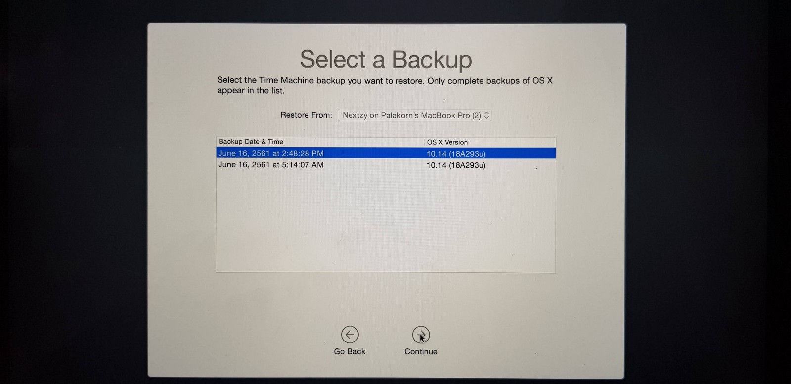

#### tl;dr

MacBook Pro และ MacBook Air ของพนักงานที่ Nextzy มีปัญหาพื้นที่ไม่พอใช้เพราะตอนซื้อเลือกความจุเป็น 128 GB เลยแก้ปัญหาด้วยการอัพเกรดความจุเป็น 256 GB แต่วิธีนี้ใช้ได้กับ MacBook รุ่นปี 2013 จนถึง Mid 2015 เท่านั้นนะครับ

---

บทความนี้จะมาบอกอย่างละเอียดเลยนะ อาจจะมีข้อความ Geek อยู่บ้าง แต่คนทั่วไปทำตามได้แน่นอน ผมเองก็งัดเอาสกิลช่างคอมมาใช้ด้วย ผู้อ่านน่าจะได้ประโยชน์ด้วย

มา 3 2 1… Go…

ก่อนแรกเลย Backup งานเราก่อนเลยครับ หรือถ้าเปลี่ยน Harddisk แล้วไม่อยากติดตั้งโปรแกรมใหม่ แนะนำ Time Machine Backup ก็หา Flashdrive หรือ HDD ที่ขนาด 128 GB **ว่างๆ** มาเสียบเลย

และก็ติ๊กที่ให้มันแสดงที่ Menu bar ตามรูป แล้วไปกดตรง icon แล้วเลือก Backup Now ได้เลย รอไปครับ ขั้นตอนนี้อาจจะใช้เวลาทั้งคืน และต้องมีพื้นที่เหลือในเครื่องเพื่อใช้ในการ Backup ด้วย ประมาณ 4–5 GB

---

ต่อมาก็ซื้ออุปกรณ์เพิ่มความจุกันนะครับ ชื่อว่า JetDrive 820 ความจุ 240 GB ราคาของมันถือว่าสูงพอสมควร เสนอราคาที่ 9,700 บาท ต่อ 1 ตัว เพราะมันเป็น Harddisk Slot PCI-E ครับ ปกติ Slot นี้ของ Notebook ทั่วไปเค้าเอาไว้ใส่พวกการ์ดจอ แต่ตัว MacBook เองเอา PCI-E มาใส่ HDD

> อย่าไปซื้อ Harddisk ที่เป็น M2 มาใส่นะครับ คนละ Slot กัน

แต่ผมว่า PCI-E ที่ MacBook เอามาใช้เนี่ยดีนะ เพราะเจ้า Slot นี้มีความเร็วในการเชื่อมต่อกับบอร์ดสูงมาก เร็วกว่า SATA กับ M2 อีก

สงสัยใช่ไหมเราจะแกะมันได้ไง เปิดกล่องชั้นล่างต่อครับเค้าแถมอุปกรณ์มาให้ด้วย จัดไปครับ

รูปเต็มๆสวยงาม ของดีครับผมบอกเลยตัวนี้ สมราคาที่ 9,700

เริ่มแกะฝาหลังของเครื่องโดยใช้ไขควง P5 ให้คว่ำ MacBook แล้วแกะน๊อตทุกตัวเลยครับ

เมื่อไขน๊อตทั้งหมดออกแล้วงัดฝาหลังออกมาได้เลยครับ จะเจอด้านในประมาณนี้

ส่วนของ HDD จะอยู่ตรงนี้ครับโดยมีน๊อตยึดมันไว้ 1 ตัวไขมันออกมาซะ

วิธีถอด HDD ออกมาก็คือให้จับที่ปลายแล้วยกขึ้นมาเล็กน้อย จากนั้นดึงออกมาทางด้านข้างได้เลย

จากนั้นก็ใส่อันใหม่เข้าไปให้เรียบร้อย พอเสร็จแล้วก็ปิดฝาหลังและขันน็อตให้ครบเหมือนเดิม

เมื่อเปิดเครื่องมามันจะขึ้นรูปแบบนี้ ไม่ต้องตกใจครับเพราะเรายังไม่ได้ลงอะไรให้มันเลย

ในตัว MacBook มันจะมี ROM เก็บ OS ไว้อยู่ถ้าจะลงให้กด ปุ่ม Command + R ค้างไว้แล้วกดเปิดเครื่องครับ แต่ถ้าเกิดไม่มีตัวลง เราสามารถลงผ่าน HDD/Flashdrive ได้อยู่แล้ว ก็ให้เสียบทิ้งไว้ตอนนี้ได้เลย เดี๋ยวจะมีให้เลือกติดตั้งจาก HDD/Flashdrive ทีหลัง แต่ถ้าไม่มีอะไรซักอย่างแนะนำให้กด Command + Option + R แทน มันจะเปิดเครื่องแล้วต่ออินเตอร์เน็ตเพื่อดาวน์โหลดไฟล์ติดตั้ง OS ให้ทันที ไม่ต้องเสียเวลากดเอง

เรียบร้อย

กรณีที่กด Command + R เราเลือก Restore จาก Time Machine ได้เลย

เลือก Disk ที่เรา Backup ไว้

เลือกอันล่าสุดถ้า Backup ไว้หลายอัน

รอครับ

หวังว่าโพสนี้จะมีประโยชน์ครับ

> คิดแล้วก็ปาดเหงื่อกับเครื่องบริษัท 30 กว่าเครื่อง 30\*9,700 เข้าไป 300,000 เอ๊งงงง

> แต่เพื่อน้องๆ Nextzy ที่ไม่ค่อยมีพื้นที่เก็บหนัง AV ,รูป BNK48 น้องๆเค้าขอมาผมเข้าใจก็เลยต้องควักจ่ายไปครับ
